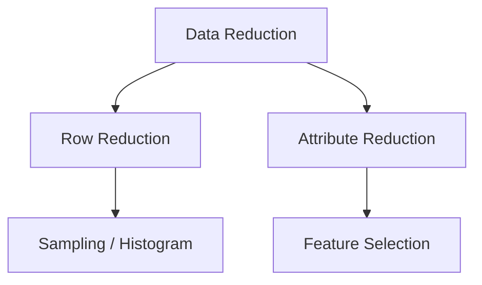
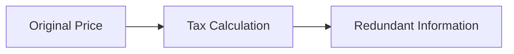
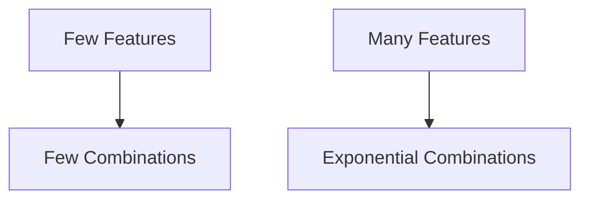
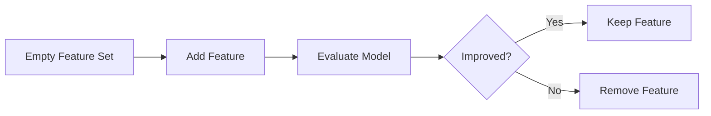
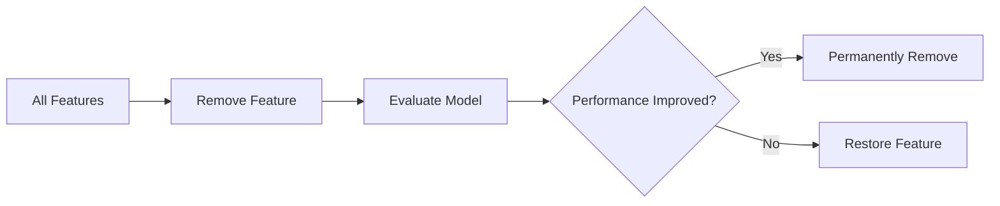
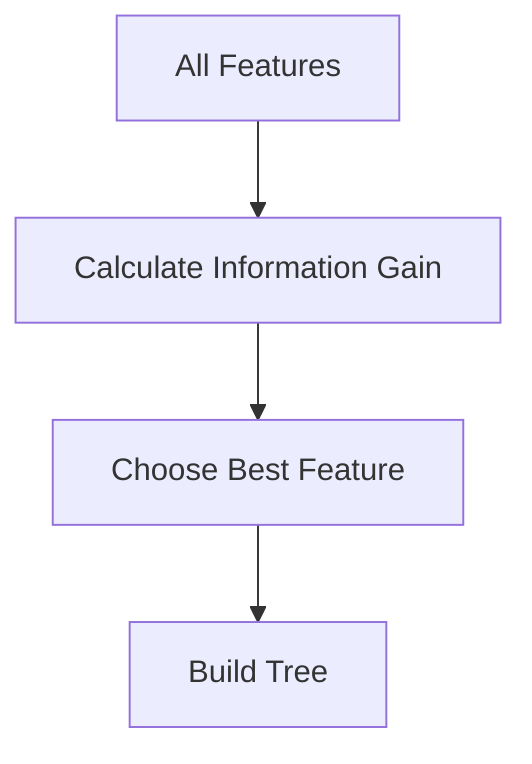
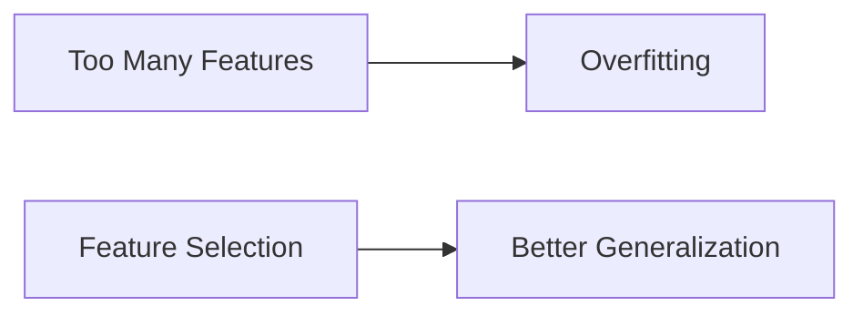

# Index

1. Introduction to Attribute Subselection
    
2. Data Reduction and Dimensionality Reduction
    
3. Understanding Attribute Subselection
    
4. Relevant vs Irrelevant Features
    
5. Redundant Features
    
6. Why Feature Selection Matters
    
7. Feature Selection as a Search Problem
    
8. Subset Combination Explosion
    
9. Computational Complexity of Exhaustive Search
    
10. Greedy Strategies in Feature Selection
    
11. Forward Selection  
    11.1 Core Idea  
    11.2 Step-by-Step Workflow  
    11.3 Accuracy-Based Selection  
    11.4 Error-Based Selection
    
12. Backward Elimination  
    12.1 Core Idea  
    12.2 Step-by-Step Workflow
    
13. Forward Selection vs Backward Elimination
    
14. Decision Tree Induction for Feature Selection
    
15. Information Gain Concept
    
16. Overfitting and Noise Reduction
    
17. Role of Domain Experts
    
18. Computational Efficiency Benefits
    
19. Practical Challenges in Feature Selection
    
20. Key Takeaways
    

# Introduction to Attribute Subselection

Attribute subselection, also called feature selection, is one of the most important dimensionality reduction techniques in data preprocessing.

The lecture focuses on reducing the number of columns or attributes inside a dataset while preserving the most useful predictive information.

The central idea is:

> Keep important attributes and remove unnecessary ones.

This improves:

- model performance
    
- interpretability
    
- computational efficiency
    
- generalization capability
    

# Data Reduction and Dimensionality Reduction

The lecture separates data reduction into two major forms.

|Reduction Type|Meaning|
|---|---|
|Row Reduction|Reduce tuples/records|
|Column Reduction|Reduce attributes/features|

Earlier lectures discussed:

- histograms
    
- sampling
    
- aggregation
    

for row reduction.

This lecture focuses specifically on reducing:

$$  
Number\ of\ Features  
$$

which is dimensionality reduction.

# Understanding Attribute Subselection

Attribute subselection is defined as:

> The process of identifying and retaining only relevant and informative attributes.

Formally:

$$  
Original\ Feature\ Set \rightarrow Reduced\ Feature\ Set  
$$

The objective is to eliminate:

- irrelevant features
    
- redundant features
    
- weakly relevant features
    

while preserving predictive power.

# Relevant vs Irrelevant Features

The lecture defines irrelevant attributes as features that do not contribute meaningfully to prediction.

Example:

Suppose the task is:

> Predict student CGPA.

Then:

|Feature|Relevance|
|---|---|
|Name|Irrelevant|
|Student ID|Irrelevant|
|City|Irrelevant|
|Attendance|Potentially Relevant|
|Study Hours|Relevant|

The lecture emphasizes that domain experts can often identify obviously irrelevant attributes using common sense.

# Redundant Features

Redundant features contain overlapping information.

The lecture gives a taxation example.

|Attribute|Meaning|
|---|---|
|Product Price|Original value|
|Tax Amount|Percentage of price|

If tax is always:

$$  
18%  
$$

then:

$$  
Tax = 0.18 \times Price  
$$

Both attributes become strongly correlated.

One of them may therefore be removed without losing much information.

# Why Feature Selection Matters

The lecture identifies several major benefits.

|Benefit|Explanation|
|---|---|
|Better Performance|Remove noise|
|Lower Complexity|Fewer computations|
|Better Interpretability|Simpler models|
|Reduced Overfitting|Avoid irrelevant patterns|
|Faster Training|Smaller feature space|

Feature selection improves both efficiency and prediction quality.

# Feature Selection as a Search Problem

The lecture explains feature selection as a combinatorial search problem.

Suppose there are 3 attributes:

|Attribute|
|---|
|A|
|B|
|C|

Possible subsets include:

|Subset|
|---|
|A|
|B|
|C|
|AB|
|AC|
|BC|
|ABC|

The empty subset is ignored.

The total number of possible subsets becomes:

2^n-1

where:

- $n$ = number of attributes
    

For:

$$  
n=3  
$$

Total subsets:

$$  
2^3 -1 = 7  
$$

# Subset Combination Explosion

The lecture highlights exponential growth.

Suppose:

$$  
n=100  
$$

Then:

$$  
2^{100}-1  
$$

possible subsets exist.

This creates combinatorial explosion.

Exhaustively evaluating every subset becomes computationally impossible.

# Computational Complexity of Exhaustive Search

For each subset:

1. Build a model
    
2. Measure performance
    
3. Compare accuracy/error
    

The lecture explains that exhaustive search requires building:

$$  
2^n -1  
$$

models.

This becomes infeasible for high-dimensional datasets.

# Greedy Strategies in Feature Selection

To avoid exhaustive search, the lecture introduces greedy strategies.

Greedy methods attempt:

> Local optimization for approximate global optimization.

Instead of evaluating every possible subset, they iteratively:

- add features
    
- remove features
    

based on model performance.

Major methods discussed:

|Method|
|---|
|Forward Selection|
|Backward Elimination|
|Decision Tree Induction|

# Forward Selection

## 11.1 Core Idea

Forward selection starts with:

$$  
0 \text{ features}  
$$

Then features are added incrementally.

## 11.2 Step-by-Step Workflow

Suppose features are:

|Features|
|---|
|A|
|B|
|C|

### Step 1

Randomly choose:

$$  
B  
$$

Build model and measure accuracy.

### Step 2

Add:

$$  
C  
$$

Build new model using:

$$  
BC  
$$

If accuracy improves:

- retain C
    

otherwise:

- remove C
    

### Step 3

Add:

$$  
A  
$$

Repeat evaluation.

This iterative expansion continues until no further improvement occurs.

## 11.3 Accuracy-Based Selection

Forward selection may use accuracy as evaluation metric.

Rule:

|Accuracy Change|Decision|
|---|---|
|Accuracy Increases|Keep Feature|
|Accuracy Decreases|Remove Feature|

The objective is maximizing predictive performance.

## 11.4 Error-Based Selection

Alternatively, error metrics may be used.

Rule:

|Error Change|Decision|
|---|---|
|Error Decreases|Keep Feature|
|Error Increases|Remove Feature|

Thus:

$$  
Error \downarrow \Rightarrow Better\ Feature  
$$

# Backward Elimination

## 12.1 Core Idea

Backward elimination performs the opposite strategy.

Instead of starting empty, it starts with:

$$  
All\ Features  
$$

and removes features iteratively.

## 12.2 Step-by-Step Workflow

Suppose:

|Features|
|---|
|A|
|B|
|C|

### Step 1

Build model using:

$$  
ABC  
$$

### Step 2

Remove:

$$  
A  
$$

Build model using:

$$  
BC  
$$

If accuracy improves:

- remove A permanently
    

otherwise:

- restore A
    

### Step 3

Repeat for remaining features.

This iterative reduction continues until performance begins degrading.

# Forward Selection vs Backward Elimination

|Property|Forward Selection|Backward Elimination|
|---|---|---|
|Starting Point|Empty Set|Full Set|
|Operation|Add Features|Remove Features|
|Complexity|Lower Initially|Higher Initially|
|Suitable For|Large Feature Spaces|Smaller Feature Spaces|

Both methods are greedy heuristics rather than exhaustive optimal search.

# Decision Tree Induction for Feature Selection

The lecture introduces decision tree induction as another feature selection approach.

Instead of random choice, the system selects attributes using statistical criteria.

The decision tree automatically prioritizes informative features.

# Information Gain Concept

The lecture briefly references:

> Information Gain

as the metric used by decision trees.

Features with higher information gain contribute more strongly toward prediction and are selected earlier in the tree.

Although detailed derivation is deferred to advanced courses, the core idea is:

$$  
Higher\ Gain \Rightarrow More\ Informative\ Feature  
$$

# Overfitting and Noise Reduction

Feature selection also reduces:

- overfitting
    
- noise
    
- irrelevant variation
    

Why?

Because unnecessary features allow models to memorize accidental patterns.

Removing weak features improves generalization.

# Role of Domain Experts

The lecture repeatedly emphasizes domain expertise.

Certain irrelevant attributes can be identified immediately through practical understanding.

Example:

|Prediction Task|Obvious Irrelevant Feature|
|---|---|
|CGPA Prediction|Student ID|
|Weather Prediction|Random Username|

Human expertise therefore complements algorithmic selection.

# Computational Efficiency Benefits

Reducing dimensionality improves computational efficiency because:

$$  
Features \downarrow \Rightarrow Computation \downarrow  
$$

Benefits include:

- lower memory usage
    
- faster training
    
- simpler models
    
- lower inference cost
    

This becomes extremely important in high-dimensional systems.

# Practical Challenges in Feature Selection

The lecture implicitly highlights several challenges.

|Challenge|Problem|
|---|---|
|Combinatorial Explosion|Too many subsets|
|Greedy Limitation|Local optimum risk|
|Feature Interaction|Important combinations missed|
|Computational Cost|Repeated model training|

Greedy methods reduce complexity but do not guarantee globally optimal subsets.

# Key Takeaways

Attribute subselection, also called feature selection, reduces dimensionality by identifying the most informative attributes inside a dataset.

The lecture emphasizes removing:

- irrelevant features
    
- redundant features
    
- weak predictors
    

Major methods discussed include:

|Method|
|---|
|Forward Selection|
|Backward Elimination|
|Decision Tree Induction|

The most important conceptual insight is that feature selection balances:

$$  
Prediction\ Quality \quad vs \quad Computational\ Complexity  
$$

Good feature selection improves model interpretability, reduces overfitting, accelerates training, and produces cleaner machine learning systems.