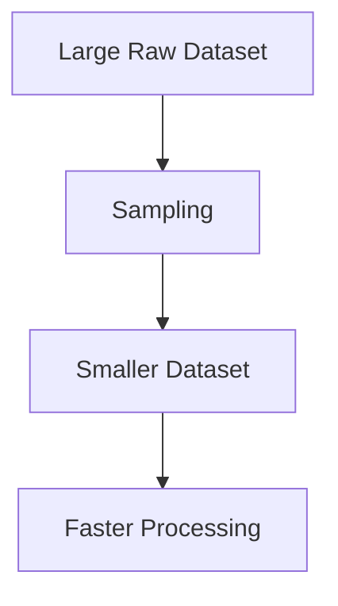
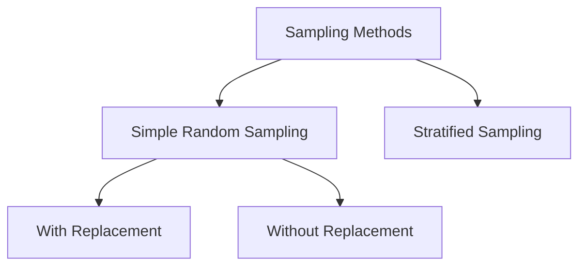
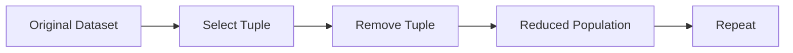
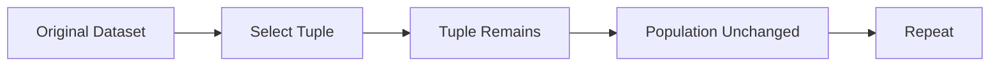
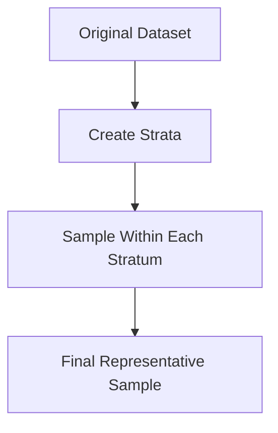
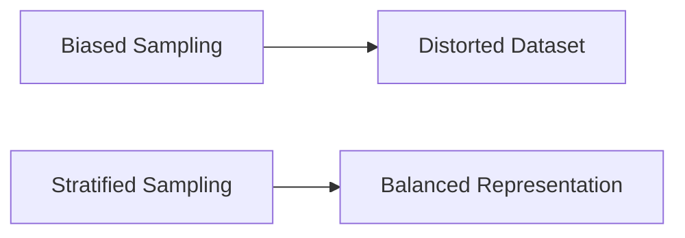
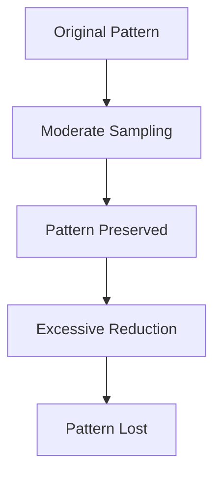

# Index

1. Introduction to Data Sampling
    
2. Why Sampling is Necessary
    
3. Representative Samples
    
4. Sampling in Data Reduction
    
5. Practical Considerations in Sampling
    
6. Types of Sampling Methods
    
7. Simple Random Sampling
    
8. Simple Random Sampling Without Replacement (SRSWOR)  
    8.1 Core Idea  
    8.2 Probability Changes Across Iterations  
    8.3 Step-by-Step Example  
    8.4 Characteristics of SRSWOR
    
9. Simple Random Sampling With Replacement (SRSWR)  
    9.1 Core Idea  
    9.2 Constant Probability Property  
    9.3 Step-by-Step Example  
    9.4 Characteristics of SRSWR
    
10. Comparing With vs Without Replacement
    
11. Stratified Sampling  
    11.1 Core Idea  
    11.2 Maintaining Distribution  
    11.3 Strata Formation  
    11.4 Step-by-Step Example
    
12. Sampling Bias and Fair Representation
    
13. Sampling and Pattern Preservation
    
14. Risks of Over-Reduction
    
15. Computational Benefits of Sampling
    
16. Sampling in Data Mining and Machine Learning
    
17. Key Takeaways
    

# Introduction to Data Sampling

Data sampling is a major data reduction technique used to decrease dataset volume while preserving the essential statistical properties of the original data.

The lecture frames sampling as:

> Selecting a smaller subset of data that approximately represents the original dataset.

Instead of processing the full dataset, machine learning systems may process only a representative sample.

This reduces:

- computational cost
    
- storage requirements
    
- processing time
    

while maintaining useful analytical behavior.

# Why Sampling is Necessary

The lecture emphasizes that real-world datasets are often extremely large.

Processing the entire dataset may become:

- computationally expensive
    
- memory intensive
    
- time consuming
    

Statisticians and data scientists therefore use samples to approximate the behavior of the original dataset.

Formally:

$$  
Original\ Dataset \rightarrow Representative\ Sample  
$$

If the sample preserves the original statistical structure, machine learning models trained on the sample may behave similarly to models trained on the complete data.

# Representative Samples

A sample is useful only if it is representative.

The lecture defines a representative sample as:

> A sample that approximately preserves the same properties as the original dataset.

These properties include:

- distribution
    
- trends
    
- statistical summaries
    
- important patterns
    


If sampling destroys the original structure, the sample becomes analytically unreliable.

# Sampling in Data Reduction

The lecture positions sampling as another major volume reduction technique alongside histograms.

Suppose:

|Dataset Type|Size|
|---|---|
|Original Dataset|10,000 rows|
|Sampled Dataset|1,000 rows|

The sampled dataset becomes significantly cheaper to process.



The goal is reducing size while preserving information quality.

# Practical Considerations in Sampling

The lecture highlights multiple practical concerns.

|Consideration|Importance|
|---|---|
|Sample Size|Must be sufficiently large|
|Representation|Must preserve distribution|
|Bias Avoidance|Prevent unfair sampling|
|Pattern Preservation|Retain trends/outliers|

## Small Sample Problem

Very small samples may:

- miss important trends
    
- remove rare events
    
- distort distributions
    

## Large Sample Problem

Very large samples reduce the benefit of sampling itself.

Thus:

$$  
Sample\ Size \Rightarrow Tradeoff\ Between\ Accuracy\ and\ Efficiency  
$$

# Types of Sampling Methods

The lecture divides sampling into two broad categories.

|Sampling Type|Subtypes|
|---|---|
|Simple Random Sampling|With Replacement / Without Replacement|
|Stratified Sampling|Distribution-aware sampling|



# Simple Random Sampling

Simple random sampling assigns equal probability to every tuple in the dataset.

Formally:

$$  
P(Tuple_i)=\frac{1}{N}  
$$

where:

- $N$ = total number of tuples
    

Every tuple has an equal chance of selection.

The lecture then separates this into:

- sampling without replacement
    
- sampling with replacement
    

# Simple Random Sampling Without Replacement (SRSWOR)

## 8.1 Core Idea

In sampling without replacement:

> Once a tuple is selected, it is removed from the population.

This means the same tuple cannot appear twice in the sample.

## 8.2 Probability Changes Across Iterations

Suppose there are:

$$  
N=8  
$$

tuples initially.

At the beginning:

$$  
P(selection)=\frac{1}{8}  
$$

After selecting one tuple:

$$  
P(selection)=\frac{1}{7}  
$$

Then:

$$  
P(selection)=\frac{1}{6}  
$$

and so on.

The probability changes because the population size decreases after every selection.

## 8.3 Step-by-Step Example

Suppose original tuples are:

|Tuples|
|---|
|A|
|B|
|C|
|D|
|E|
|F|
|G|
|H|

### Iteration 1

Select:

$$  
B  
$$

Now remove B from the original dataset.

### Iteration 2

Remaining tuples:

|Remaining|
|---|
|A|
|C|
|D|
|E|
|F|
|G|
|H|

Now select:

$$  
D  
$$

Again remove D.

This continues until the sample size requirement is satisfied.



## 8.4 Characteristics of SRSWOR

|Property|Behavior|
|---|---|
|Duplicate Tuples|Impossible|
|Population Size|Decreases|
|Selection Probability|Changes each iteration|
|Diversity|Higher|

This method naturally produces distinct sampled tuples.

# Simple Random Sampling With Replacement (SRSWR)

## 9.1 Core Idea

In sampling with replacement:

> Selected tuples are NOT removed from the original dataset.

Therefore the same tuple may appear multiple times in the sample.

## 9.2 Constant Probability Property

Since tuples are never removed:

$$  
P(selection)=\frac{1}{N}  
$$

remains constant across all iterations.

If:

$$  
N=8  
$$

then every iteration continues using:

$$  
P(selection)=\frac{1}{8}  
$$

## 9.3 Step-by-Step Example

Suppose:

|Tuples|
|---|
|A|
|B|
|C|
|D|
|E|
|F|
|G|
|H|

### Iteration 1

Select:

$$  
B  
$$

B remains inside the original dataset.

### Iteration 2

Again all tuples remain available.

Select:

$$  
D  
$$

### Iteration 3

Again all tuples remain available.

Select:

$$  
B  
$$

again.

Thus duplicates become possible.



## 9.4 Characteristics of SRSWR

|Property|Behavior|
|---|---|
|Duplicate Tuples|Possible|
|Population Size|Constant|
|Selection Probability|Constant|
|Random Independence|Higher|

This method behaves similarly to repeated independent probabilistic trials.

# Comparing With vs Without Replacement

|Property|Without Replacement|With Replacement|
|---|---|---|
|Tuple Removal|Yes|No|
|Duplicate Samples|Impossible|Possible|
|Probability Changes|Yes|No|
|Population Size|Decreases|Constant|

The lecture repeatedly emphasizes this distinction.

# Stratified Sampling

## 11.1 Core Idea

Stratified sampling preserves subgroup distribution during sampling.

Instead of blindly selecting tuples randomly, the dataset is first partitioned into subgroups called strata.



## 11.2 Maintaining Distribution

The lecture emphasizes:

> Distribution must remain approximately preserved.

Suppose original dataset contains:

|Category|Count|
|---|---|
|Youth|4|
|Middle Age|8|
|Senior|2|

Total:

$$  
14  
$$

Suppose sample size required is:

$$  
7  
$$

Then proportional sampling becomes:

|Category|Sample Count|
|---|---|
|Youth|2|
|Middle Age|4|
|Senior|1|

Distribution is therefore preserved approximately.

## 11.3 Strata Formation

Each subgroup becomes a separate stratum.

Example:

|Stratum|
|---|
|Youth|
|Middle Age|
|Senior|

Sampling is then performed independently inside each group.

This prevents subgroup imbalance.

## 11.4 Step-by-Step Example

Suppose original distribution is:

```text
Youth       = 4
Middle Age  = 8
Senior      = 2
```

After stratified sampling:

```text
Youth       ≈ 2
Middle Age  ≈ 4
Senior      ≈ 1
```

The proportional structure remains approximately preserved.

This reduces sampling bias.

# Sampling Bias and Fair Representation

The lecture warns that naive random sampling may create bias.

Example:

- minority categories may disappear
    
- skewed distributions may emerge
    
- fairness may reduce
    

Stratified sampling helps preserve balanced subgroup representation.



# Sampling and Pattern Preservation

An extremely important section of the lecture discusses pattern preservation.

Suppose original dataset contains:

$$  
8000  
$$

points forming a visible structure.

After moderate reduction:

$$  
2000  
$$

points still preserve the pattern.

But after excessive reduction:

$$  
500  
$$

points may destroy the visible structure entirely.



# Risks of Over-Reduction

The lecture strongly emphasizes:

> Excessive compression destroys information.

If sampling becomes too aggressive:

- distributions change
    
- rare events disappear
    
- patterns vanish
    
- inference quality decreases
    

Thus:

$$  
Too\ Much\ Reduction \Rightarrow Information\ Loss  
$$

# Computational Benefits of Sampling

Sampling dramatically improves computational efficiency.

Benefits include:

|Benefit|Explanation|
|---|---|
|Faster Processing|Smaller datasets|
|Lower Memory Usage|Reduced storage|
|Quicker Experiments|Rapid prototyping|
|Lower Cost|Reduced computation|

Sampling is therefore widely used during exploratory analysis and large-scale machine learning.

# Sampling in Data Mining and Machine Learning

Sampling becomes extremely important in:

- distributed systems
    
- big data processing
    
- streaming analytics
    
- preliminary experimentation
    
- scalable machine learning
    

Large systems often cannot process entire datasets repeatedly.

Representative sampling becomes the practical solution.

# Key Takeaways

Sampling is a major data reduction technique used to reduce computational complexity while preserving the important statistical properties of the original dataset.

The lecture introduces three major sampling methods:

|Method|
|---|
|Simple Random Sampling Without Replacement|
|Simple Random Sampling With Replacement|
|Stratified Sampling|

The most important conceptual insight is:

$$  
Good\ Samples \approx Original\ Dataset  
$$

A sample is useful only if it preserves:

- distribution
    
- trends
    
- patterns
    
- statistical behavior
    

while reducing storage and computational requirements.

Stratified sampling further improves fairness by preserving subgroup distribution during data reduction.

Tags: #statistics #machine-learning #data-science #statistical-modelling