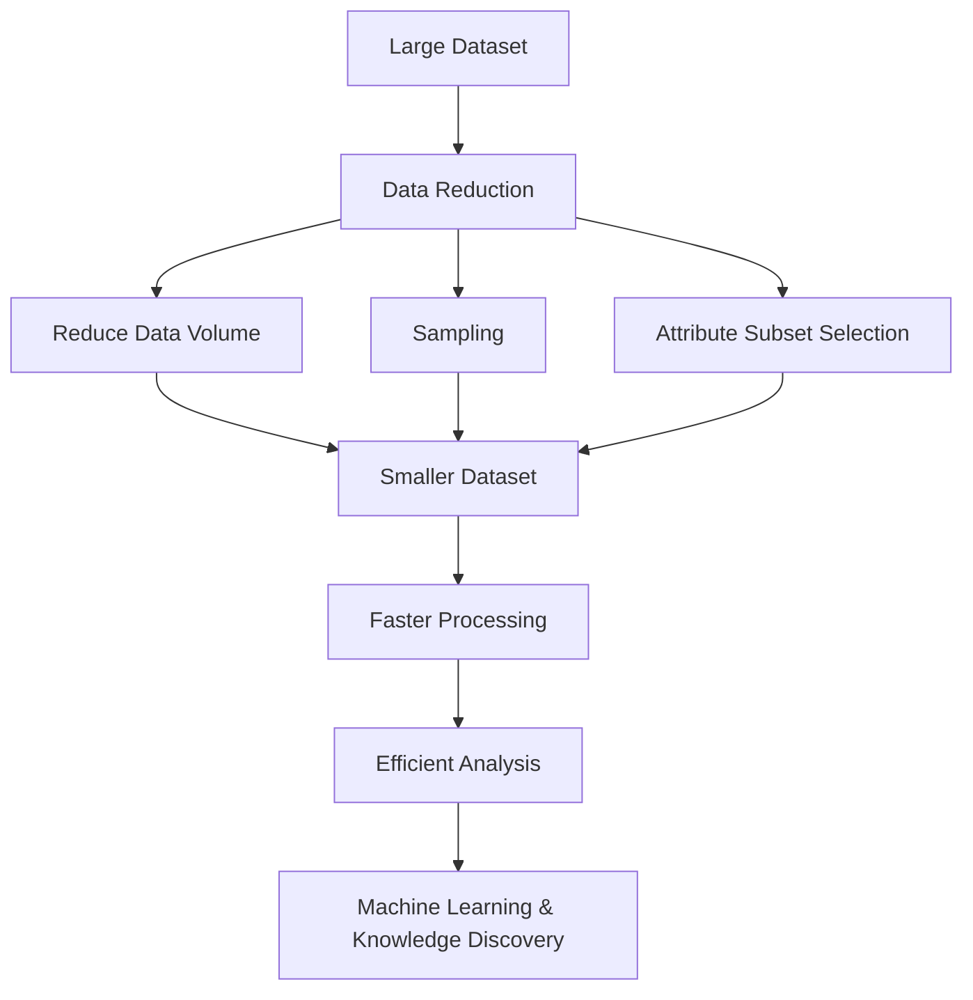

# Lesson 1: Introduction to Data Reduction

## Overview

Modern organizations generate enormous amounts of data every day from transactions, sensors, social media platforms, websites, and business applications. While large datasets provide valuable information, they also introduce challenges related to storage, computation, processing time, and analytical complexity.

Data reduction is a preprocessing technique that aims to reduce the size and complexity of datasets while preserving the essential characteristics and information contained within them. By reducing data volume and dimensionality, analysts can perform faster computations, build more efficient machine learning models, and simplify the overall analytical process.

This lesson introduces the fundamental concepts of data reduction, explores techniques for reducing data volume, explains the importance of sampling, and discusses attribute subset selection as a dimensionality reduction strategy.

Understanding data reduction is essential because modern analytical systems often deal with massive datasets that cannot be processed efficiently without appropriate reduction techniques.

## Learning Objectives

After completing this lesson, you should be able to:

- Define data reduction and explain its importance.
- Understand the need for reducing data volume.
- Explain various sampling techniques.
- Describe attribute subset selection methods.
- Identify situations where data reduction techniques should be applied.
- Evaluate the advantages and limitations of different reduction methods.

## Topics Covered

### 1. [Introduction to Data Reduction](Introduction%20to%20Data%20Reduction.md)

Data reduction refers to the process of obtaining a reduced representation of a dataset that is significantly smaller in size while preserving the integrity of the original information.

The primary objectives of data reduction include:

- Reducing storage requirements.
- Improving computational efficiency.
- Decreasing processing time.
- Simplifying analysis.
- Reducing model complexity.

Data reduction techniques are widely used in:

- Data Mining
- Machine Learning
- Big Data Analytics
- Data Warehousing
- Business Intelligence

Effective data reduction enables organizations to analyze large datasets more efficiently without substantial information loss.

### 2. [Reducing Data Volume](Reducing%20Data%20Volume.md)

Data volume reduction techniques aim to decrease the number of records or the amount of storage required for datasets.

Common approaches include:

#### Data Cube Aggregation

Summarizes detailed data into higher-level representations.

Example:

- Daily sales → Monthly sales

#### Data Compression

Reduces storage space by encoding data efficiently.

Examples:

- Lossless compression
- Lossy compression

#### Numerosity Reduction

Replaces original data with smaller alternative representations.

Examples:

- Histograms
- Clustering
- Regression models

Volume reduction helps organizations manage large-scale datasets effectively while maintaining analytical usefulness.

### 3. [Data Sampling](Data%20Sampling.md)

Sampling involves selecting a representative subset from a larger population or dataset.

Rather than analyzing the complete dataset, analysts study a carefully selected sample to draw conclusions about the entire population.

Common sampling techniques include:

#### Probability Sampling

- Simple Random Sampling
- Systematic Sampling
- Stratified Sampling
- Cluster Sampling

#### Non-Probability Sampling

- Convenience Sampling
- Judgment Sampling
- Quota Sampling

Sampling is widely used because it:

- Reduces computational cost.
- Speeds up analysis.
- Enables analysis when complete data is unavailable.

However, poorly designed sampling methods can introduce bias and reduce analytical reliability.

### 4. [Attribute Subset Selection](Attribute%20Subset%20Selection.md)

Attribute subset selection, also known as feature selection, is the process of identifying the most relevant attributes within a dataset while removing redundant or irrelevant features.

Benefits include:

- Reduced dimensionality.
- Faster model training.
- Lower computational requirements.
- Reduced overfitting.
- Improved model interpretability.

Common feature selection approaches include:

#### Filter Methods

Select features based on statistical measures.

Examples:

- Correlation Analysis
- Chi-Square Test
- Information Gain

#### Wrapper Methods

Evaluate feature subsets using machine learning algorithms.

Examples:

- Forward Selection
- Backward Elimination
- Recursive Feature Elimination (RFE)

#### Embedded Methods

Perform feature selection during model training.

Examples:

- LASSO Regression
- Decision Trees
- Random Forest Feature Importance

Feature selection is a critical component of modern machine learning workflows.

## Conceptual Relationship

## Lesson Navigation

| Resource | Description |
|-----------|-------------|
| 📄 [Introduction to Data Reduction](Introduction%20to%20Data%20Reduction.md) | Introduction to the concepts, objectives, and importance of data reduction |
| 📄 [Reducing Data Volume](Reducing%20Data%20Volume.md) | Explore techniques used to decrease dataset size and storage requirements |
| 📄 [Data Sampling](Data%20Sampling.md) | Learn about sampling techniques and their applications |
| 📄 [Attribute Subset Selection](Attribute%20Subset%20Selection.md) | Understand feature selection methods used to reduce dimensionality |

## Real-World Applications

| Domain | Application |
|---------|-------------|
| Healthcare | Selecting important patient attributes for diagnosis |
| Finance | Sampling transactions for fraud detection |
| Retail | Aggregating sales data for trend analysis |
| Social Media | Reducing large-scale user interaction data |
| Machine Learning | Feature selection to improve model performance |

## Key Takeaways

- Data reduction decreases dataset size while preserving important information.
- Reducing data volume improves storage efficiency and processing speed.
- Sampling allows analysts to study representative subsets instead of entire populations.
- Attribute subset selection removes irrelevant and redundant features.
- Effective data reduction improves scalability, model performance, and analytical efficiency.
- Data reduction techniques are essential when working with large-scale datasets.

## Prerequisites for Future Topics

The concepts introduced in this lesson provide the foundation for:

- Feature Engineering
- Machine Learning
- Big Data Analytics
- Dimensionality Reduction
- Principal Component Analysis (PCA)
- Predictive Modeling
- Data Mining
- Scalable Analytics
