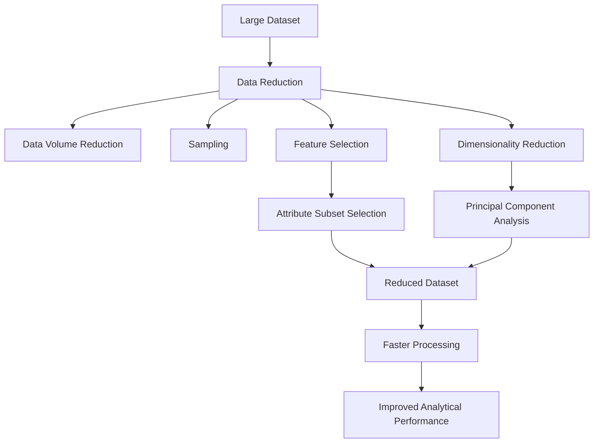

# Week 6: Data Reduction

## Overview

As datasets continue to grow in size and complexity, analyzing every record and attribute becomes increasingly challenging. Large datasets often lead to increased storage requirements, longer processing times, higher computational costs, and more complex analytical models.

Data reduction techniques address these challenges by reducing the size or dimensionality of datasets while preserving their essential information. By creating smaller yet representative datasets, analysts can perform faster and more efficient analysis without significantly compromising accuracy.

This week introduces the fundamental concepts of data reduction, explores methods for reducing dataset dimensionality, and provides practical experience with feature selection and Principal Component Analysis (PCA).

Understanding data reduction techniques is essential for modern Data Science, Machine Learning, Big Data Analytics, and Business Intelligence applications.

## Learning Objectives

After completing this week, you should be able to:

- Explain the need for data reduction.
- Describe common data reduction techniques.
- Understand attribute subset selection and its applications.
- Explain the concept of dimensionality reduction.
- Apply feature selection techniques to reduce dataset complexity.
- Perform dimensionality reduction using Principal Component Analysis (PCA).
- Evaluate the impact of data reduction on analytical performance.

## Topics Covered

### 1. [Intro](Intro.md)

This introductory topic provides an overview of data reduction and its importance within the data preprocessing pipeline.

Key concepts include:

- Definition of data reduction
- Need for data reduction
- Advantages of reduced datasets
- Challenges associated with high-dimensional data
- Overview of data reduction techniques

Benefits of data reduction include:

- Faster computation
- Reduced storage requirements
- Improved model performance
- Reduced overfitting
- Better interpretability

### 2. [L1](L1/)

Lesson 1 explores the major concepts and techniques used in data reduction.

Topics include:

#### [Introduction to Data Reduction](L1/Introduction%20to%20Data%20Reduction.md)

Introduces the goals, objectives, and importance of reducing dataset size and complexity.

#### [Reducing Data Volume](L1/Reducing%20Data%20Volume.md)

Explains techniques such as:

- Data cube aggregation
- Compression
- Numerosity reduction

#### [Data Sampling](L1/Data%20Sampling.md)

Discusses methods for selecting representative subsets from larger datasets.

Examples include:

- Simple Random Sampling
- Stratified Sampling
- Cluster Sampling

#### [Attribute Subset Selection](L1/Attribute%20Subset%20Selection.md)

Introduces feature selection techniques used to identify the most relevant attributes while eliminating redundant or irrelevant features.

### 3. [Lab 6.1: Data Reduction Attribute Subset Selection](Lab%206.1_%20Data%20Reduction%20Attribute%20Subset%20Selection_1100376.ipynb)

This practical laboratory exercise focuses on feature selection techniques used to reduce dataset dimensionality.

Typical activities include:

- Identifying irrelevant attributes
- Evaluating feature importance
- Applying filter methods
- Performing feature subset selection
- Comparing datasets before and after reduction

The lab demonstrates how reducing the number of attributes can improve computational efficiency and model performance.

### 4. [Lab 6.2: Dimensionality Reduction using Principal Component Analysis](Lab%206.2_%20Dimensionality%20Reduction%20using%20Principal%20Component%20Analysis.ipynb)

Principal Component Analysis (PCA) is one of the most widely used dimensionality reduction techniques in Data Science and Machine Learning.

This practical laboratory exercise introduces:

- Principal Components
- Variance maximization
- Feature transformation
- Dimensionality reduction using PCA
- Visualization of high-dimensional data

Typical activities include:

- Standardizing data
- Applying PCA using Scikit-learn
- Determining explained variance
- Visualizing transformed data
- Comparing original and reduced datasets

PCA is extensively used in:

- Image processing
- Pattern recognition
- Data visualization
- Feature extraction
- Noise reduction

## Conceptual Relationship

## Week Navigation

| Resource | Description |
|-----------|-------------|
| [Intro](Intro.md) | Overview of data reduction concepts and motivations |
| [L1](L1/) | Core lesson materials covering data reduction techniques |
| [Lab 6.1: Data Reduction Attribute Subset Selection](Lab%206.1_%20Data%20Reduction%20Attribute%20Subset%20Selection_1100376.ipynb) | Practical implementation of feature selection techniques |
| [Lab 6.2: Dimensionality Reduction using Principal Component Analysis](Lab%206.2_%20Dimensionality%20Reduction%20using%20Principal%20Component%20Analysis.ipynb) | Hands-on implementation of PCA for dimensionality reduction |

## Real-World Applications

| Domain | Application |
|---------|-------------|
| Healthcare | Selecting important diagnostic attributes for disease prediction |
| Finance | Reducing variables for credit risk and fraud detection |
| Retail | Customer segmentation using reduced feature sets |
| Image Processing | Compressing high-dimensional image data |
| Machine Learning | Improving model performance and reducing overfitting |

## Key Takeaways

- Data reduction decreases dataset size while preserving essential information.
- Feature selection removes irrelevant and redundant attributes.
- Dimensionality reduction simplifies high-dimensional datasets.
- PCA transforms original variables into a smaller set of informative components.
- Reduced datasets improve computational efficiency and model scalability.
- Data reduction techniques are critical for handling modern large-scale datasets.

## Prerequisites for Future Topics

The concepts introduced in this week provide the foundation for:

- Feature Engineering
- Machine Learning
- Principal Component Analysis (PCA)
- Clustering
- Big Data Analytics
- Pattern Recognition
- Deep Learning
- Predictive Modeling
