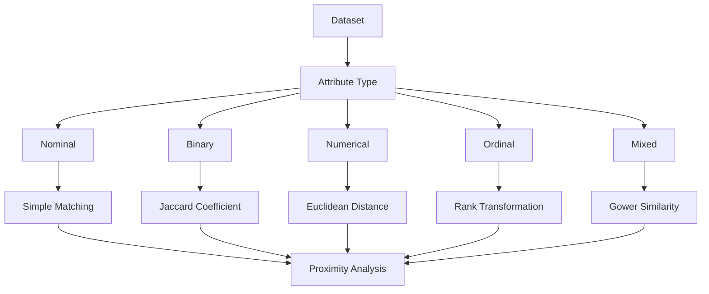

# Lesson 1: Proximity Analysis

## Overview

Many data mining and machine learning algorithms rely on measuring the similarity or dissimilarity between data objects. The concept of proximity analysis provides a mathematical framework for quantifying how similar or different two objects are.

Proximity measures are fundamental to numerous analytical techniques including clustering, classification, recommendation systems, anomaly detection, and information retrieval. The choice of an appropriate proximity measure depends heavily on the type of data being analyzed.

This lesson introduces proximity analysis for various attribute types, including nominal, binary, numerical, ordinal, and mixed attributes. Understanding these measures is essential because different data types require different similarity and distance calculations.

By selecting suitable proximity measures, analysts can improve the performance and interpretability of data mining and machine learning models.

## Learning Objectives

After completing this lesson, you should be able to:

- Define proximity analysis and explain its importance.
- Distinguish between similarity and dissimilarity measures.
- Compute proximity measures for nominal attributes.
- Compute similarity measures for binary attributes.
- Apply distance measures to numerical data.
- Analyze ordinal and mixed-type attributes using appropriate techniques.
- Select suitable proximity measures based on data characteristics.

## Topics Covered

### 1. [Proximity Analysis for Nominal Attributes]([1.%20Proximity%20Analysis%20for%20Nominal%20Attributes.md](https://github.com/Balasubramanian-pg/MSC.-Data-Science-AI/blob/main/Trimester%201/Data%20Preprocessing/W07%20-%20Proximity%20Measures/L1/7.1.%20Proximity%20Analysis%20for%20Nominal%20Attributes.md))

Nominal attributes represent categorical values that have no inherent ordering.

Examples include:

- Gender
- Nationality
- Blood Group
- Product Category

For nominal data, similarity is commonly determined by counting matching and non-matching attribute values.

Common measures include:

- Simple Matching Coefficient (SMC)
- Dissimilarity Measures

Example:

| Object | Color |
|---------|-------|
| A | Red |
| B | Red |

Since both values are identical, the similarity between the objects is high.

Nominal proximity measures are widely used in categorical data analysis and clustering.

### 2. [Proximity Analysis for Binary Attributes](2.%20Proximity%20Analysis%20for%20Binary%20Attributes.md)

Binary attributes contain only two possible states.

Examples include:

- Yes / No
- True / False
- Purchased / Not Purchased
- Disease Present / Disease Absent

Binary attributes can be classified as:

#### Symmetric Binary Attributes

Both states are equally important.

Examples:

- Gender (Male/Female)
- Pass/Fail

#### Asymmetric Binary Attributes

One state carries greater significance.

Examples:

- Fraud Detected
- Disease Diagnosis

Common similarity measures include:

- Simple Matching Coefficient (SMC)
- Jaccard Coefficient

The Jaccard coefficient is particularly useful when the presence of a characteristic is more important than its absence.

### 3. [Proximity Analysis for Numerical Attributes](3.%20Proximity%20Analysis%20for%20Numerical%20Attributes.md)

Numerical attributes contain quantitative values.

Examples include:

- Age
- Income
- Height
- Temperature

Distance measures are commonly used to evaluate proximity between numerical objects.

Popular distance metrics include:

#### Euclidean Distance

Measures the straight-line distance between two points.

$$
d(x,y)=\sqrt{\sum_{i=1}^{n}(x_i-y_i)^2}
$$

#### Manhattan Distance

Measures the distance travelled along coordinate axes.

$$
d(x,y)=\sum_{i=1}^{n}|x_i-y_i|
$$

#### Minkowski Distance

Generalized distance metric.

$$
d(x,y)=\left(\sum_{i=1}^{n}|x_i-y_i|^p\right)^{1/p}
$$

#### Cosine Similarity

Measures the angle between two vectors.

$$
\text{Cosine Similarity}=
\frac{X \cdot Y}{||X|| \ ||Y||}
$$

These measures are extensively used in clustering, recommendation systems, and text mining.

### 4. [Proximity Analysis for Ordinal & Mixed Attributes](4.%20Proximity%20Analysis%20for%20Ordinal%20%26%20Mixed%20Attributes.md)

Ordinal attributes possess a natural ordering among values.

Examples include:

- Education Level
- Customer Satisfaction Ratings
- Movie Ratings

Typical ordinal categories:

| Value | Rank |
|--------|------|
| Poor | 1 |
| Fair | 2 |
| Good | 3 |
| Excellent | 4 |

Ordinal values are often transformed into ranks before similarity computation.

Mixed datasets contain multiple attribute types simultaneously.

Example:

| Age | Gender | Income | Satisfaction |
|-----|---------|--------|-------------|
| Numerical | Nominal | Numerical | Ordinal |

Specialized measures such as Gower's Similarity Coefficient are commonly used to analyze mixed datasets.

Mixed-attribute proximity analysis is widely used in real-world applications because most datasets contain heterogeneous features.

## Conceptual Relationship

## Lesson Navigation

| Resource | Description |
|-----------|-------------|
| [Proximity Analysis for Nominal Attributes](1.%20Proximity%20Analysis%20for%20Nominal%20Attributes.md) | Similarity and dissimilarity measures for categorical attributes |
| [Proximity Analysis for Binary Attributes](2.%20Proximity%20Analysis%20for%20Binary%20Attributes.md) | Proximity measures for symmetric and asymmetric binary data |
| [Proximity Analysis for Numerical Attributes](3.%20Proximity%20Analysis%20for%20Numerical%20Attributes.md) | Distance and similarity measures for quantitative data |
| [Proximity Analysis for Ordinal & Mixed Attributes](4.%20Proximity%20Analysis%20for%20Ordinal%20%26%20Mixed%20Attributes.md) | Techniques for analyzing ordered and heterogeneous datasets |

## Real-World Applications

| Domain | Application |
|---------|-------------|
| E-Commerce | Product recommendation systems |
| Healthcare | Patient similarity analysis |
| Marketing | Customer segmentation |
| Social Media | User similarity detection |
| Finance | Fraud and anomaly detection |
| Text Mining | Document similarity analysis |

## Key Takeaways

- Proximity analysis measures similarity or dissimilarity between objects.
- Different attribute types require different proximity measures.
- Nominal data commonly uses matching-based similarity measures.
- Binary data often uses Jaccard or Simple Matching coefficients.
- Numerical data relies on distance metrics such as Euclidean distance.
- Ordinal and mixed datasets require specialized transformation and similarity techniques.
- Appropriate proximity measures improve the effectiveness of data mining and machine learning algorithms.

## Prerequisites for Future Topics

The concepts introduced in this lesson provide the foundation for:

- Clustering
- Classification
- Recommendation Systems
- Anomaly Detection
- Pattern Recognition
- Data Mining
- Machine Learning
- Similarity Search
