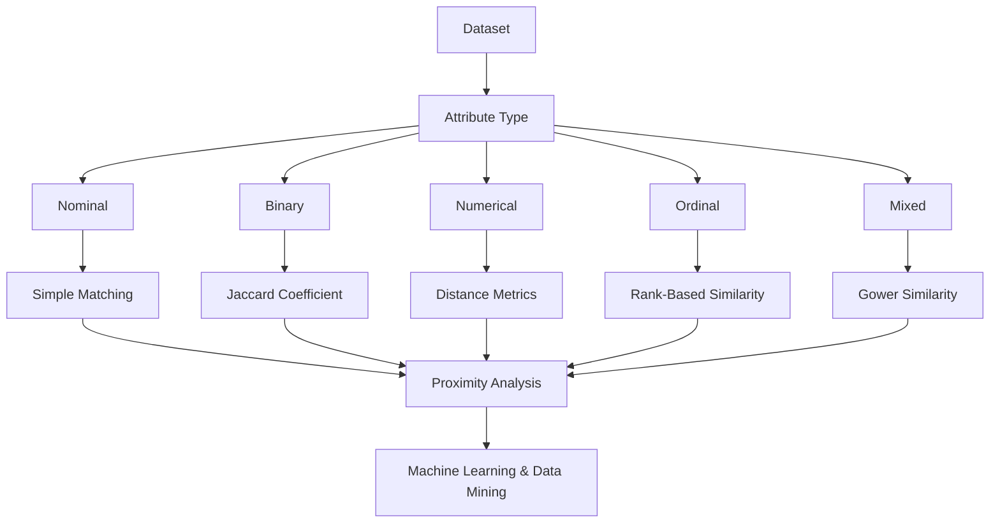

# Week 7: Proximity Measures

## Overview

Many Data Mining and Machine Learning algorithms rely on measuring how similar or dissimilar objects are. The ability to quantify similarity between data objects is fundamental to tasks such as clustering, classification, recommendation systems, anomaly detection, and information retrieval.

Proximity measures provide mathematical techniques for determining the degree of similarity or distance between objects. The choice of an appropriate proximity measure depends heavily on the nature of the underlying data, as different attribute types require different methods of comparison.

This week introduces the concept of proximity measures and explores similarity and dissimilarity analysis for nominal, binary, numerical, ordinal, and mixed attributes. It also provides practical experience in implementing proximity analysis using Python.

Understanding proximity measures is essential because they form the foundation of many advanced analytical techniques used throughout Data Science and Machine Learning.

## Learning Objectives

After completing this week, you should be able to:

- Define proximity measures and explain their importance.
- Differentiate between similarity and dissimilarity measures.
- Apply proximity analysis to nominal attributes.
- Compute similarity measures for binary data.
- Calculate distance measures for numerical attributes.
- Analyze ordinal and mixed-type datasets.
- Select appropriate proximity measures based on data characteristics.
- Implement proximity analysis techniques using Python.

## Topics Covered

### 1. [Intro](Intro.md)

This introductory topic provides an overview of proximity analysis and explains why measuring similarity between objects is important.

Key concepts include:

- Definition of proximity measures
- Similarity vs dissimilarity
- Distance measures
- Importance of proximity analysis
- Applications in Data Mining and Machine Learning

Common applications include:

- Clustering
- Classification
- Recommendation Systems
- Pattern Recognition
- Anomaly Detection

### 2. [L1](L1/)

Lesson 1 explores proximity measures for various attribute types.

Topics include:

#### [Proximity Analysis for Nominal Attributes](L1/1.%20Proximity%20Analysis%20for%20Nominal%20Attributes.md)

Introduces similarity measures for categorical attributes using matching-based approaches.

Typical techniques include:

- Simple Matching Coefficient (SMC)
- Dissimilarity Measures

#### [Proximity Analysis for Binary Attributes](L1/2.%20Proximity%20Analysis%20for%20Binary%20Attributes.md)

Explores similarity measures for binary data.

Topics include:

- Symmetric binary attributes
- Asymmetric binary attributes
- Jaccard Coefficient
- Simple Matching Coefficient

#### [Proximity Analysis for Numerical Attributes](L1/3.%20Proximity%20Analysis%20for%20Numerical%20Attributes.md)

Discusses distance measures for quantitative data.

Common techniques include:

- Euclidean Distance
- Manhattan Distance
- Minkowski Distance
- Cosine Similarity

#### [Proximity Analysis for Ordinal & Mixed Attributes](L1/4.%20Proximity%20Analysis%20for%20Ordinal%20%26%20Mixed%20Attributes.md)

Introduces methods for analyzing ordered and heterogeneous datasets.

Topics include:

- Rank transformation
- Ordinal similarity measures
- Gower Similarity Coefficient
- Mixed-attribute analysis

### 3. [Lab 7.1: Proximity Analysis on Different Types of Attributes](Lab%207.1_%20Proximity%20Analysis%20on%20different%20types%20of%20attributes.ipynb)

This practical laboratory exercise provides hands-on experience in computing proximity measures for different attribute types.

Typical activities include:

- Calculating similarity for nominal attributes
- Computing Jaccard similarity for binary data
- Measuring Euclidean and Manhattan distances
- Performing similarity analysis on mixed datasets
- Comparing proximity measures across different data types

Students will implement these techniques using Python libraries such as:

- NumPy
- Pandas
- Scikit-learn
- SciPy

The lab bridges theoretical concepts with practical implementation.

## Conceptual Relationship

## Week Navigation

| Resource | Description |
|-----------|-------------|
| [Intro](Intro.md) | Introduction to proximity measures and similarity analysis |
| [L1](L1/) | Core lesson materials covering proximity measures for various attribute types |
| [Lab 7.1: Proximity Analysis on Different Types of Attributes](Lab%207.1_%20Proximity%20Analysis%20on%20different%20types%20of%20attributes.ipynb) | Practical implementation of similarity and distance measures |

## Real-World Applications

| Domain | Application |
|---------|-------------|
| E-Commerce | Product recommendation systems |
| Healthcare | Patient similarity and disease diagnosis |
| Finance | Fraud detection and customer profiling |
| Social Media | User recommendation and community detection |
| Marketing | Customer segmentation |
| Text Analytics | Document similarity and information retrieval |

## Key Takeaways

- Proximity measures quantify similarity or dissimilarity between data objects.
- Different data types require different similarity and distance measures.
- Nominal and binary attributes typically use matching-based similarity measures.
- Numerical attributes commonly use distance metrics such as Euclidean distance.
- Mixed datasets often require specialized measures such as Gower similarity.
- Proximity analysis forms the basis of many machine learning and data mining algorithms.

## Prerequisites for Future Topics

The concepts introduced in this week provide the foundation for:

- Clustering
- Classification
- Recommendation Systems
- Anomaly Detection
- Pattern Recognition
- Machine Learning
- Data Mining
- Similarity Search
