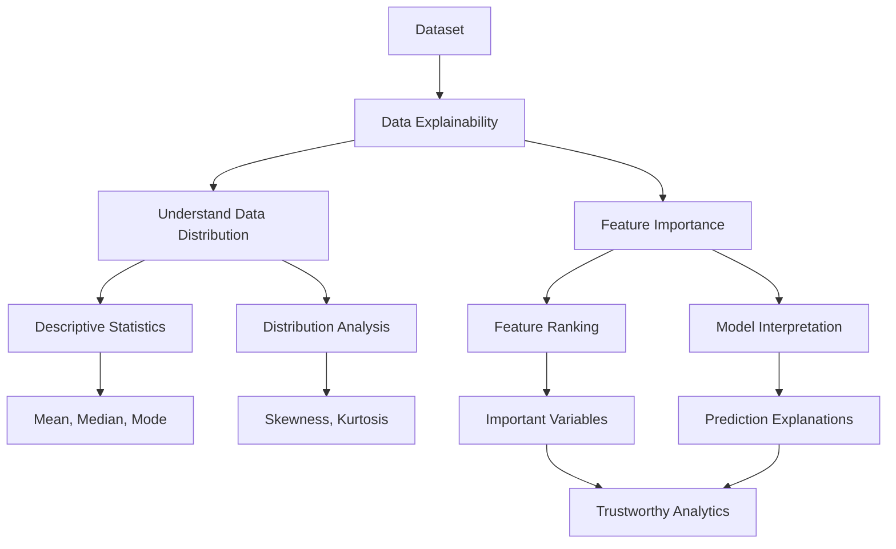

# Lesson 1: Data Explainability and Understanding Data Distributions

## Overview

Understanding data is the first and most important step in any Data Science or Machine Learning project. Before building predictive models or performing advanced analytics, analysts must thoroughly explore and interpret the underlying characteristics of the dataset.

Data explainability refers to the ability to understand, interpret, and communicate insights derived from data and analytical models. At the data level, explainability involves understanding how data is distributed, identifying important variables, detecting unusual patterns, and determining which features contribute most significantly to predictions.

This lesson introduces methods for understanding data distributions using descriptive analytical techniques and explores feature importance methods that help explain the influence of variables within machine learning models.

By understanding both data distributions and feature importance, analysts can build more interpretable, transparent, and trustworthy analytical systems.

## Learning Objectives

After completing this lesson, you should be able to:

- Explain the concept of data explainability.
- Understand the importance of analyzing data distributions.
- Interpret descriptive statistical measures.
- Identify different types of data distributions.
- Understand the concept of feature importance.
- Explain how features influence model predictions.
- Apply explainability techniques to improve model transparency.
- Interpret feature contribution results.

## Topics Covered

### 1. [Intro](Intro.md)

This introductory topic provides an overview of data explainability and its significance in modern Data Science and Artificial Intelligence.

Key concepts include:

- Definition of explainability
- Importance of interpretable analytics
- Explainable Artificial Intelligence (XAI)
- Transparency and accountability in AI systems
- Understanding data before modeling

Explainability helps analysts and stakeholders:

- Trust analytical outcomes
- Validate model behavior
- Detect bias and anomalies
- Improve decision-making

### 2. [Data Explainability Understanding for Data Distribution](1.%20Data%20Explanability%20Understanding%20for%20Data%20Distribution.md)

Understanding data distribution is fundamental for selecting appropriate analytical techniques and statistical models.

This topic introduces:

- Measures of central tendency
- Measures of dispersion
- Distribution characteristics
- Shape of distributions
- Data spread and variability

Important statistical measures include:

- Mean
- Median
- Mode
- Variance
- Standard Deviation
- Range

Understanding these measures provides valuable insights into the structure of the dataset.

### 3. [Data Explainability Understanding for Data Distribution 2](2.%20Data%20Explanability%20Understanding%20for%20Data%20Distribution%202.md)

This topic extends the understanding of data distributions by exploring advanced distribution characteristics.

Concepts may include:

- Skewness
- Kurtosis
- Normal Distribution
- Probability Distributions
- Distribution Visualization
- Detection of anomalies and unusual observations

Understanding distribution shapes helps analysts:

- Detect non-normality
- Identify outliers
- Select suitable modeling approaches
- Interpret data behavior more effectively

Common distribution patterns include:

- Symmetric distributions
- Positively skewed distributions
- Negatively skewed distributions
- Multimodal distributions

### 4. [Data Explainability Feature Importance I](3.%20Data%20Explanability%20Feature%20Importance%20I.md)

Feature importance techniques quantify the contribution of individual variables to predictive outcomes.

This topic introduces foundational concepts of feature importance, including:

- Importance scores
- Feature ranking
- Model interpretability
- Variable influence analysis

Feature importance helps answer questions such as:

- Which variables are most influential?
- Which features contribute least?
- Which variables can potentially be removed?

Understanding feature importance improves model transparency and interpretability.

### 5. [Data Explainability Feature Importance II](4.%20Data%20Explanability%20Feature%20Importance%20II.md)

This topic extends feature importance analysis by introducing advanced explainability methods.

Potential concepts include:

- Global feature importance
- Local feature importance
- Model-specific interpretation
- Model-agnostic interpretation

Advanced explainability techniques often include:

- SHAP values
- LIME explanations
- Permutation importance
- Tree-based feature importance

These methods enable analysts to explain both overall model behavior and individual predictions.

## Conceptual Relationship

## Lesson Navigation

| Resource | Description |
|-----------|-------------|
| 📄 [Intro](Intro.md) | Introduction to data explainability concepts and their importance |
| 📄 [Data Explainability Understanding for Data Distribution](1.%20Data%20Explanability%20Understanding%20for%20Data%20Distribution.md) | Fundamental concepts for understanding data distributions |
| 📄 [Data Explainability Understanding for Data Distribution 2](2.%20Data%20Explanability%20Understanding%20for%20Data%20Distribution%202.md) | Advanced concepts related to data distribution analysis |
| 📄 [Data Explainability Feature Importance I](3.%20Data%20Explanability%20Feature%20Importance%20I.md) | Introduction to feature importance and variable influence |
| 📄 [Data Explainability Feature Importance II](4.%20Data%20Explanability%20Feature%20Importance%20II.md) | Advanced techniques for model interpretation and explainability |

## Real-World Applications

| Domain | Application |
|---------|-------------|
| Healthcare | Explaining disease prediction models and diagnostic factors |
| Finance | Understanding credit scoring and loan approval decisions |
| Retail | Identifying factors influencing customer purchases |
| Marketing | Determining drivers of campaign performance |
| Insurance | Understanding risk prediction variables |
| Artificial Intelligence | Building transparent and accountable AI systems |

## Key Takeaways

- Data explainability improves understanding, transparency, and trust in analytical systems.
- Understanding data distributions is essential before performing advanced analysis.
- Descriptive statistics summarize important characteristics of datasets.
- Distribution analysis helps identify patterns, anomalies, and data quality issues.
- Feature importance techniques identify the variables that most influence predictions.
- Explainability techniques increase confidence in machine learning models.
- Transparent models support better decision-making and ethical AI practices.

## Prerequisites for Future Topics

The concepts introduced in this lesson provide the foundation for:

- Exploratory Data Analysis (EDA)
- Statistical Analysis
- Machine Learning
- Explainable AI (XAI)
- Model Evaluation
- Feature Engineering
- Predictive Analytics
- Ethical Artificial Intelligence
