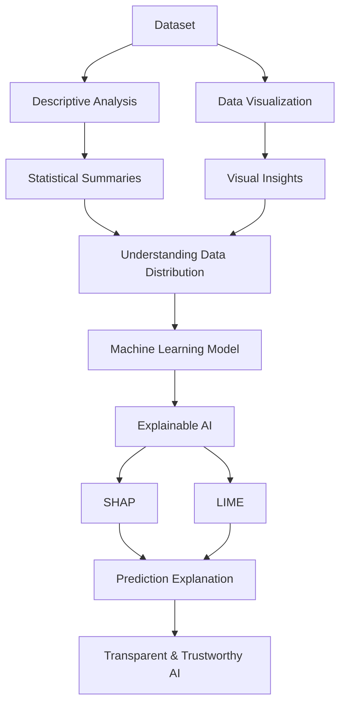

# Week 8: Data Explainability

## Overview

As data-driven systems become increasingly complex, understanding how data behaves and how machine learning models arrive at their predictions has become critically important. Data explainability focuses on making datasets, analytical results, and machine learning predictions transparent, interpretable, and understandable to humans.

In Data Science, explainability begins with understanding the underlying characteristics of the data itself. Descriptive statistics and visualization techniques help analysts explore data distributions, identify patterns, detect anomalies, and communicate insights effectively.

With the rise of sophisticated machine learning models, explainability has expanded to include techniques that explain model behavior and prediction outcomes. Methods such as SHAP and LIME provide insights into how features influence predictions, thereby increasing trust, accountability, and transparency in AI systems.

This week introduces descriptive analytical techniques, visualization methods, and modern Explainable Artificial Intelligence (XAI) approaches.

## Learning Objectives

After completing this week, you should be able to:

- Explain the importance of data and model explainability.
- Understand data distributions using descriptive statistics.
- Interpret measures of central tendency and dispersion.
- Visualize data distributions using appropriate charts.
- Identify patterns, trends, and anomalies through visualization.
- Explain the purpose of Explainable AI (XAI).
- Interpret model predictions using SHAP and LIME.
- Communicate analytical findings effectively.

## Topics Covered

### 1. [L1](L1/)

Lesson 1 focuses on understanding and explaining data through descriptive and visual analytical techniques.

Typical concepts include:

- Descriptive statistics
- Data distribution analysis
- Measures of central tendency
- Measures of dispersion
- Data visualization
- Exploratory Data Analysis (EDA)
- Understanding patterns and anomalies

These techniques help analysts gain insights into the structure and characteristics of datasets before applying advanced analytical methods.

### 2. [Lab 8.1: Understanding Data Distribution through Descriptive Analytical Techniques](Lab%208.1_%20Understanding%20data%20distribution%20through%20descriptive%20analytical%20techniques.ipynb)

This practical laboratory exercise introduces descriptive analytical techniques used to summarize and understand datasets.

Typical activities include:

- Calculating mean, median, and mode
- Measuring variance and standard deviation
- Computing quartiles and percentiles
- Understanding skewness and kurtosis
- Generating descriptive summaries
- Interpreting distribution characteristics

Python libraries commonly used include:

- Pandas
- NumPy
- SciPy

These techniques provide a statistical foundation for understanding dataset behavior.

### 3. [Lab 8.2: Understanding Data Distribution through Data Visualization](Lab%208.2_%20Understanding%20data%20distribution%20through%20data%20visualization.ipynb)

Visualization is one of the most effective ways to understand and communicate data patterns.

This laboratory exercise focuses on exploring data distributions visually.

Typical activities include:

- Creating histograms
- Generating box plots
- Creating scatter plots
- Producing bar charts
- Visualizing correlations
- Identifying trends and outliers

Common visualization libraries include:

- Matplotlib
- Seaborn
- Plotly

Visualization techniques help uncover insights that may not be apparent through numerical summaries alone.

### 4. [Lab 8.3: SHAP and LIME](Lab%208.3_%20SHAP%20and%20LIME.ipynb)

Modern machine learning models often operate as "black boxes," making it difficult to understand how predictions are generated.

This laboratory exercise introduces two widely used Explainable AI techniques:

#### SHAP (SHapley Additive exPlanations)

SHAP explains model predictions by assigning contribution scores to each feature.

Key capabilities include:

- Global model interpretation
- Local prediction explanation
- Feature importance analysis
- Visualization of feature contributions

#### LIME (Local Interpretable Model-Agnostic Explanations)

LIME explains individual predictions by approximating complex models locally with simpler interpretable models.

Key capabilities include:

- Instance-level explanations
- Model-agnostic interpretation
- Understanding prediction behavior

These techniques improve transparency, trust, fairness, and accountability in AI systems.

## Conceptual Relationship

## Week Navigation

| Resource | Description |
|-----------|-------------|
| 📁 [L1](L1/) | Core lesson materials covering descriptive analysis and data explainability |
| 📓 [Lab 8.1: Understanding Data Distribution through Descriptive Analytical Techniques](Lab%208.1_%20Understanding%20data%20distribution%20through%20descriptive%20analytical%20techniques.ipynb) | Practical implementation of descriptive statistical techniques |
| 📓 [Lab 8.2: Understanding Data Distribution through Data Visualization](Lab%208.2_%20Understanding%20data%20distribution%20through%20data%20visualization.ipynb) | Practical exploration of data distributions through visualization |
| 📓 [Lab 8.3: SHAP and LIME](Lab%208.3_%20SHAP%20and%20LIME.ipynb) | Practical introduction to Explainable AI techniques |

## Real-World Applications

| Domain | Application |
|---------|-------------|
| Healthcare | Explaining disease prediction models |
| Finance | Interpreting credit scoring decisions |
| Retail | Understanding customer behavior patterns |
| Marketing | Explaining customer segmentation models |
| Insurance | Interpreting claim risk predictions |
| Artificial Intelligence | Building transparent and trustworthy AI systems |

## Key Takeaways

- Data explainability helps analysts understand both datasets and model predictions.
- Descriptive statistics summarize and explain dataset characteristics.
- Visualization techniques reveal hidden patterns, trends, and anomalies.
- Explainable AI techniques increase transparency in machine learning systems.
- SHAP provides feature contribution explanations based on game theory.
- LIME explains individual predictions using local approximations.
- Explainability is essential for building trustworthy, ethical, and accountable AI systems.

## Prerequisites for Future Topics

The concepts introduced in this week provide the foundation for:

- Exploratory Data Analysis (EDA)
- Machine Learning
- Explainable AI (XAI)
- Model Evaluation
- Ethical AI
- Predictive Analytics
- Data Visualization
- Artificial Intelligence Governance
