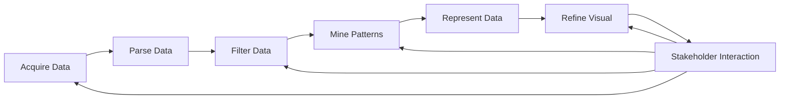

# Visualization Lifecycle

```mermaid
flowchart LR

A[Acquire Data]
--> B[Parse Data]
--> C[Filter Data]
--> D[Mine Patterns]
--> E[Represent Data]
--> F[Refine Visual]
--> G[Stakeholder Interaction]

G --> F
G --> D
G --> C
G --> A
```
