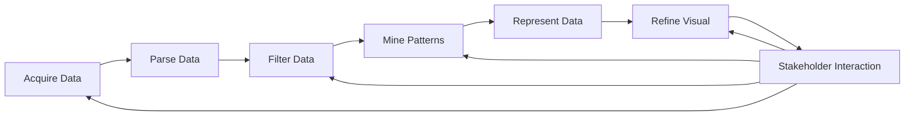

![[Pasted image 20260527230732.png]]
# Table of Contents

1. [Introduction to the Seven Stages of Data Visualization](https://chatgpt.com/g/g-p-6a0d41583fe88191a2893b540108b3b5-msc-data-science/c/6a10ae9f-5308-8321-80ea-23d7426ab7ae#1-introduction-to-the-seven-stages-of-data-visualization)  
    1.1 [Purpose of the Visualization Workflow](https://chatgpt.com/g/g-p-6a0d41583fe88191a2893b540108b3b5-msc-data-science/c/6a10ae9f-5308-8321-80ea-23d7426ab7ae#11-purpose-of-the-visualization-workflow)  
    1.2 [Visualization as an Iterative System](https://chatgpt.com/g/g-p-6a0d41583fe88191a2893b540108b3b5-msc-data-science/c/6a10ae9f-5308-8321-80ea-23d7426ab7ae#12-visualization-as-an-iterative-system)
    
2. [Foundational Concepts Before Visualization](https://chatgpt.com/g/g-p-6a0d41583fe88191a2893b540108b3b5-msc-data-science/c/6a10ae9f-5308-8321-80ea-23d7426ab7ae#2-foundational-concepts-before-visualization)  
    2.1 [Understanding Variables and Attributes](https://chatgpt.com/g/g-p-6a0d41583fe88191a2893b540108b3b5-msc-data-science/c/6a10ae9f-5308-8321-80ea-23d7426ab7ae#21-understanding-variables-and-attributes)  
    2.2 [Numerical vs Textual Data](https://chatgpt.com/g/g-p-6a0d41583fe88191a2893b540108b3b5-msc-data-science/c/6a10ae9f-5308-8321-80ea-23d7426ab7ae#22-numerical-vs-textual-data)  
    2.3 [Primary Variables of Interest](https://chatgpt.com/g/g-p-6a0d41583fe88191a2893b540108b3b5-msc-data-science/c/6a10ae9f-5308-8321-80ea-23d7426ab7ae#23-primary-variables-of-interest)
    
3. [The Seven Stages of Data Visualization](https://chatgpt.com/g/g-p-6a0d41583fe88191a2893b540108b3b5-msc-data-science/c/6a10ae9f-5308-8321-80ea-23d7426ab7ae#3-the-seven-stages-of-data-visualization)  
    3.1 [Stage 1: Acquiring Data](https://chatgpt.com/g/g-p-6a0d41583fe88191a2893b540108b3b5-msc-data-science/c/6a10ae9f-5308-8321-80ea-23d7426ab7ae#31-stage-1-acquiring-data)  
    3.2 [Stage 2: Parsing Data](https://chatgpt.com/g/g-p-6a0d41583fe88191a2893b540108b3b5-msc-data-science/c/6a10ae9f-5308-8321-80ea-23d7426ab7ae#32-stage-2-parsing-data)  
    3.3 [Stage 3: Filtering Data](https://chatgpt.com/g/g-p-6a0d41583fe88191a2893b540108b3b5-msc-data-science/c/6a10ae9f-5308-8321-80ea-23d7426ab7ae#33-stage-3-filtering-data)  
    3.4 [Stage 4: Mining Data](https://chatgpt.com/g/g-p-6a0d41583fe88191a2893b540108b3b5-msc-data-science/c/6a10ae9f-5308-8321-80ea-23d7426ab7ae#34-stage-4-mining-data)  
    3.5 [Stage 5: Representing Data](https://chatgpt.com/g/g-p-6a0d41583fe88191a2893b540108b3b5-msc-data-science/c/6a10ae9f-5308-8321-80ea-23d7426ab7ae#35-stage-5-representing-data)  
    3.6 [Stage 6: Refining Visualizations](https://chatgpt.com/g/g-p-6a0d41583fe88191a2893b540108b3b5-msc-data-science/c/6a10ae9f-5308-8321-80ea-23d7426ab7ae#36-stage-6-refining-visualizations)  
    3.7 [Stage 7: Interaction and Feedback](https://chatgpt.com/g/g-p-6a0d41583fe88191a2893b540108b3b5-msc-data-science/c/6a10ae9f-5308-8321-80ea-23d7426ab7ae#37-stage-7-interaction-and-feedback)
    
4. [Detailed Case Study: Election Voter Turnout Visualization](https://chatgpt.com/g/g-p-6a0d41583fe88191a2893b540108b3b5-msc-data-science/c/6a10ae9f-5308-8321-80ea-23d7426ab7ae#4-detailed-case-study-election-voter-turnout-visualization)  
    4.1 [Acquisition from Election Commission Data](https://chatgpt.com/g/g-p-6a0d41583fe88191a2893b540108b3b5-msc-data-science/c/6a10ae9f-5308-8321-80ea-23d7426ab7ae#41-acquisition-from-election-commission-data)  
    4.2 [Parsing the Dataset Structure](https://chatgpt.com/g/g-p-6a0d41583fe88191a2893b540108b3b5-msc-data-science/c/6a10ae9f-5308-8321-80ea-23d7426ab7ae#42-parsing-the-dataset-structure)  
    4.3 [Filtering by Voter Turnout Ratio](https://chatgpt.com/g/g-p-6a0d41583fe88191a2893b540108b3b5-msc-data-science/c/6a10ae9f-5308-8321-80ea-23d7426ab7ae#43-filtering-by-voter-turnout-ratio)  
    4.4 [Mining Hidden Patterns](https://chatgpt.com/g/g-p-6a0d41583fe88191a2893b540108b3b5-msc-data-science/c/6a10ae9f-5308-8321-80ea-23d7426ab7ae#44-mining-hidden-patterns)  
    4.5 [Initial Visualization Problems](https://chatgpt.com/g/g-p-6a0d41583fe88191a2893b540108b3b5-msc-data-science/c/6a10ae9f-5308-8321-80ea-23d7426ab7ae#45-initial-visualization-problems)  
    4.6 [Refined Visualization Design](https://chatgpt.com/g/g-p-6a0d41583fe88191a2893b540108b3b5-msc-data-science/c/6a10ae9f-5308-8321-80ea-23d7426ab7ae#46-refined-visualization-design)  
    4.7 [Stakeholder Interaction and Iteration](https://chatgpt.com/g/g-p-6a0d41583fe88191a2893b540108b3b5-msc-data-science/c/6a10ae9f-5308-8321-80ea-23d7426ab7ae#47-stakeholder-interaction-and-iteration)
    
5. [Gestalt Principles in Visualization](https://chatgpt.com/g/g-p-6a0d41583fe88191a2893b540108b3b5-msc-data-science/c/6a10ae9f-5308-8321-80ea-23d7426ab7ae#5-gestalt-principles-in-visualization)  
    5.1 [Similarity Principle](https://chatgpt.com/g/g-p-6a0d41583fe88191a2893b540108b3b5-msc-data-science/c/6a10ae9f-5308-8321-80ea-23d7426ab7ae#51-similarity-principle)  
    5.2 [Focus Principle](https://chatgpt.com/g/g-p-6a0d41583fe88191a2893b540108b3b5-msc-data-science/c/6a10ae9f-5308-8321-80ea-23d7426ab7ae#52-focus-principle)  
    5.3 [Figure-Ground Principle](https://chatgpt.com/g/g-p-6a0d41583fe88191a2893b540108b3b5-msc-data-science/c/6a10ae9f-5308-8321-80ea-23d7426ab7ae#53-figure-ground-principle)
    
6. [Chart Selection and Design Thinking](https://chatgpt.com/g/g-p-6a0d41583fe88191a2893b540108b3b5-msc-data-science/c/6a10ae9f-5308-8321-80ea-23d7426ab7ae#6-chart-selection-and-design-thinking)  
    6.1 [Simple vs Ordered Bar Charts](https://chatgpt.com/g/g-p-6a0d41583fe88191a2893b540108b3b5-msc-data-science/c/6a10ae9f-5308-8321-80ea-23d7426ab7ae#61-simple-vs-ordered-bar-charts)  
    6.2 [When to Use Horizontal Bar Charts](https://chatgpt.com/g/g-p-6a0d41583fe88191a2893b540108b3b5-msc-data-science/c/6a10ae9f-5308-8321-80ea-23d7426ab7ae#62-when-to-use-horizontal-bar-charts)  
    6.3 [Why Ordering Matters](https://chatgpt.com/g/g-p-6a0d41583fe88191a2893b540108b3b5-msc-data-science/c/6a10ae9f-5308-8321-80ea-23d7426ab7ae#63-why-ordering-matters)
    
7. [Visualization as an Iterative Analytical System](https://chatgpt.com/g/g-p-6a0d41583fe88191a2893b540108b3b5-msc-data-science/c/6a10ae9f-5308-8321-80ea-23d7426ab7ae#7-visualization-as-an-iterative-analytical-system)
    
8. [Visualization Decision Framework](https://chatgpt.com/g/g-p-6a0d41583fe88191a2893b540108b3b5-msc-data-science/c/6a10ae9f-5308-8321-80ea-23d7426ab7ae#8-visualization-decision-framework)
    
9. [Golden Rules of Effective Data Visualization](https://chatgpt.com/g/g-p-6a0d41583fe88191a2893b540108b3b5-msc-data-science/c/6a10ae9f-5308-8321-80ea-23d7426ab7ae#9-golden-rules-of-effective-data-visualization)
    

---

# 1. Introduction to the Seven Stages of Data Visualization

## 1.1 Purpose of the Visualization Workflow

The lecture introduces a structured framework called the **Seven Stages of Data Visualization**. These stages define how raw information evolves into meaningful visual communication.

The framework exists because visualization is not simply “drawing charts.” It involves:

- collecting reliable data
    
- understanding data structure
    
- filtering information
    
- discovering patterns
    
- constructing visuals
    
- refining communication
    
- interacting with stakeholders
    

The lecture emphasizes that effective visualization is fundamentally a **process of analytical storytelling**.

---

## 1.2 Visualization as an Iterative System

A major insight from the lecture is that visualization is:

- **iterative**
    
- **sequential**
    
- sometimes **parallel**
    

This is critical because beginners often assume dashboards are built linearly.

The instructor explicitly states:

> visualization development repeatedly loops between data, analysis, refinement, and stakeholder feedback.

This mirrors real-world analytics workflows in:

- Business Intelligence
    
- Product Analytics
    
- Data Science
    
- Government Reporting
    
- ML Monitoring Systems
    

---

# 2. Foundational Concepts Before Visualization

## 2.1 Understanding Variables and Attributes

Before selecting charts, analysts must understand the dataset structure.

The lecture refers to:

- variables
    
- attributes
    
- components
    
- columns
    

These are the building blocks of visualization.

### Example Variables from the Election Dataset

|Variable|Type|Description|
|---|---|---|
|State Name|Categorical|Indian state/region|
|Number of Electors|Numerical Discrete|Total eligible voters|
|Polling Stations|Numerical Discrete|Number of polling booths|
|Postal Ballots|Numerical Discrete|Votes cast via ballots|
|Total Votes|Numerical Discrete|Aggregate vote count|
|Voter Turnout Ratio|Numerical Continuous|Percentage turnout|

---

## 2.2 Numerical vs Textual Data

The lecture highlights that parsing helps determine:

- whether data is textual
    
- numerical
    
- mixed
    
- incomplete
    
- inconsistent
    

This distinction directly affects:

- chart selection
    
- aggregation logic
    
- sorting capability
    
- statistical analysis
    

### Example

|Data Type|Suitable Charts|
|---|---|
|Categorical|Bar chart|
|Numerical Continuous|Histogram|
|Time Series|Line chart|
|Binary|Stacked bar|

---

## 2.3 Primary Variables of Interest

The lecture repeatedly emphasizes the concept of a **main variable of interest**.

In this example:

> The primary variable is the voter turnout ratio.

This matters because visualization design should revolve around the key analytical question.

Without identifying the primary metric:

- visuals become cluttered
    
- dashboards lose focus
    
- stakeholders get confused
    

---

# 3. The Seven Stages of Data Visualization

# 3.1 Stage 1: Acquiring Data

## Definition

**Data Acquisition** is the process of collecting data from one or more sources.

The lecture explains that data often comes from:

- websites
    
- Excel files
    
- CSV files
    
- APIs
    
- multiple external systems
    

---

## Example from Lecture

Source:

- Election Commission of India website
    

The dataset was downloaded in Excel format.

---

## Important Warning: Format Compatibility

The lecture gives a practical warning:

> Ensure compatibility between your software and your data format.

### Example

If visualization software cannot process:

- `.xlsx`
    
- `.csv`
    
- `.json`
    

then the acquisition pipeline fails immediately.

---

## Business Insight

Poor acquisition practices create downstream problems:

- dashboard failures
    
- incorrect KPIs
    
- broken pipelines
    
- inconsistent reporting
    

This is why enterprise BI teams heavily standardize ingestion pipelines.

---

# 3.2 Stage 2: Parsing Data

## Definition

**Parsing** means understanding:

- dataset structure
    
- columns
    
- variables
    
- missing values
    
- data integrity
    

The lecture describes parsing as:

> “eyeballing” the data structure.

---

## Key Questions During Parsing

- What are the variables?
    
- Which are numerical?
    
- Which are categorical?
    
- Are there null values?
    
- Are formats consistent?
    

---

## Example from Lecture

The dataset contains:

- state names
    
- polling stations
    
- total votes
    
- turnout ratio
    

The analyst identifies:

```text
Primary variable of interest = Voter Turnout Ratio
```

---

## Business Insight

Parsing prevents catastrophic reporting errors.

Example:

If percentages are interpreted as raw counts:

```text
66% → 66
```

instead of:

```text
0.66
```

then analytical conclusions become invalid.

---

# 3.3 Stage 3: Filtering Data

## Definition

**Filtering** means partitioning the data based on important variables.

The lecture explains filtering using:

- gender
    
- categories
    
- turnout ratio
    

---

## Core Purpose of Filtering

Filtering enables:

- segmentation
    
- subgroup analysis
    
- ranking
    
- conditional comparisons
    

---

## Example from Lecture

The data is sorted:

```text
Highest voter turnout → Lowest voter turnout
```

Result:

- Lakshadweep at top
    
- Bihar at bottom
    

---

## Specific Numbers

|State|Turnout|
|---|---|
|Lakshadweep|Highest|
|Bihar|Lowest|
|All India Average|66.1%|

---

## Use of Color During Filtering

The lecture introduces a Gestalt principle:

- Blue = Above national average
    
- Brown = Below national average
    

This immediately creates cognitive grouping.

---

## Business Insight

Filtering converts “raw data” into “decision-ready data.”

Example:

A policymaker can instantly identify:

- low-performing states
    
- intervention zones
    
- benchmark outliers
    

---

# 3.4 Stage 4: Mining Data

## Definition

**Data Mining** is the process of discovering patterns and relationships in data.

The lecture describes mining as:

> uncovering hidden patterns.

---

## Key Mining Questions

- What patterns exist?
    
- What anomalies appear?
    
- Which groups outperform?
    
- Which variables correlate?
    

---

## Example from Lecture

Mining reveals:

```text
States above national average = 23
States below national average = 13
```

---

## Analytical Insight

This is important because the raw dataset did not explicitly contain:

```text
Above average = TRUE/FALSE
```

The analyst discovered it through mining.

---

## Potential Derived Metrics Mentioned

The instructor also suggests:

- voters per polling station
    
- transformed metrics
    
- percentage metrics
    

These are examples of **feature engineering** in analytics.

---

## Business Insight

Mining converts data into insight.

Without mining:

- dashboards remain descriptive
    
- no strategic conclusions emerge
    

---

# 3.5 Stage 5: Representing Data

## Definition

**Representation** is the first visual expression of the data.

This stage uses simple charts to communicate findings.

---

## Example from Lecture

Initial visualization:

- simple horizontal bar chart
    
- alphabetical ordering
    

Problem:

> The chart failed to communicate the mined insight.

---

## Why the First Chart Failed

Although technically correct, it lacked:

- ordering
    
- emphasis
    
- benchmark comparison
    
- storytelling
    

This is a critical lesson:

> Correct charts can still be ineffective charts.

---

# 3.6 Stage 6: Refining Visualizations

## Definition

**Refinement** means improving the visual so it communicates insight more effectively.

---

## Refinements Introduced

### 1. Ordered Bars

The bars are reordered:

```text
Highest turnout → Lowest turnout
```

### 2. National Average Line

A reference line at:

```text
66.1%
```

was added.

### 3. Focus Principle

The benchmark line visually stands out.

### 4. Color Encoding

- Above average states
    
- Below average states
    

### 5. Highlighting Extremes

- Lakshadweep highlighted
    
- Bihar highlighted
    

---

## Result

The refined chart now communicates:

- ranking
    
- benchmark comparison
    
- distribution
    
- top performer
    
- worst performer
    
- counts above/below average
    

all simultaneously.

---

## Business Insight

Refinement transforms charts from:

```text
Data display
```

into:

```text
Decision-support systems
```

---

# 3.7 Stage 7: Interaction and Feedback

## Definition

The final stage involves presenting visuals to stakeholders and gathering feedback.

---

## Key Insight from Lecture

Stakeholder questions may require:

- new filters
    
- deeper mining
    
- additional variables
    
- entirely new data sources
    

---

## Example from Lecture

Stakeholder asks:

```text
What is the region-wise performance?
```

Problem:

```text
Region variable does not exist.
```

Solution:

- return to acquisition stage
    
- add new variable
    
- rebuild visuals
    

---

## Business Insight

Real dashboards are rarely “finished.”

They evolve continuously because stakeholder questions evolve continuously.

---

# 4. Detailed Case Study: Election Voter Turnout Visualization

# 4.1 Acquisition from Election Commission Data

Source:

- Election Commission of India
    

Format:

- Excel dataset
    

Important operational concern:

```text
Software compatibility with Excel/CSV
```

---

# 4.2 Parsing the Dataset Structure

Identified columns:

|Column|Role|
|---|---|
|State Name|Categorical label|
|Polling Stations|Infrastructure metric|
|Total Votes|Participation metric|
|Voter Turnout Ratio|Main KPI|

---

# 4.3 Filtering by Voter Turnout Ratio

Sorting logic:

```text
Descending turnout order
```

Outcome:

|Highest|Lowest|
|---|---|
|Lakshadweep|Bihar|

---

# 4.4 Mining Hidden Patterns

Discovered insights:

|Pattern|Value|
|---|---|
|Above national average|23 states|
|Below national average|13 states|
|National benchmark|66.1%|

---

# 4.5 Initial Visualization Problems

Initial chart issues:

- alphabetical ordering
    
- weak narrative
    
- no benchmark
    
- no emphasis
    
- poor insight communication
    

This is an important distinction:

> Visualization quality is not about decoration.  
> It is about cognitive efficiency.

---

# 4.6 Refined Visualization Design

Enhancements:

|Enhancement|Purpose|
|---|---|
|Ordered bars|Show ranking|
|Benchmark line|Show comparison|
|Color grouping|Improve grouping|
|Highlight extremes|Emphasize outliers|

---

# 4.7 Stakeholder Interaction and Iteration

Stakeholder requests may force movement back into:

- acquisition
    
- mining
    
- refinement
    

This demonstrates that visualization is not a pipeline.

It is a feedback system.

---

# 5. Gestalt Principles in Visualization

## 5.1 Similarity Principle

Objects with similar appearance are perceived as related.

### Example from Lecture

- Blue bars = Above average
    
- Brown bars = Below average
    

This enables instant grouping.

---

## 5.2 Focus Principle

A visually distinct element attracts attention first.

### Example

National average line:

```text
66.1%
```

acts as a focal reference point.

---

## 5.3 Figure-Ground Principle

Foreground elements stand out against the background.

Used in:

- highlighted bars
    
- benchmark lines
    
- ordered ranking systems
    

---

# 6. Chart Selection and Design Thinking

# 6.1 Simple vs Ordered Bar Charts

|Simple Bar Chart|Ordered Bar Chart|
|---|---|
|Raw display|Analytical display|
|Weak comparison|Strong comparison|
|Harder pattern detection|Easier ranking recognition|

---

# 6.2 When to Use Horizontal Bar Charts

Use horizontal bar charts when:

- category labels are long
    
- comparing many categories
    
- ranking entities
    
- showing benchmarks
    

Examples:

- state performance
    
- department productivity
    
- sales comparisons
    
- survey rankings
    

---

# 6.3 Why Ordering Matters

Humans naturally detect:

- ranking
    
- gradients
    
- extremes
    

more efficiently when visuals are ordered.

Ordering reduces cognitive load dramatically.

---

# 7. Visualization as an Iterative Analytical System

## Visualization Lifecycle



---

# 8. Visualization Decision Framework

## What Do You Want to Show?

```text
What is your analytical objective?
│
├── Compare categories?
│   ├── Few categories → Bar Chart
│   └── Long labels/many categories → Horizontal Bar Chart
│
├── Show trend over time?
│   └── Line Chart
│
├── Show distribution?
│   ├── Numerical data → Histogram
│   ├── Outliers → Box Plot
│   └── Density comparison → Violin Plot
│
├── Show relationship?
│   ├── Numerical vs Numerical → Scatter Plot
│   └── Correlation matrix → Heatmap
│
├── Show proportions?
│   ├── Small categories → Pie Chart
│   └── Complex proportions → Stacked Bar
│
├── Show geography?
│   └── Choropleth Map
│
└── Show hierarchy?
    └── Tree Map
```

---

# Common Analytical Formulas

## Percentage Change

Used implicitly in comparative analysis.

\text{Percentage Change}=\frac{\text{New Value}-\text{Old Value}}{\text{Old Value}}\times100

---

## Voter Turnout Ratio

\text{Voter Turnout Ratio}=\frac{\text{Total Votes Cast}}{\text{Eligible Voters}}\times100

---

# Common Visualization Pitfalls

## 1. Mistaking Pretty Charts for Effective Charts

Aesthetic visuals without analytical clarity fail stakeholders.

---

## 2. Ignoring Ordering

Unordered categories obscure ranking patterns.

---

## 3. Missing Benchmarks

Without comparison baselines:

- context disappears
    
- interpretation weakens
    

---

## 4. Overloading the Graphic

Too many colors or annotations reduce readability.

---

## 5. Correlation ≠ Causation

Even if two variables move together:

```text
Correlation does not imply causal relationship.
```

---

## 6. Ignoring Stakeholder Feedback

Visualization is communication.

If the audience cannot derive insight quickly, refinement is required.

---

# 9. Golden Rules of Effective Data Visualization

1. Every chart must answer a specific analytical question.
    
2. Identify the primary variable before building visuals.
    
3. Data acquisition quality determines visualization quality.
    
4. Parsing prevents structural data mistakes.
    
5. Filtering creates meaningful analytical partitions.
    
6. Mining is where insights are discovered.
    
7. Representation is only the starting point.
    
8. Refinement transforms charts into narratives.
    
9. Stakeholder interaction is part of the visualization process, not an afterthought.
    
10. Ordering dramatically improves comprehension.
    
11. Benchmarks make charts interpretable.
    
12. Color should communicate meaning, not decoration.
    
13. Effective visuals reduce cognitive effort.
    
14. Visual hierarchy guides audience attention.
    
15. Visualization is iterative, not linear.
    
16. The best visualizations expose patterns immediately.
    
17. Dashboards should support decisions, not merely display numbers.
    
18. Good visualization systems evolve with stakeholder questions.
    
19. Simplicity improves analytical clarity.
    
20. A successful visualization tells a credible story with evidence.