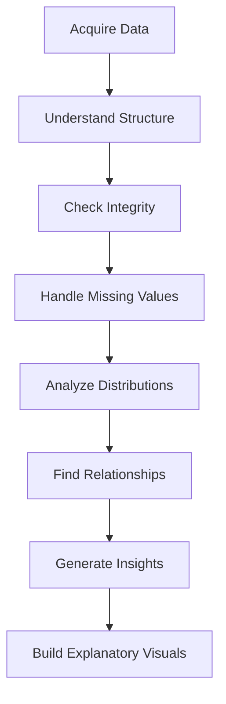

# Typical EDA Pipeline

```mermaid
flowchart TD

A[Acquire Data]
--> B[Understand Structure]

B --> C[Check Integrity]
C --> D[Handle Missing Values]

D --> E[Analyze Distributions]
E --> F[Find Relationships]

F --> G[Generate Insights]
G --> H[Build Explanatory Visuals]
```
