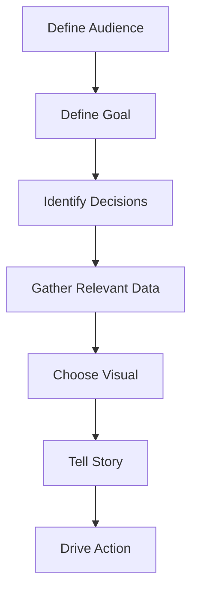

# Bias Questions

* Does the audience have preconceived beliefs?
* Could the visual be misinterpreted?

# 11. Practical Framework

Use the following workflow.

# 12. Real-World Business Example

Suppose a company wants to visualize sales data.

Same dataset.

Different contexts.

| Audience             | Visualization          |
| -------------------- | ---------------------- |
| CEO                  | KPI Dashboard          |
| Regional Manager     | Region Comparison      |
| Sales Representative | Individual Performance |
| Data Scientist       | Scatter Plot Analysis  |

Same data.

Different story.

Different visualization.

# 13. Common Mistakes
