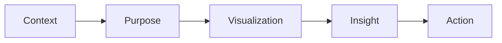

# For Analysts

Best Choice:

Scatter Plot

Reason:

* Shows relationships
* Supports investigation
* Provides deeper insight

# 9. Context and Storytelling

Data storytelling requires alignment between:

If any component is misaligned:

Communication becomes ineffective.

# 10. Questions to Build Context

Before creating any visualization, ask:
