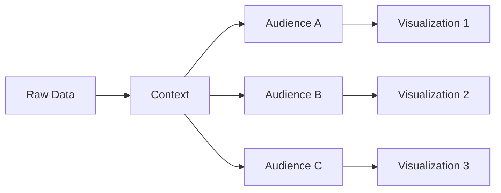

# Question 3

### Do I have sufficient data?

Sometimes additional variables must be collected.

Example:

To analyze regional voting patterns, merely having state-level turnout data is insufficient.

You may need:

* Region information
* Demographic data
* Historical trends

# 5. Context Drives Visualization Design

A common misconception is:

> Same Data = Same Visualization

This is incorrect.

The same dataset can generate entirely different visualizations depending on the audience.

# 6. Election Example from the Lecture

The instructor uses voter turnout data to illustrate context.

Assume the dataset contains:

* State-wise voter turnout
* National average turnout
* Number of voters
* Polling booth information

Different stakeholders need different insights.

# Scenario 1: National Newspaper
