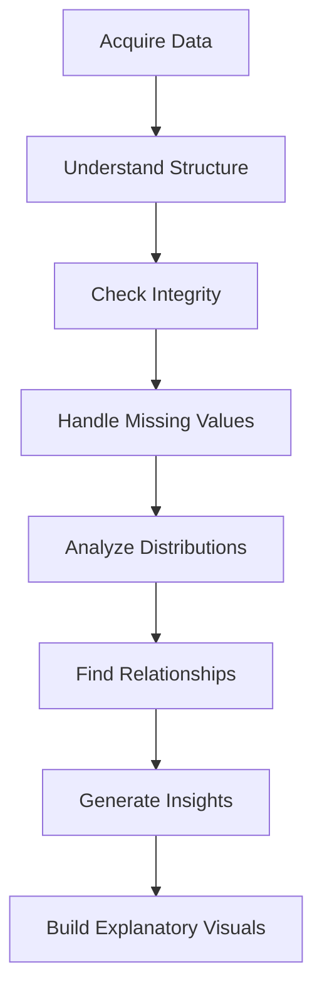

# Exploratory vs Explanatory Analysis in Data Visualization

Source Transcript:

# Table of Contents

1. [Introduction to Exploratory and Explanatory Analysis](https://chatgpt.com/g/g-p-6a0d41583fe88191a2893b540108b3b5-msc-data-science/c/6a10ae9f-5308-8321-80ea-23d7426ab7ae#1-introduction-to-exploratory-and-explanatory-analysis)  
    1.1 [Why These Concepts Matter](https://chatgpt.com/g/g-p-6a0d41583fe88191a2893b540108b3b5-msc-data-science/c/6a10ae9f-5308-8321-80ea-23d7426ab7ae#11-why-these-concepts-matter)  
    1.2 [Visualization as a Philosophical Process](https://chatgpt.com/g/g-p-6a0d41583fe88191a2893b540108b3b5-msc-data-science/c/6a10ae9f-5308-8321-80ea-23d7426ab7ae#12-visualization-as-a-philosophical-process)
    
2. [Understanding Exploratory Analysis](https://chatgpt.com/g/g-p-6a0d41583fe88191a2893b540108b3b5-msc-data-science/c/6a10ae9f-5308-8321-80ea-23d7426ab7ae#2-understanding-exploratory-analysis)  
    2.1 [Definition of Exploratory Analysis](https://chatgpt.com/g/g-p-6a0d41583fe88191a2893b540108b3b5-msc-data-science/c/6a10ae9f-5308-8321-80ea-23d7426ab7ae#21-definition-of-exploratory-analysis)  
    2.2 [Goals of Exploratory Data Analysis (EDA)](https://chatgpt.com/g/g-p-6a0d41583fe88191a2893b540108b3b5-msc-data-science/c/6a10ae9f-5308-8321-80ea-23d7426ab7ae#22-goals-of-exploratory-data-analysis-eda)  
    2.3 [Questions Asked During EDA](https://chatgpt.com/g/g-p-6a0d41583fe88191a2893b540108b3b5-msc-data-science/c/6a10ae9f-5308-8321-80ea-23d7426ab7ae#23-questions-asked-during-eda)  
    2.4 [Variables, Structure, and Integrity](https://chatgpt.com/g/g-p-6a0d41583fe88191a2893b540108b3b5-msc-data-science/c/6a10ae9f-5308-8321-80ea-23d7426ab7ae#24-variables-structure-and-integrity)  
    2.5 [Exploratory Analysis and Data Diversity](https://chatgpt.com/g/g-p-6a0d41583fe88191a2893b540108b3b5-msc-data-science/c/6a10ae9f-5308-8321-80ea-23d7426ab7ae#25-exploratory-analysis-and-data-diversity)
    
3. [Understanding Explanatory Analysis](https://chatgpt.com/g/g-p-6a0d41583fe88191a2893b540108b3b5-msc-data-science/c/6a10ae9f-5308-8321-80ea-23d7426ab7ae#3-understanding-explanatory-analysis)  
    3.1 [Definition of Explanatory Analysis](https://chatgpt.com/g/g-p-6a0d41583fe88191a2893b540108b3b5-msc-data-science/c/6a10ae9f-5308-8321-80ea-23d7426ab7ae#31-definition-of-explanatory-analysis)  
    3.2 [From Insight Discovery to Storytelling](https://chatgpt.com/g/g-p-6a0d41583fe88191a2893b540108b3b5-msc-data-science/c/6a10ae9f-5308-8321-80ea-23d7426ab7ae#32-from-insight-discovery-to-storytelling)  
    3.3 [Communicating to Different Audiences](https://chatgpt.com/g/g-p-6a0d41583fe88191a2893b540108b3b5-msc-data-science/c/6a10ae9f-5308-8321-80ea-23d7426ab7ae#33-communicating-to-different-audiences)
    
4. [Relationship Between Exploratory and Explanatory Analysis](https://chatgpt.com/g/g-p-6a0d41583fe88191a2893b540108b3b5-msc-data-science/c/6a10ae9f-5308-8321-80ea-23d7426ab7ae#4-relationship-between-exploratory-and-explanatory-analysis)  
    4.1 [EDA as the Foundation](https://chatgpt.com/g/g-p-6a0d41583fe88191a2893b540108b3b5-msc-data-science/c/6a10ae9f-5308-8321-80ea-23d7426ab7ae#41-eda-as-the-foundation)  
    4.2 [Transformation Pipeline](https://chatgpt.com/g/g-p-6a0d41583fe88191a2893b540108b3b5-msc-data-science/c/6a10ae9f-5308-8321-80ea-23d7426ab7ae#42-transformation-pipeline)  
    4.3 [Iterative Nature of Visualization](https://chatgpt.com/g/g-p-6a0d41583fe88191a2893b540108b3b5-msc-data-science/c/6a10ae9f-5308-8321-80ea-23d7426ab7ae#43-iterative-nature-of-visualization)
    
5. [Case Study: Lok Sabha Election Voter Participation](https://chatgpt.com/g/g-p-6a0d41583fe88191a2893b540108b3b5-msc-data-science/c/6a10ae9f-5308-8321-80ea-23d7426ab7ae#5-case-study-lok-sabha-election-voter-participation)  
    5.1 [Exploratory Phase](https://chatgpt.com/g/g-p-6a0d41583fe88191a2893b540108b3b5-msc-data-science/c/6a10ae9f-5308-8321-80ea-23d7426ab7ae#51-exploratory-phase)  
    5.2 [Constructing Variables](https://chatgpt.com/g/g-p-6a0d41583fe88191a2893b540108b3b5-msc-data-science/c/6a10ae9f-5308-8321-80ea-23d7426ab7ae#52-constructing-variables)  
    5.3 [Explanatory Phase](https://chatgpt.com/g/g-p-6a0d41583fe88191a2893b540108b3b5-msc-data-science/c/6a10ae9f-5308-8321-80ea-23d7426ab7ae#53-explanatory-phase)  
    5.4 [Business and Policy Insights](https://chatgpt.com/g/g-p-6a0d41583fe88191a2893b540108b3b5-msc-data-science/c/6a10ae9f-5308-8321-80ea-23d7426ab7ae#54-business-and-policy-insights)
    
6. [Exploratory Data Analysis Workflow](https://chatgpt.com/g/g-p-6a0d41583fe88191a2893b540108b3b5-msc-data-science/c/6a10ae9f-5308-8321-80ea-23d7426ab7ae#6-exploratory-data-analysis-workflow)
    
7. [Visualization Decision Framework](https://chatgpt.com/g/g-p-6a0d41583fe88191a2893b540108b3b5-msc-data-science/c/6a10ae9f-5308-8321-80ea-23d7426ab7ae#7-visualization-decision-framework)
    
8. [Common Pitfalls in Exploratory and Explanatory Analysis](https://chatgpt.com/g/g-p-6a0d41583fe88191a2893b540108b3b5-msc-data-science/c/6a10ae9f-5308-8321-80ea-23d7426ab7ae#8-common-pitfalls-in-exploratory-and-explanatory-analysis)
    
9. [Golden Rules for Effective Visual Analysis](https://chatgpt.com/g/g-p-6a0d41583fe88191a2893b540108b3b5-msc-data-science/c/6a10ae9f-5308-8321-80ea-23d7426ab7ae#9-golden-rules-for-effective-visual-analysis)
    

---

# 1. Introduction to Exploratory and Explanatory Analysis

## 1.1 Why These Concepts Matter

The lecture introduces two foundational concepts in data visualization:

1. **Exploratory Analysis**
    
2. **Explanatory Analysis**
    

The instructor explicitly describes them as:

> “philosophical approaches” to understanding and building visualizations.

This is important because visualization is not merely technical chart creation. It is fundamentally about:

- understanding data
    
- discovering patterns
    
- communicating meaning
    
- shaping decisions
    

---

## 1.2 Visualization as a Philosophical Process

The lecture emphasizes that these approaches are:

- not rigid rules
    
- not formulaic procedures
    
- but frameworks for analytical thinking
    

Visualization therefore becomes:

```text
Data Understanding → Insight Discovery → Storytelling
```

This distinction is critical in real-world analytics.

Many analysts fail because they:

- jump directly to dashboards
    
- skip understanding the data
    
- confuse presentation with analysis
    

---

# 2. Understanding Exploratory Analysis

# 2.1 Definition of Exploratory Analysis

**Exploratory Analysis** refers to the process of investigating and understanding the structure and characteristics of data before formal presentation.

The lecture describes EDA as:

- exploring data structure
    
- understanding variables
    
- identifying distributions
    
- examining relationships
    
- checking integrity
    

---

## Core Objective of EDA

```text
Understand what the data is trying to tell you.
```

This is one of the most important ideas in analytics.

---

# 2.2 Goals of Exploratory Data Analysis (EDA)

The lecture identifies several objectives of EDA.

## Main Goals

|Goal|Purpose|
|---|---|
|Understand structure|Know dataset organization|
|Identify variables|Understand dimensions|
|Detect missing values|Ensure integrity|
|Find distributions|Understand statistical behavior|
|Discover patterns|Generate insights|
|Detect relationships|Support future storytelling|

---

## EDA is the Foundation of Visualization

The lecture states:

> Exploratory analysis is the first step of any data visualization process.

Without EDA:

- charts become superficial
    
- insights become unreliable
    
- storytelling becomes weak
    

---

# 2.3 Questions Asked During EDA

The instructor emphasizes that EDA is fundamentally about asking questions.

## Typical Exploratory Questions

### About Structure

- What variables exist?
    
- Which are numerical?
    
- Which are categorical?
    

### About Quality

- Are there missing values?
    
- Are there outliers?
    
- Is the dataset complete?
    

### About Relationships

- Which variables move together?
    
- Are there trends?
    
- Are there clusters?
    

### About Analytical Potential

- Do we have enough diversity in the data?
    
- Can meaningful relationships be tested?
    

---

# 2.4 Variables, Structure, and Integrity

The lecture highlights several critical aspects of EDA.

---

## Variable Identification

Example variables:

|Variable|Type|
|---|---|
|State name|Categorical|
|Voter turnout ratio|Numerical continuous|
|Number of voters|Numerical discrete|

---

## Integrity Checking

EDA involves validating:

- missing values
    
- incorrect formats
    
- outliers
    
- inconsistent entries
    

---

## Formula Example: Missing Percentage

A common EDA metric.

\text{Missing Percentage}=\frac{\text{Missing Values}}{\text{Total Values}}\times100

---

## Formula Example: Outlier Detection Using IQR

IQR=Q_3-Q_1

Outlier boundaries:

```text
Lower Bound = Q1 - 1.5 × IQR
Upper Bound = Q3 + 1.5 × IQR
```

---

## Business Insight

Poor data integrity leads to:

- misleading dashboards
    
- incorrect KPIs
    
- flawed strategic decisions
    

---

# 2.5 Exploratory Analysis and Data Diversity

One of the strongest insights in the lecture is the importance of **data diversity**.

The instructor states:

> Richer datasets enable deeper analysis.

---

## Why Diversity Matters

If data lacks diversity:

- relationships cannot be tested
    
- segmentation becomes weak
    
- conclusions become fragile
    

---

## Example

Sparse data:

```text
Only voter turnout percentage
```

Rich data:

```text
Voter turnout
+ region
+ gender
+ age
+ education
+ urban/rural classification
```

The second dataset supports:

- causal exploration
    
- segmentation
    
- predictive analysis
    
- policy recommendations
    

---

## Business Insight

Organizations that collect richer datasets gain:

- stronger analytical capability
    
- better forecasting
    
- better personalization
    
- better strategic decision-making
    

---

# 3. Understanding Explanatory Analysis

# 3.1 Definition of Explanatory Analysis

**Explanatory Analysis** is the process of communicating discovered insights to an audience.

The lecture describes explanatory analysis as:

> building on exploratory analysis to explain insights.

---

## Core Objective

```text
Drive home a specific insight or narrative.
```

---

# 3.2 From Insight Discovery to Storytelling

EDA discovers patterns.

Explanatory analysis transforms those patterns into:

- narratives
    
- arguments
    
- recommendations
    
- business stories
    

---

## Exploratory vs Explanatory Mindset

|Exploratory|Explanatory|
|---|---|
|Ask questions|Deliver conclusions|
|Discover patterns|Communicate insights|
|Open-ended|Goal-oriented|
|Analyst-focused|Audience-focused|
|Flexible|Structured|

---

## Important Distinction

EDA asks:

```text
What is happening?
```

Explanatory analysis asks:

```text
What should the audience understand?
```

---

# 3.3 Communicating to Different Audiences

The lecture highlights that explanatory visuals are designed for:

- stakeholders
    
- business users
    
- policymakers
    
- broader audiences
    

This requires:

- clarity
    
- focus
    
- simplicity
    
- contextual storytelling
    

---

## Business Insight

A technically perfect chart can still fail if stakeholders cannot interpret it quickly.

---

# 4. Relationship Between Exploratory and Explanatory Analysis

# 4.1 EDA as the Foundation

The lecture strongly establishes:

```text
Explanatory analysis is built on exploratory analysis.
```

Without EDA:

- storytelling lacks evidence
    
- narratives become weak
    
- conclusions become speculative
    

---

# 4.2 Transformation Pipeline

## Conceptual Pipeline


---

# 4.3 Iterative Nature of Visualization

The lecture implicitly reinforces the earlier “7 stages” framework.

Visualization evolves through:

- questioning
    
- refining
    
- re-analyzing
    
- storytelling
    

This makes visualization:

```text
An iterative analytical communication system
```

---

# 5. Case Study: Lok Sabha Election Voter Participation

# 5.1 Exploratory Phase

The instructor revisits the election turnout dataset.

### Activities Performed

- data acquisition
    
- parsing
    
- understanding structure
    
- identifying main variable
    
- examining turnout ratios
    

---

## Key Variable

```text
Main Variable = Voter Turnout Ratio
```

---

# 5.2 Constructing Variables

The lecture mentions that some variables may not exist directly.

Analysts may need to:

- derive variables
    
- compute metrics
    
- engineer features
    

---

## Example Formula

Voter turnout ratio:

\text{Voter Turnout Ratio}=\frac{\text{Votes Cast}}{\text{Eligible Voters}}\times100

---

## Insight

Feature engineering is a core part of exploratory analysis.

---

# 5.3 Explanatory Phase

The final refined visualization communicates:

- highest turnout state
    
- lowest turnout state
    
- national average
    
- state comparisons
    

The audience can immediately understand:

- performance variation
    
- benchmark gaps
    
- regional disparities
    

---

# 5.4 Business and Policy Insights

The visualization enables:

|Insight|Possible Action|
|---|---|
|Low turnout states|Awareness campaigns|
|High-performing regions|Replicate successful strategies|
|Regional disparity|Targeted interventions|

---

# 6. Exploratory Data Analysis Workflow

## Typical EDA Pipeline



---

# 7. Visualization Decision Framework

## What Are You Trying To Do?

```text
What is your objective?
│
├── Understand the data?
│   ├── Missing values → EDA tables
│   ├── Distribution → Histogram
│   ├── Outliers → Box Plot
│   └── Relationships → Scatter Plot
│
├── Communicate insights?
│   ├── Compare categories → Bar Chart
│   ├── Show trends → Line Chart
│   ├── Show proportions → Pie Chart
│   └── Explain relationships → Bubble Chart
│
├── Discover hidden patterns?
│   ├── Clustering → Scatter Plot
│   ├── Correlation → Heatmap
│   └── Text patterns → Word Cloud
│
└── Tell a business story?
    └── Refined dashboard with annotations
```

---

# 8. Common Pitfalls in Exploratory and Explanatory Analysis

## 1. Skipping Exploratory Analysis

Building visuals without understanding data leads to shallow analysis.

---

## 2. Confusing Exploration with Explanation

EDA charts are often messy and analytical.

Explanatory charts should be:

- clean
    
- focused
    
- audience-oriented
    

---

## 3. Sparse Data

Limited data restricts analytical depth.

---

## 4. Overfitting Stories to Weak Data

Weak exploratory evidence produces misleading narratives.

---

## 5. Ignoring Data Integrity

Missing values and outliers distort conclusions.

---

## 6. Using Complex Charts for Simple Messages

The audience should not struggle to understand the insight.

---

## 7. Correlation ≠ Causation

The lecture references causal interpretation questions:

```text
Does variable X cause variable Y?
```

This requires caution.

Relationships alone do not prove causality.

---

# 9. Golden Rules for Effective Visual Analysis

1. Exploratory analysis always comes before explanatory analysis.
    
2. EDA is about asking questions, not presenting conclusions.
    
3. Explanatory analysis is about communicating insights clearly.
    
4. Rich datasets produce richer insights.
    
5. Data diversity increases analytical power.
    
6. Visualization without EDA is superficial.
    
7. Always identify the primary variable of interest.
    
8. Understand variable types before charting.
    
9. Missing values and outliers must be checked early.
    
10. Exploratory charts can be messy; explanatory charts should be focused.
    
11. Effective storytelling depends on strong exploratory evidence.
    
12. The audience should understand the insight immediately.
    
13. Feature engineering is a key part of EDA.
    
14. Visualization is iterative, not linear.
    
15. Better questions produce better insights.
    
16. Exploratory analysis defines the boundaries of possible analysis.
    
17. Good explanatory visuals simplify complexity without losing meaning.
    
18. Sparse datasets limit strategic decision-making.
    
19. Data visualization is both analytical and communicative.
    
20. The ultimate goal of analysis is insight extraction and decision support.

Tags: #statistics #machine-learning #data-science #statistical-modelling