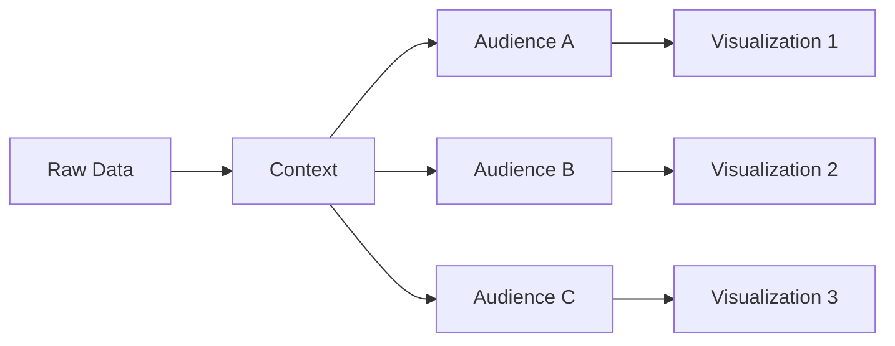
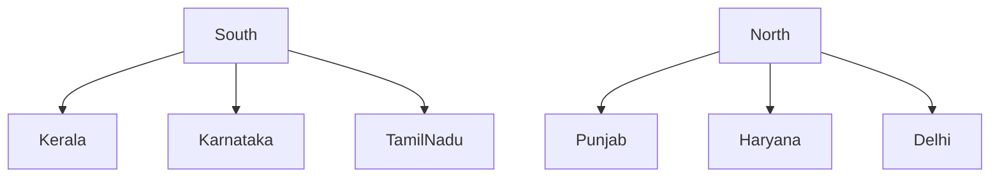
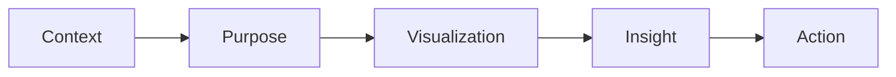
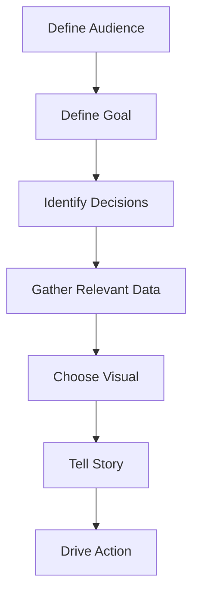

# Understanding Context in Data Visualization

**Module:** Introduction to Visualization <br>
**Topic:** Context for Effective Data Presentations

## Learning Objectives

After studying this module, you should be able to:

* Define context in data visualization
* Understand why context is the foundation of effective visual communication
* Identify the role of audience in visualization design
* Select appropriate visualizations based on purpose
* Recognize how the same dataset can produce different visualizations for different stakeholders
* Develop a framework for establishing context before creating charts

# 1. Introduction

Most people believe that data visualization is primarily about charts, graphs, colors, and dashboards.

However, effective visualization begins much earlier.

The most important question is:

> "Who is this visualization for, and why am I creating it?"

The answer to this question defines the **context**.

Context acts as the foundation upon which every visualization decision is built.

Without context:

* Charts may be technically correct
* Insights may be accurate
* Visuals may still fail to communicate effectively

With context:

* Visuals become purposeful
* Communication becomes efficient
* Storytelling becomes clearer
* Decision-making becomes easier

# 2. What is Context?

## Definition

Context is the collection of factors that determine:

* Why a visualization is being created
* Who will consume it
* What decisions it should support
* How the information should be communicated

Context is not directly visible like:

* Bar charts
* Scatter plots
* Histograms
* Dashboards

Instead, it is a design philosophy that guides all visualization choices.

# 3. Why Context Matters

Modern organizations generate enormous amounts of data.

The challenge is rarely:

> "Do we have enough data?"

Instead, it is:

> "Which information is relevant?"

Context helps answer this question.

Without context:

```text
Data → Information Overload → Confusion
```

With context:

```text
Data → Context → Relevant Information → Insight
```

## Key Benefit

Context acts as a filter.

It helps identify:

* Important variables
* Relevant comparisons
* Appropriate visuals
* Necessary explanations

# 4. The Core Elements of Context

The lecture highlights three critical questions.

## Question 1

### Who is the audience?

Examples:

* General public
* Newspaper readers
* Business executives
* Policymakers
* Election officials
* Scientists

Different audiences require different communication styles.

## Question 2

### What are they trying to learn?

Examples:

| Audience            | Desired Information   |
| ------------------- | --------------------- |
| Newspaper Reader    | Election outcome      |
| Political Party     | Regional performance  |
| Election Commission | Causes of low turnout |
| CEO                 | Business performance  |
| Investor            | Growth potential      |

## Question 3

### Do I have sufficient data?

Sometimes additional variables must be collected.

Example:

To analyze regional voting patterns, merely having state-level turnout data is insufficient.

You may need:

* Region information
* Demographic data
* Historical trends

# 5. Context Drives Visualization Design

A common misconception is:

> Same Data = Same Visualization

This is incorrect.

The same dataset can generate entirely different visualizations depending on the audience.



# 6. Election Example from the Lecture

The instructor uses voter turnout data to illustrate context.

Assume the dataset contains:

* State-wise voter turnout
* National average turnout
* Number of voters
* Polling booth information

Different stakeholders need different insights.

# Scenario 1: National Newspaper

## Objective

Provide a nationwide summary.

## Audience

General public.

## Questions

* Which states had highest turnout?
* Which states had lowest turnout?
* How does turnout compare with previous elections?

## Appropriate Visualization

Horizontal Bar Chart

Example:

```text
State A ████████████ 75%

State B ██████████ 70%

National Avg ████████ 66%

State C ██████ 60%
```

## Why It Works

The audience wants:

* Quick understanding
* Easy comparison
* Minimal interpretation effort

# Scenario 2: Regional Newspaper or Political Party

## Objective

Evaluate regional performance.

## Audience

Political analysts and regional stakeholders.

## Questions

* Which regions performed better?
* How does one state compare with neighboring states?

## Additional Data Required

Region variable.

Example:

| State     | Region |
| --------- | ------ |
| Kerala    | South  |
| Karnataka | South  |
| Punjab    | North  |

## Appropriate Visualization

Regional comparison charts.



## Why It Works

The audience is interested in regional patterns rather than national summaries.

# Scenario 3: Election Commission

## Objective

Improve voter turnout.

## Audience

Policy and decision makers.

## Key Question

What factors influence voter turnout?

The focus shifts from:

```text
"What happened?"
```

to

```text
"Why did it happen?"
```

## Example Analysis

Relationship between:

* Average electors per booth
* Voter turnout

A scatter plot becomes useful.

```text
      *
    *
  *
 *
-------------------
Booth Size
```

The analysis revealed:

> Higher voters per booth may be associated with slightly lower turnout.

## Potential Policy Insight

Increase polling booths.

Reason:

```text
Smaller queues
↓
Better accessibility
↓
Higher participation
```

# 7. Exploratory vs Explanatory Visualization

A critical distinction.

## Exploratory Visualization

Used by analysts.

Purpose:

* Discover patterns
* Investigate relationships
* Generate hypotheses

Examples:

* Scatter plots
* Correlation matrices
* Pair plots

## Explanatory Visualization

Used for communication.

Purpose:

* Present findings
* Tell a story
* Support decisions

Examples:

* Bar charts
* Infographics
* Dashboards

## Comparison

| Feature     | Exploratory | Explanatory   |
| ----------- | ----------- | ------------- |
| Audience    | Analyst     | End User      |
| Goal        | Discovery   | Communication |
| Complexity  | High        | Low           |
| Detail      | Extensive   | Focused       |
| Visual Type | Analytical  | Storytelling  |

# 8. Why the "Best" Chart Depends on Context

The lecture presents an important lesson.

A scatter plot and a bar chart can communicate the same information.

Yet one may be superior depending on the audience.

## For General Public

Best Choice:

Bar Chart

Reason:

* Familiar
* Easy to read
* Requires minimal interpretation

## For Analysts

Best Choice:

Scatter Plot

Reason:

* Shows relationships
* Supports investigation
* Provides deeper insight

# 9. Context and Storytelling

Data storytelling requires alignment between:



If any component is misaligned:

Communication becomes ineffective.

# 10. Questions to Build Context

Before creating any visualization, ask:

## Audience Questions

* Who will see this?
* What is their expertise level?
* What decisions do they make?

## Objective Questions

* What problem am I solving?
* What action should result from this visual?

## Data Questions

* Do I have sufficient data?
* Do I need additional variables?

## Constraint Questions

* How much time does the audience have?
* How much space is available?
* Will this be viewed on a slide, dashboard, or mobile screen?

## Bias Questions

* Does the audience have preconceived beliefs?
* Could the visual be misinterpreted?

# 11. Practical Framework

Use the following workflow.



# 12. Real-World Business Example

Suppose a company wants to visualize sales data.

Same dataset.

Different contexts.

| Audience             | Visualization          |
| -------------------- | ---------------------- |
| CEO                  | KPI Dashboard          |
| Regional Manager     | Region Comparison      |
| Sales Representative | Individual Performance |
| Data Scientist       | Scatter Plot Analysis  |

Same data.

Different story.

Different visualization.

# 13. Common Mistakes

## Mistake 1

Starting with the chart.

Wrong:

```text
I want a scatter plot.
```

Correct:

```text
Who am I presenting to?
```

## Mistake 2

Ignoring audience expertise.

Example:

Using regression plots for non-technical executives.

## Mistake 3

Showing everything.

More information does not mean more insight.

## Mistake 4

Using analyst visuals for public communication.

Complexity often reduces understanding.

## Mistake 5

Ignoring time constraints.

A CEO with 30 seconds requires a different visual than an analyst with 30 minutes.

# 14. Key Examination Points

### Define Context

Context is the understanding of audience, purpose, constraints, and communication goals that guide visualization design.

### Why is Context Important?

Because it determines:

* What information is relevant
* Which visual should be used
* How insights should be communicated

### Central Element of Context

The audience.

### Main Questions for Establishing Context

1. Who is the audience?
2. What information do they need?
3. Do I have sufficient data?
4. What action should result?

### Same Data, Different Visuals

Different stakeholders require different perspectives from the same dataset.

# Final Takeaways

[!IMPORTANT]

Context is the most important component of effective data visualization.

Key principles:

1. Always identify the audience first.
2. Define the purpose before choosing a chart.
3. The same data can produce different visualizations.
4. Exploratory visuals help analysts discover insights.
5. Explanatory visuals help communicate insights.
6. Good visualization is not about attractive charts.
7. Good visualization is about delivering the right message to the right audience in the right way.

## One-Line Summary

> Context determines what story should be told, who should hear it, and how that story should be visually communicated.
