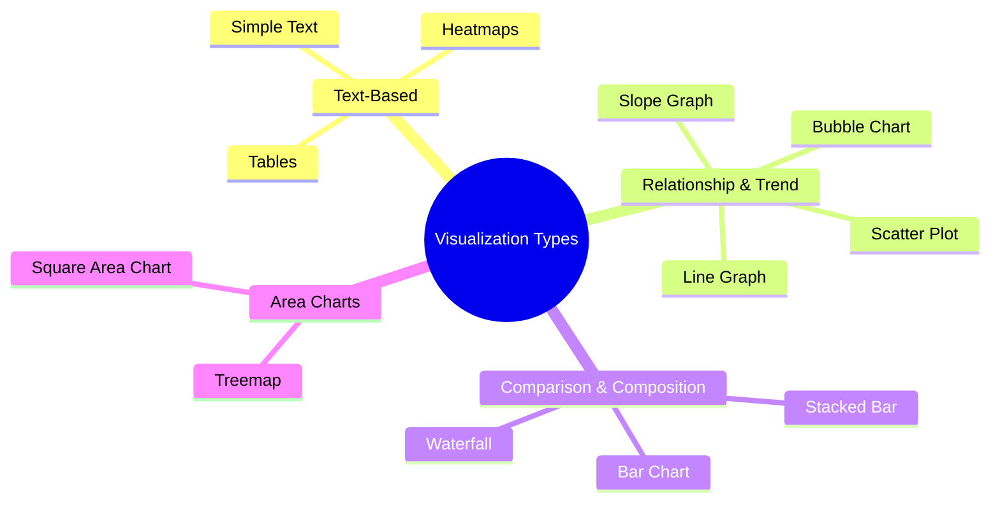

# 4. Four Major Categories of Visualizations

The lecture groups visualization methods into four broad families:

```mermaid
mindmap
  root((Visualization Types))

    Text-Based
      Simple Text
      Tables
      Heatmaps

    Relationship & Trend
      Scatter Plot
      Bubble Chart
      Line Graph
      Slope Graph

    Comparison & Composition
      Bar Chart
      Stacked Bar
      Waterfall

    Area Charts
      Treemap
      Square Area Chart
```
