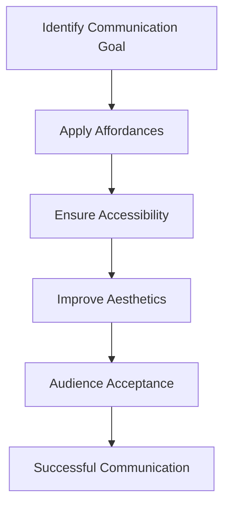
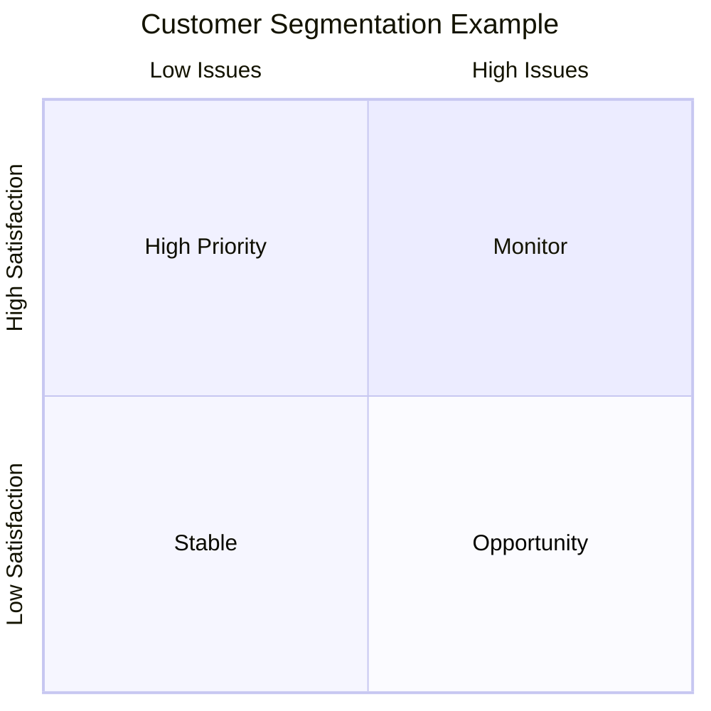
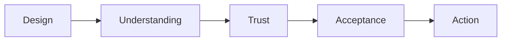
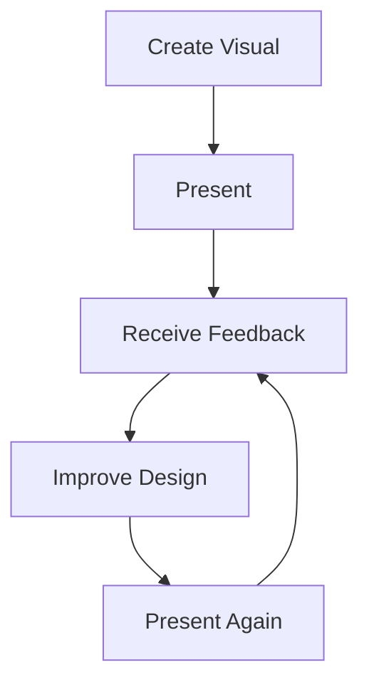

# Design Principles for Effective Data Visualization

**Module:** Statistical Modelling and Inferencing
**Topic:** Design Principles, Affordances, Accessibility, Aesthetics, and Audience Acceptance

## Learning Objectives

After studying this module, you should be able to:

* Understand the philosophy of "Form Follows Function"
* Explain the relationship between design and communication
* Define affordances in data visualization
* Apply accessibility principles to visual design
* Improve visual aesthetics without sacrificing clarity
* Understand how audience acceptance influences visualization success
* Apply practical techniques to reduce cognitive load

## 1. Introduction

Many people believe that effective visualization is primarily about selecting the correct chart.

While chart selection is important, a well-designed visualization goes beyond choosing between a bar chart, line chart, or scatter plot.

The real challenge is:

> How do we make the audience immediately understand the intended message?

The answer comes from a design philosophy borrowed from product design:

> Form Follows Function

This principle suggests that the appearance of something should be driven by its purpose.

In data visualization:

| Component | Meaning                                  |
| --------- | ---------------------------------------- |
| Function  | The message we want to communicate       |
| Form      | The visual design used to communicate it |

The primary goal is not creating beautiful charts.

The primary goal is communicating information effectively.

[!IMPORTANT]

A visualization that looks impressive but fails to communicate is a design failure.

A simple visualization that clearly communicates the intended insight is a design success.

## 2. Form Follows Function

### What Does It Mean?

Before deciding:

* Colors
* Labels
* Shapes
* Layouts
* Annotations

you must first determine:

> What should the audience understand?

Only after identifying the communication objective should visual design decisions be made.

### Example

Suppose management wants to know:

> Which customer segments require immediate attention?

The function is not:

```text
Create a scatter plot.
```

The function is:

```text
Identify high-risk customer groups.
```

The visual design should therefore emphasize those groups.

Everything else becomes secondary.

## 3. The Path to Audience Acceptance

The lecture introduces a three-step framework that connects design principles with audience understanding.



The ultimate objective is:

> Acceptance

Acceptance occurs when the audience receives the message exactly as intended.

## 4. The Three Pillars of Visual Design

The lecture identifies three essential pillars:

1. Affordances
2. Accessibility
3. Aesthetics

Together they increase the likelihood of audience acceptance.

## 5. Affordances

### Definition

Affordances are visual cues that help users understand:

* What is important
* Where to focus
* How to interpret the visual

They guide attention and reduce mental effort.

### Why Affordances Matter

Human attention is limited.

Without guidance, viewers must work harder to determine:

* What matters
* What should be ignored
* Where the insight exists

This increases cognitive load.

Affordances reduce this burden.

### Mental Model

Think of affordances as visual signposts.

```text
Data
 ↓
Visual Cue
 ↓
Attention
 ↓
Insight
```

### Common Affordance Techniques

#### Highlight Important Information

Examples:

* Bold text
* Larger font size
* Color emphasis
* Callout annotations

#### Remove Visual Noise

Examples:

* Excessive gridlines
* Redundant legends
* Unnecessary borders
* Decorative effects

#### Direct Labeling

Instead of:

```text
Blue = Product A
Red = Product B
Green = Product C
```

Label lines or bars directly.

This reduces eye movement.

### Goal

Guide the audience to the conclusion without forcing them to search for it.

## 6. Affordance Example: Marriage Rates by Education

### Original Visualization

The original chart attempted to compare marriage rates across education levels.

However, the audience had to repeatedly:

1. Look at a bar
2. Move to the axis
3. Read the legend
4. Return to the chart

This constant switching created cognitive friction.

### Redesigned Visualization

The improved version:

* Simplified the axes
* Removed unnecessary chart elements
* Added direct labels
* Included explanatory text

The insight became immediately visible.

### Lesson

[!IMPORTANT]

The audience should spend their energy understanding the insight, not decoding the chart.

## 7. Affordance Example: Customer Satisfaction Analysis

### Original Scatter Plot

A traditional scatter plot displayed:

* Customer satisfaction
* Number of issues

While technically correct, it required significant interpretation.

### Improved Scatter Plot

The redesigned version introduced:

* Average reference lines
* Four quadrants
* Highlighted business-critical regions
* Muted less important areas



### Result

The audience immediately knew:

* Which segments mattered
* Which segments required action
* Where management attention should focus

### Key Insight

Visual hierarchy directs attention.

## 8. Accessibility

### Definition

Accessibility refers to designing visualizations that can be easily understood by a broad audience.

The audience may vary in:

* Technical knowledge
* Domain expertise
* Data literacy
* Visual perception

An accessible visualization minimizes barriers to understanding.

### Goal

Make information available to everyone in the room.

### Accessibility Principles

#### Simplify Visual Structure

Avoid:

* Excessive chart elements
* Unnecessary complexity
* Dense labeling

#### Use Readable Text

Ensure:

* Adequate font sizes
* Clear labels
* Logical spacing

#### Minimize Interpretation Steps

Every additional step required to interpret a chart increases the chance of misunderstanding.

### Accessibility Formula

```text
More Interpretation Required
            ↓
Higher Cognitive Load
            ↓
Lower Understanding
```

Therefore:

```text
Lower Cognitive Load
            ↓
Higher Understanding
```

## 9. Cognitive Load and Visualization

### What is Cognitive Load?

Cognitive load refers to the mental effort required to process information.

Consider two charts:

### Chart A

* Multiple legends
* Dense labels
* Several colors
* Complex formatting

### Chart B

* Direct labels
* Clear emphasis
* Minimal distractions

Most audiences understand Chart B faster.

### Design Goal

Reduce cognitive effort.

Increase insight delivery.

[!TIP]

The fastest understood chart is usually the most effective chart.

## 10. Aesthetics

### Definition

Aesthetics refers to the visual appeal of a visualization.

This includes:

* Color choices
* Alignment
* Spacing
* Balance
* Layout

### Why Aesthetics Matter

People naturally trust organized information more than disorganized information.

A clean visual creates:

* Credibility
* Confidence
* Engagement

### Good Aesthetic Design

Characteristics include:

* Consistent formatting
* Balanced color palettes
* Adequate whitespace
* Clear hierarchy

### Poor Aesthetic Design

Characteristics include:

* Clutter
* Misalignment
* Excessive colors
* Visual inconsistency

### Important Distinction

[!WARNING]

Aesthetic improvements should support communication, not replace it.

Beautiful confusion is still confusion.

## 11. The Final Goal: Acceptance

A visualization succeeds only when the audience accepts it.

Acceptance means:

* The audience understands the message
* The audience trusts the message
* The audience focuses on the insight rather than the chart mechanics

### Acceptance Flow



## 12. Resistance to New Visualizations

A common problem occurs when introducing new chart formats.

Even better visualizations may encounter resistance because:

* People prefer familiar formats
* Existing habits are difficult to change
* New visuals initially feel uncomfortable

### Example

A redesigned dashboard may communicate insights more effectively.

However, users may reject it simply because:

> "This isn't how we used to see the data."

This is a human behavior problem rather than a visualization problem.

## 13. Strategies for Achieving Acceptance

### Strategy 1: Explain the Why

Show:

* Old version
* New version

Then explain:

* What changed
* Why it changed
* How it improves understanding

### Strategy 2: Build Supporters

Identify audience members who understand the improvement.

Their endorsement often accelerates acceptance.

### Strategy 3: Gather Feedback

Not all resistance is bad.

Some feedback identifies genuine weaknesses.

Examples:

* Poor color choices
* Missing labels
* Confusing terminology

### Strategy 4: Iterate

Visualization design is an iterative process.

Rarely is the first version perfect.



## 14. Practical Visualization Design Checklist

Before presenting a visual, ask:

### Function

* What should the audience learn?
* What action should result?

### Affordances

* Is the important insight highlighted?
* Can viewers immediately identify the key message?

### Accessibility

* Is the chart easy to understand?
* Is unnecessary complexity removed?

### Aesthetics

* Is the visual clean?
* Is the formatting consistent?

### Acceptance

* Will the audience trust and understand the message?

## Common Mistakes

### Mistake 1

Assuming aesthetics alone create effective communication.

### Mistake 2

Adding excessive visual decoration.

### Mistake 3

Using color without purpose.

### Mistake 4

Forcing viewers to constantly reference legends.

### Mistake 5

Ignoring audience familiarity.

### Mistake 6

Treating visualization as a one-time activity instead of an iterative process.

## Examination Notes

### What does "Form Follows Function" mean?

The visual design should be driven by the communication objective.

### What are the three pillars of visual design?

1. Affordances
2. Accessibility
3. Aesthetics

### What is the purpose of affordances?

To guide audience attention and reduce cognitive load.

### What is accessibility in visualization?

Making information understandable to a broad audience.

### What is aesthetics?

The visual appeal and presentation quality of a visualization.

### What is the ultimate goal of visualization design?

Audience acceptance and effective communication.

## Final Takeaways

[!IMPORTANT]

Effective visualizations are not created by adding more design elements.

They are created by removing barriers between information and understanding.

Remember:

1. Function comes before form.
2. Highlight what matters.
3. Reduce cognitive load.
4. Design for accessibility.
5. Use aesthetics to support communication.
6. Expect resistance to change.
7. Iterate continuously based on feedback.
8. Measure success by audience understanding, not visual complexity.

### One-Line Summary

> Great visualizations succeed when design choices make the intended insight effortless for the audience to understand and accept.
