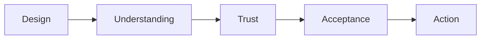

# 11. The Final Goal: Acceptance

A visualization succeeds only when the audience accepts it.

Acceptance means:

* The audience understands the message
* The audience trusts the message
* The audience focuses on the insight rather than the chart mechanics

### Acceptance Flow

