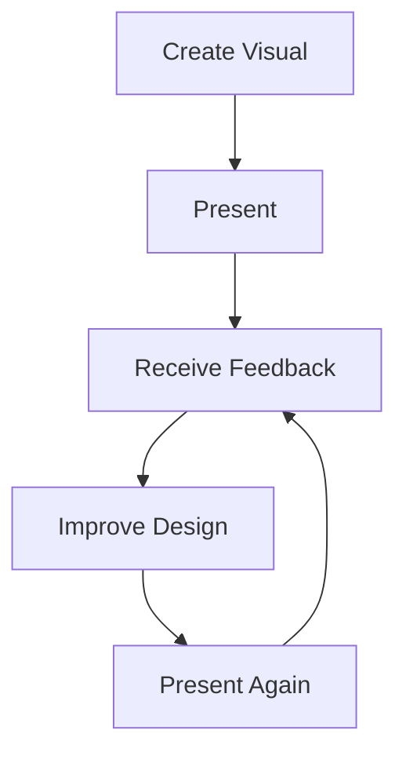

# 13. Strategies for Achieving Acceptance

### Strategy 1: Explain the Why

Show:

* Old version
* New version

Then explain:

* What changed
* Why it changed
* How it improves understanding

### Strategy 2: Build Supporters

Identify audience members who understand the improvement.

Their endorsement often accelerates acceptance.

### Strategy 3: Gather Feedback

Not all resistance is bad.

Some feedback identifies genuine weaknesses.

Examples:

* Poor color choices
* Missing labels
* Confusing terminology

### Strategy 4: Iterate

Visualization design is an iterative process.

Rarely is the first version perfect.

