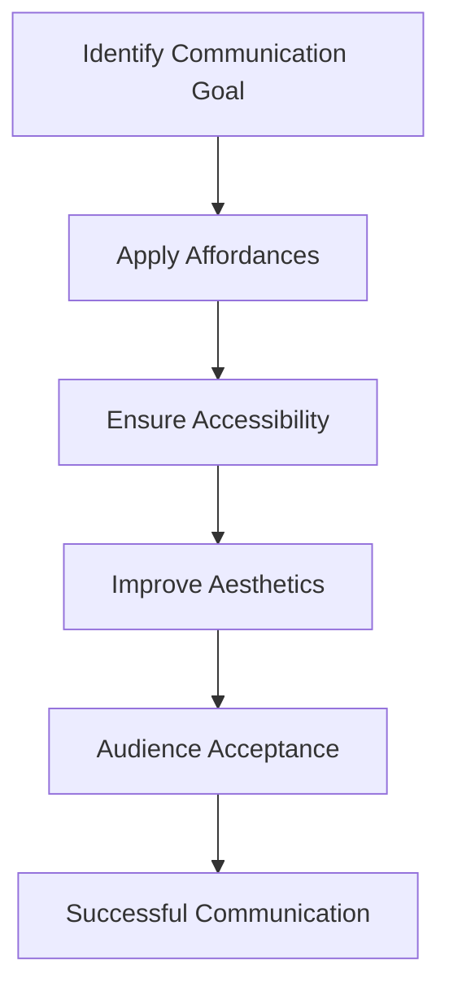

# 3. The Path to Audience Acceptance

The lecture introduces a three-step framework that connects design principles with audience understanding.

The ultimate objective is:

> Acceptance

Acceptance occurs when the audience receives the message exactly as intended.
