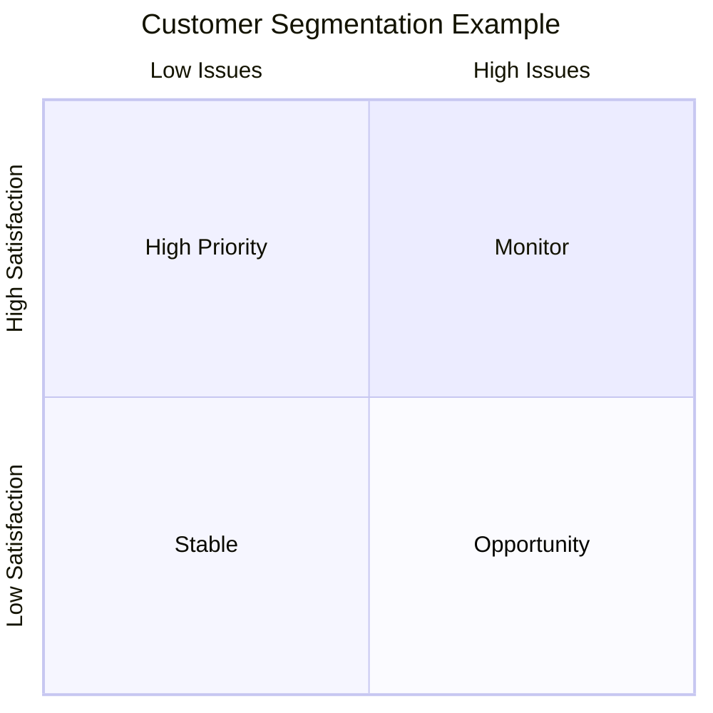

# 7. Affordance Example: Customer Satisfaction Analysis

### Original Scatter Plot

A traditional scatter plot displayed:

* Customer satisfaction
* Number of issues

While technically correct, it required significant interpretation.

### Improved Scatter Plot

The redesigned version introduced:

* Average reference lines
* Four quadrants
* Highlighted business-critical regions
* Muted less important areas

### Result

The audience immediately knew:

* Which segments mattered
* Which segments required action
* Where management attention should focus

### Key Insight

Visual hierarchy directs attention.
