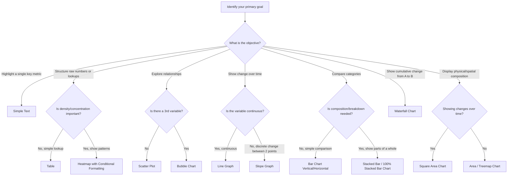

![[Pasted image 20260527231448.png]]

While there are over 150 different types of data visualizations available across modern software tools, **a core set of about 12 visual types is sufficient to handle 90% of business and analytical communication needs.** Knowing when and how to apply these basic options allows for highly effective communication without relying on overly complex, custom visuals.

### **Decision Tree: Choosing the Right Visualization**

This decision tree helps determine which visual format to use based on your specific communication objective and data structure.

### **Detailed Breakdown of Visual Formats**

The core visualization options can be categorized into four primary groups: text-based visuals, relationship/trend graphs, comparison/composition graphs, and physical area charts.

#### **1. Text-Based Visuals (Non-Graphs)**
These options are ideal when the precise values themselves are the message, rather than the trends or relationships between those values.

*   **Simple Text**
    *   **Purpose:** Best used when you have only one or two critical data points to share. If a graph is not strictly necessary to explain the change, simple text is often clearer.
    *   **Key Design Tips:** Use Gestalt principles (such as variations in size, bolding, and color) to create visual hierarchy and highlight key numbers.
    *   **Example:** Instead of using a two-bar graph to show the percentage of stay-at-home mothers falling from 41% to 20%, state it directly: *"Currently, the stay-at-home mother ratio is 20% as compared to 41% in 1970."*
*   **Tables**
    *   **Purpose:** Tables interact primarily with our *verbal cognitive system*. Audiences naturally read them row-by-row or column-by-column to compare precise values.
    *   **Best Use:** Highlighting simple data for lookup purposes without trying to force a visual trend.
*   **Heatmaps**
    *   **Purpose:** Combines the precise look-up structure of a table with visual guidance.
    *   **Key Design Tips:** Uses saturated or graded colors (often applied via conditional formatting) to draw the eye immediately to data concentration, composition, or directional changes.

#### **2. Relationship & Trend Graphs**
These options map data along X and Y axes to illustrate how variables interact or change.

*   **Scatter Plots (Point Graphs)**
    *   **Purpose:** Excellent for exploratory analysis to discover relationships between two variables when those relationships are not known beforehand.
    *   **Extensions:** Can be upgraded to **Bubble Charts** by using the size of the points to denote a third quantitative variable, or using different shapes/colors to categorize data.
    *   **Example:** Plotting average voter turnout against the average number of voters per booth to reveal a negative correlation.
*   **Line Graphs**
    *   **Purpose:** Used for continuous variables, signaling to the human brain that the data points are connected and sequential (e.g., changes over time).
    *   **Key Design Tips:** Avoid cluttering the visual with too many overlapping series. Use color to emphasize the primary line of interest.
*   **Slope Graphs**
    *   **Purpose:** A specialized type of line graph used to connect categorical points across two discrete time periods.
    *   **Best Use:** Showing the rate of change and relative ranking shifts between two specific points in time.
    *   **Example:** Comparing employee feedback scores across different company departments between 2014 and 2015.

#### **3. Comparison & Composition Graphs**
These use physical length or stacked elements to compare absolute values or parts-of-a-whole.

*   **Bar Graphs (Horizontal & Vertical)**
    *   **Purpose:** The most common tool for comparing discrete categories. They are highly intuitive because the human eye easily compares the relative lengths of the bars.
    *   **Key Requirement:** Must always plot quantitative data to maintain a consistent scale for comparison.
*   **Stacked Bar Graphs**
    *   **Purpose:** Shows both the total value of a category and its internal composition.
    *   **100% Stacked Bar Alternative:** A highly effective alternative to pie charts, allowing users to compare the relative proportions of sub-segments across multiple categories.
    *   **Example:** Comparing survey response proportions (Strongly Agree vs. Disagree) across five different business units.
*   **Waterfall Charts**
    *   **Purpose:** A variation of a bar graph that tracks the step-by-step cumulative movement of a variable from an initial value (Point A) to a final value (Point B).
    *   **Best Use:** Highly effective for financial reporting (e.g., showing how gross revenue transitions into net profit through various expense deductions) or tracking workforce fluctuations.
    *   **Example:** Showing how a team grew from 100 to 116 employees by visually displaying the steps: starting base (+100) $\rightarrow$ new hires (+30) $\rightarrow$ internal transfers in (+8) $\rightarrow$ transfers out (-12) $\rightarrow$ exits (-10) $\rightarrow$ final count (116).

#### **4. Area Charts**
These use two-dimensional space to display proportions.

*   **Area / Treemap Charts**
    *   **Purpose:** Represents composition using the physical area of rectangles or squares. The larger the space occupied by the shape, the larger the variable's share.
    *   **Example:** Representing the populations of Indian states, where Uttar Pradesh occupies the largest physical rectangle, followed by progressively smaller rectangles for Bihar, Maharashtra, and West Bengal.
*   **Square Area Charts**
    *   **Purpose:** Displays composition where a grid of equal squares represents units of data.
    *   **Best Use:** Comparing composition changes side-by-side across different time periods.