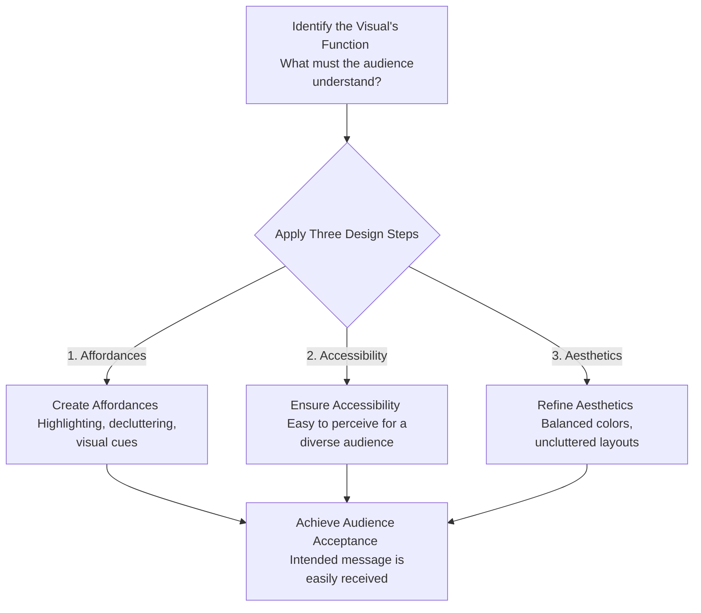
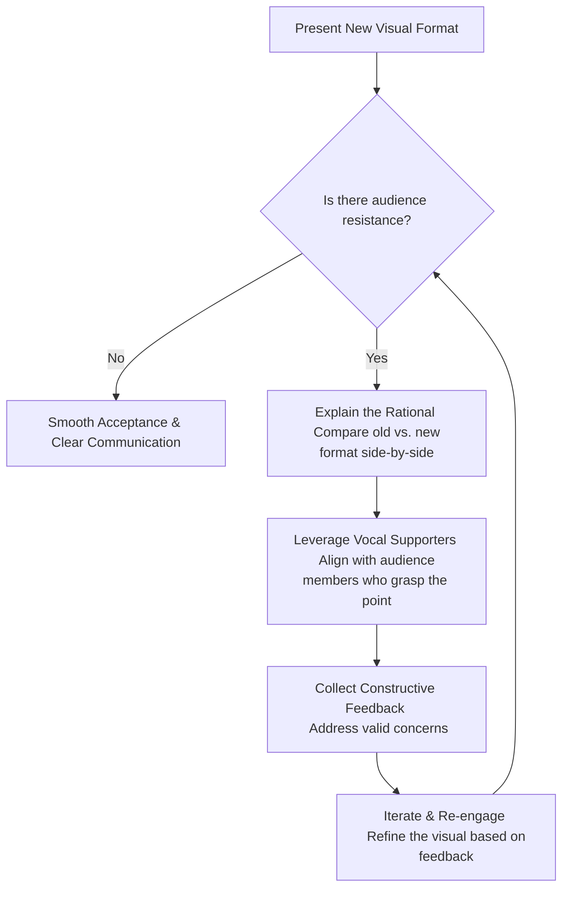

![[Pasted image 20260527231856.png]]
### **Core Philosophy: Form Follows Function**

The design concepts shared in this lecture are rooted in **product design philosophy**, which asserts that the most successful and widely accepted products are designed with the principle **"form follows function."** 

When applied to data visualization:
*   **The Function:** Effectively and efficiently communicating information to the audience.
*   **The Form:** The visual design (colors, axes, layout, labels) chosen to deliver that function.

Keeping the audience at the center, designers follow a three-step process—**Affordances, Accessibility, and Aesthetics**—to achieve the ultimate goal: **Acceptance**.

### **Process Flow: Designing for Audience Acceptance**

The following diagram illustrates how product design philosophy is mapped to visualization design, leading to a smooth transition of information from the screen to the audience's mind.

---

### **The Three Pillars of Visual Design**

#### **1. Affordances**
Affordances are visual clues or artifacts built into a graphic that indicate how it should be read and where the audience should focus. They reduce the mental energy (cognitive load) required to process the information.

*   **Key Techniques:**
    *   Using bold text or specific colors to highlight key data points.
    *   Decluttering unnecessary visual noise (like excessive gridlines or redundant legends).
    *   Simplifying axes and utilizing direct labeling instead of separate color legends.

*   **Example 1: New Marriage by Education (2008 vs. 2012)**
    *   *The Original Visual:* A bar graph attempting to show falling marriage rates across education levels. It was mentally taxing because the audience had to constantly map back and forth between the bars, the axis, and the color legend at the top.
    *   *The Redesigned Version:* The axes were simplified to show the years. Instead of complete bars, it plotted only start and end points (using a cleaner comparison style) with direct labels. Adding a descriptive text block in the empty space between the points immediately delivered the insight that marriage rates fall as education level increases.

*   **Example 2: Creating Visual Hierarchies (Customer Satisfaction vs. Issues)**
    *   *The Original Visual:* A standard scatter plot mapping satisfaction against the number of issues.
    *   *The Redesigned Version:* Average lines were added to segment the plot into a 2x2 grid (four distinct quadrants of customer behavior). The three most critical quadrants—which made up 50% of the customer base—were highlighted in prominent colors. The remaining, less critical quadrant was colored in muted gray. This visual hierarchy naturally directed the business managers' focus to the target segments without cluttering the slide.

#### **2. Accessibility**
*   **Purpose:** Ensuring that the visualization can be easily understood by a broad and diverse audience.
*   **Approach:** By simplifying the visual presentation and eliminating unnecessary cognitive barriers, you ensure the message is readable and usable by everyone in the room, regardless of their familiarity with the raw data.

#### **3. Aesthetics**
*   **Purpose:** Creating a visually pleasing presentation that puts the audience in a receptive frame of mind.
*   **Approach:** Utilizing clean layouts, balanced color palettes, and avoiding messy or disorganized structures. Visuals that look professional and structured are naturally trusted more and are received with less friction.

---

### **Achieving Acceptance (Overcoming Resistance to Change)**

Even a highly optimized visualization can face resistance if it introduces a new format or challenges existing perspectives. Achieving **Acceptance** means the audience receives the information in the exact form you intended, without being distracted by secondary questions.

If you encounter resistance when presenting a redesigned visual, you can apply the following feedback loop to gain broader support.

#### **Key Strategies for Visual Acceptance:**
*   **Show the "Why":** Explain the design decisions and compare the new visual against the older format to show how much faster the new one delivers the key insight.
*   **Build Allies:** Connect with key audience members beforehand or during the presentation. Let those who understand the visual help champion its adoption.
*   **Iterate Dynamically:** Treat visualization as an ongoing process. Welcome constructive feedback to refine color choices, labels, or structures for the next iteration.