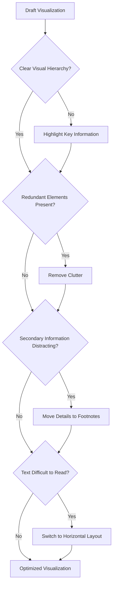

# Dissecting and Optimizing Data Visualizations

**Module:** Statistical Modelling and Inferencing
**Topic:** Visual Dissection, Optimization, and Model Visualization Design

## Learning Objectives

After studying this module, you should be able to:

* Understand the purpose of visual dissection
* Analyze why effective visualizations work
* Identify common design improvements applied to business charts
* Create visual hierarchy using color and emphasis
* Reduce chart clutter through simplification
* Apply best practices for labels, axes, and annotations
* Evaluate visualizations from a communication perspective rather than a technical perspective

## 1. Introduction

Most visualization software can generate charts automatically.

For example:

* Tableau
* Power BI
* Excel
* Python visualization libraries

can produce charts with a few clicks.

However, automatically generated charts are rarely optimal.

The difference between an average chart and an effective chart is often not the data itself.

It is the design decisions.

This process of studying and understanding these design decisions is known as:

> Visual Dissection

Visual dissection involves breaking down successful visualizations and asking:

* Why was this color chosen?
* Why was this axis removed?
* Why was this annotation added?
* Why was this chart made horizontal instead of vertical?

The goal is not to copy the visual.

The goal is to understand the reasoning behind the design.

[!IMPORTANT]

Great visualizations are rarely accidental.

Every element should have a communication purpose.

## 2. What is Visual Dissection?

### Definition

Visual dissection is the process of analyzing an existing visualization to understand:

* Design choices
* Communication strategies
* Visual hierarchy
* Information prioritization

The purpose is to identify how a standard chart becomes a highly effective communication tool.

### Core Question

Instead of asking:

> What chart type is this?

Ask:

> Why was it designed this way?

This shift in thinking transforms visualization from chart creation into communication design.

## 3. The Visualization Optimization Process

Most visualizations begin as simple drafts.

The optimization process involves progressively improving communication effectiveness.



### Key Idea

Optimization is usually not about adding elements.

It is about removing unnecessary elements.

## 4. Principles Behind Model Visuals

Highly effective visualizations share several common characteristics.

### They Guide Attention

The viewer immediately knows:

* What matters
* Where to look
* What conclusion to draw

### They Reduce Cognitive Load

The viewer does not need to:

* Search extensively
* Interpret multiple legends
* Compare unnecessary elements

### They Prioritize Information

Not all information has equal importance.

The visual should communicate this hierarchy.

### They Support Decision Making

A model visual answers questions quickly.

It does not force the audience to perform analysis themselves.

## 5. Case Study 1: Campaign Fundraising Line Graph

### Business Context

A fundraising campaign wants to compare:

* Current year's progress
* Previous year's progress
* Target goal of $50,000

### Common Mistake

A standard chart would display:

* Two lines with equal emphasis
* Uniform colors
* No clear focus

This forces the audience to determine:

* Which line matters
* Where the target lies
* Whether performance is improving

### Design Improvements

#### Selective Emphasis

Current year:

* Thick line
* Dark color
* Strong contrast

Previous year:

* Thin line
* Muted color
* Background context

#### Goal Benchmark

A horizontal target line immediately communicates:

```text
Current Progress
        ↓
      Gap
        ↓
Target Goal
```

#### Strategic Annotation

Rather than labeling every point:

* Label only the important milestone
* Highlight the latest fundraising total

### Result

The audience immediately understands:

* Current performance
* Target distance
* Historical comparison

[!TIP]

When comparing multiple series, emphasize only the series that drives the decision.

## 6. Principle: Visual Hierarchy

### Definition

Visual hierarchy determines the order in which information attracts attention.

Humans do not process all chart elements equally.

Elements naturally compete for attention.

The designer controls this competition.

### Methods for Creating Hierarchy

#### Color

Bright colors attract attention.

Muted colors recede into the background.

#### Size

Larger objects attract more attention.

#### Position

Objects placed near the center or top are noticed earlier.

#### Contrast

High contrast elements dominate visual attention.

### Example

Poor hierarchy:

```text
Everything Important
```

Good hierarchy:

```text
MOST IMPORTANT

Important

Supporting Information
```

## 7. Case Study 2: Project Attainment Dashboard

### Business Context

Projects are categorized as:

* Missed target
* Met target
* Exceeded target

Management wants to understand project performance.

### Standard Approach

A stacked bar chart with multiple equally bright colors.

Problem:

Every category appears equally important.

### Improved Approach

Highlight only:

```text
Missed Target
```

because it represents the business concern.

### Design Decisions

#### Single Highlight Color

Only the "Missed" category receives strong emphasis.

All other categories become supporting context.

#### Narrative Annotation

A text callout explains:

> 42% of projects missed their targets.

The audience no longer needs to calculate this themselves.

#### Footnote Placement

Raw counts are moved below the chart.

The chart focuses on:

* Percentages
* Performance patterns

while preserving detailed information elsewhere.

### Key Lesson

[!IMPORTANT]

Highlight the problem, not every category.

## 8. Principle: Decluttering

### Definition

Decluttering is the removal of non-essential visual elements.

Every element should answer:

> Does this help communicate the message?

If not, remove it.

### Common Sources of Clutter

#### Excessive Gridlines

Too many reference lines distract from the data.

#### Redundant Legends

Legends become unnecessary when direct labels exist.

#### Duplicate Labels

Avoid displaying the same information multiple times.

#### Decorative Effects

Examples:

* 3D charts
* Shadows
* Gradients
* Unnecessary icons

### Decluttering Rule

```text
If information appears twice,
one version can often be removed.
```

## 9. Case Study 3: Director Headcount Planning

### Business Context

HR needs a five-year workforce forecast.

Key factors:

* Attrition
* Promotions
* Acquisitions
* Resource gaps

### Visualization Challenge

Positive and negative workforce movements must be shown simultaneously.

### Design Solution

#### Bidirectional Layout

Positive movements:

```text
Above X-axis
```

Negative movements:

```text
Below X-axis
```

This creates immediate separation.

#### Logical Flow

Attrition appears first.

This reflects the actual business process:

```text
Current Workforce
        ↓
Attrition
        ↓
Promotions
        ↓
Acquisitions
        ↓
Final Workforce
```

#### Color Meaning

| Color Type | Meaning   |
| ---------- | --------- |
| Blue       | Attrition |
| Green      | Additions |
| Black      | Gap       |

### Result

Executives can identify workforce shortages immediately.

## 10. Principle: Color Consistency

Color should carry meaning.

It should not exist merely for decoration.

### Good Example

| Color | Meaning             |
| ----- | ------------------- |
| Red   | Risk                |
| Green | Success             |
| Blue  | Neutral Information |

Once assigned, meanings should remain consistent.

### Bad Example

Using:

* Green for revenue in one chart
* Green for losses in another chart

This creates confusion.

[!WARNING]

Changing color meanings across dashboards increases cognitive load.

## 11. Case Study 4: Development Priorities Survey

### Business Context

A survey of 4,000 participants identifies the top development priorities.

The categories contain long text descriptions.

### Standard Approach

Vertical bars.

Problem:

Labels become difficult to read.

```text
Leadership
Communication
Innovation
Collaboration
```

rotated vertically creates unnecessary effort.

### Improved Approach

Horizontal stacked bars.

### Benefits

#### Natural Reading Direction

Humans read left-to-right.

Horizontal charts preserve this pattern.

#### Easier Scanning

Users can quickly compare categories.

#### Better Space Utilization

Long labels fit naturally.

### Additional Improvements

#### Remove Redundant Axis

Percentages are already labeled directly.

Therefore:

* Axis labels become unnecessary
* Gridlines become unnecessary

#### Color Alignment

The top priorities use:

* Matching text colors
* Matching bar colors

This reinforces the message.

#### Footnotes

Survey methodology is moved outside the chart area.

The chart remains clean while retaining credibility.

## 12. Direct Labeling vs Legends

One recurring lesson from all case studies is the preference for direct labeling.

### Traditional Method

```text
Legend
Blue = Product A
Red = Product B
Green = Product C
```

Requires constant eye movement.

### Direct Labeling Method

```text
Product A  ██████

Product B  ████

Product C  ███
```

The audience immediately understands the chart.

### Benefits

* Faster comprehension
* Less cognitive effort
* Cleaner design

## 13. Footnotes as a Design Tool

Many visualizations fail because they attempt to show everything simultaneously.

Instead:

### Main Visual

Should contain:

* Key message
* Primary insight
* Important comparisons

### Footnotes

Should contain:

* Methodology
* Definitions
* Sample sizes
* Assumptions
* Supporting details

### Benefit

Separates:

```text
Need to Know
```

from

```text
Nice to Know
```

## 14. Model Visualization Design Checklist

Before finalizing a chart, ask:

### Hierarchy

* Is the most important information obvious?

### Emphasis

* Have I highlighted only what matters?

### Labels

* Can I replace legends with direct labels?

### Clutter

* Can anything be removed?

### Layout

* Would a horizontal format improve readability?

### Context

* Can secondary information be moved to a footnote?

### Colors

* Are colors meaningful and consistent?

## Common Mistakes

### Mistake 1

Giving equal emphasis to every data element.

### Mistake 2

Using too many bright colors.

### Mistake 3

Displaying redundant labels and axes.

### Mistake 4

Using vertical layouts for long category names.

### Mistake 5

Treating footnotes as an afterthought.

### Mistake 6

Using color for decoration rather than meaning.

## Examination Notes

### What is visual dissection?

The process of analyzing existing visualizations to understand the design decisions behind them.

### Why is visual hierarchy important?

It guides audience attention toward the most important information.

### What is decluttering?

Removing unnecessary visual elements that do not contribute to communication.

### Why are horizontal charts often preferred for text-heavy categories?

They align with natural reading behavior.

### Why should secondary information be moved to footnotes?

To preserve clarity while retaining access to detailed information.

### What is the purpose of direct labeling?

To eliminate unnecessary dependence on legends.

## Final Takeaways

[!IMPORTANT]

The difference between an average chart and an excellent chart is rarely the chart type.

It is the design decisions applied to that chart.

Remember:

1. Create visual hierarchy.
2. Highlight selectively.
3. Remove clutter aggressively.
4. Use direct labels whenever possible.
5. Move secondary details to footnotes.
6. Use horizontal layouts for long text.
7. Maintain color consistency.
8. Design for comprehension, not decoration.

### One-Line Summary

> Great visualizations are not created by adding more elements, but by carefully removing distractions until the intended insight becomes impossible to miss.
