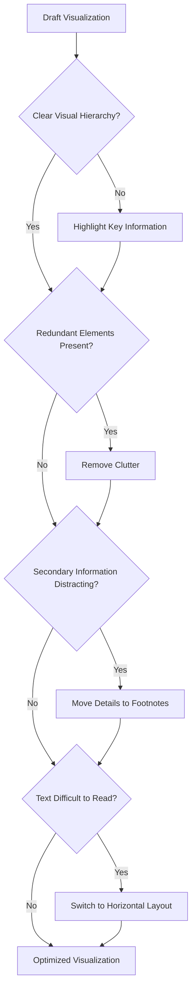

# 3. The Visualization Optimization Process

Most visualizations begin as simple drafts.

The optimization process involves progressively improving communication effectiveness.

### Key Idea

Optimization is usually not about adding elements.

It is about removing unnecessary elements.
