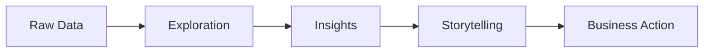

# 2. From Data to Action

The ultimate purpose of analytics is not analysis.

The purpose is action.

A successful visualization helps audiences move through a structured decision-making process.

### Stage 1: Raw Data

Data exists in its original form.

Examples:

* Sales transactions
* Customer records
* Survey responses
* Financial metrics

At this stage, meaning is often hidden.

### Stage 2: Exploration

Analysts investigate:

* Trends
* Patterns
* Outliers
* Relationships

The goal is discovery.

### Stage 3: Insights

Important findings emerge.

Examples:

* Customer churn is increasing.
* Revenue growth is slowing.
* Employee turnover is concentrated in one region.

### Stage 4: Storytelling

Insights are organized into a coherent narrative.

This stage answers:

* Why does the finding matter?
* What is causing it?
* What should happen next?

### Stage 5: Action

The audience:

* Makes decisions
* Changes behavior
* Allocates resources
* Implements solutions

Without storytelling, many insights never reach this stage.
