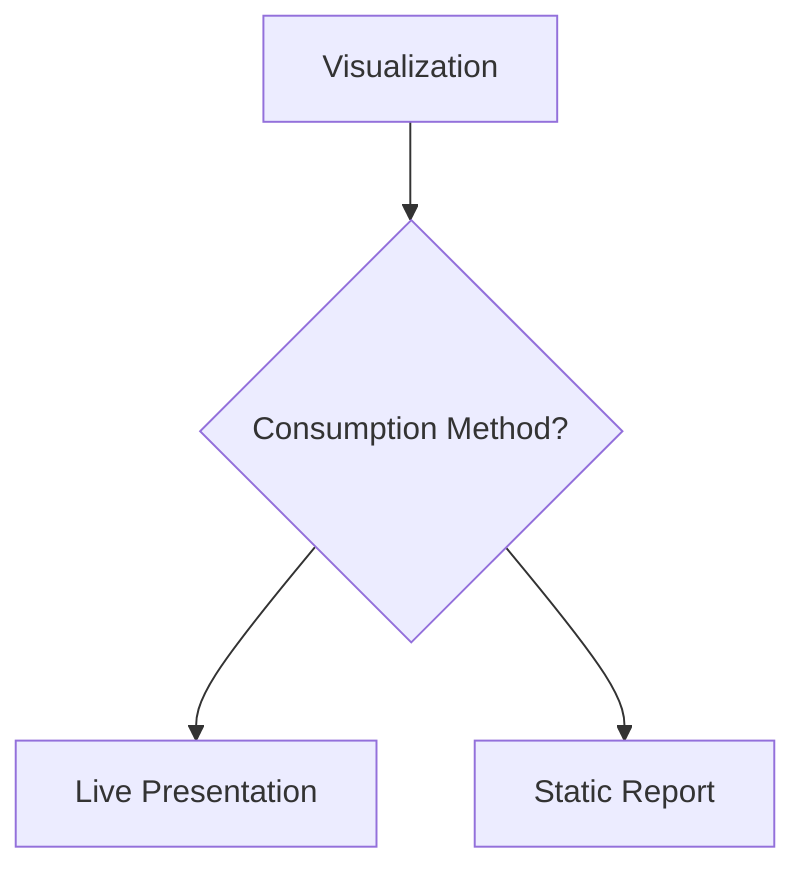

# 7. Delivery Medium Matters

The same visualization may need redesign depending on how it is consumed.

### Live Presentations

Characteristics:

* Presenter provides explanation
* Questions can be answered immediately
* Context can be added verbally

Design Focus:

* Simplicity
* Large visuals
* Minimal text

### Static Documents

Examples:

* Email reports
* PDFs
* Executive summaries

Characteristics:

* No presenter available
* Audience reads independently

Design Focus:

* Detailed annotations
* Self-contained explanations
* Clear labels and hierarchy

[!NOTE]

A chart designed for a presentation often fails when copied directly into a report.
