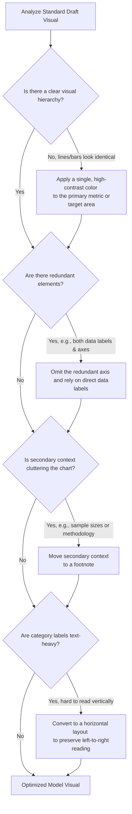

### **The Purpose of Dissecting Model Visuals**

Dissecting model visuals is the practice of analyzing well-designed visualizations to understand **why** specific design choices were made. The goal is to identify how changes in layout, axis management, color selection, and hierarchy transform a basic chart into an effective communication tool that drives quick, intuitive decision-making.

---

### **Visual Dissection & Optimization Process**

This workflow outlines the decision-making process required to transition a standard, default-generated chart into an optimized, high-impact model visual.

---

### **Four Case Studies in Visual Dissection**

#### **Case Study 1: The Paced Line Graph (Campaign Fundraising)**
*   **Context:** Tracking progress of a fundraising campaign against a \$50,000 goal, comparing the current year to the previous year.
*   **Dissection & Design Choices:**
    *   **Visual Contrast:** Rather than displaying two lines of equal weight, last year's line is rendered in a **muted, light blue**, while the current year's line is a **prominent, thick blue** to signal its importance.
    *   **Visual Benchmarks:** A clear, horizontal bar marks the \$50,000 goal, making the "gap to target" instantly recognizable.
    *   **Strategic Labeling:** A specific data callout (\$33,967) is placed at the end of the current year's segment to show exactly where the team stands today compared to last year's performance at the exact same point in time (which was under \$20,000).

---

#### **Case Study 2: Highlighted Stacked Bar Chart (Project Attainment)**
*   **Context:** Tracking project outcomes categorized by whether they missed, met, or exceeded targets.
*   **Dissection & Design Choices:**
    *   **Selective Color Focus:** Instead of using multiple bright colors, a single "attention-seeking" color is chosen for the "Missed" category. 
    *   **Contextual Callouts:** A dedicated text insert is placed near the visual to explain that in Q23, 42% (or roughly one-third) of the projects missed their targets, aligning the text color directly with the highlighted segment.
    *   **Footnote Offloading:** Raw project quantities are moved to a footnote. Since a stacked bar chart converts segments into visual percentages, placing raw volumes in the main chart causes clutter. Moving them to the footnote keeps the visual clean while maintaining accessibility for those who need the exact numbers.

---

#### **Case Study 3: Bidirectional Flow Chart (HR Director Planning)**
*   **Context:** A 5-year outlook of director-level headcount to identify unmet hiring gaps, accounting for losses (attrition) and additions (promotions/acquisitions).
*   **Dissection & Design Choices:**
    *   **Bidirectional Layout:** Positive flows (promotions, acquisitions) are charted above the X-axis, while negative flows (attrition) are mapped *below* the X-axis.
    *   **Logical Ordering:** Attrition is positioned at the very bottom of the chart because losses occur before additions can address the gap.
    *   **Color Consistency:** Distinct, meaningful colors are applied—blue for attrition, green for additions, and black for the unmet resource gap.
    *   **Direct Labeling:** The exact unmet gap values are labeled prominently at the top to immediately capture the attention of board members and HR planners.

---

#### **Case Study 4: Horizontal Stacked Bars (Developmental Priorities Survey)**
*   **Context:** Ranking the top 15 development priorities based on a survey of 4,000 participants.
*   **Dissection & Design Choices:**
    *   **Horizontal Layout for Text:** Long text-based categories are rotated into a horizontal layout. This aligns with natural left-to-right reading habits, making category titles much easier to scan compared to vertical bars with angled text.
    *   **Omitting Redundant Elements:** The X-axis is removed entirely. Because exact percentage labels are printed directly on the bars (e.g., 45%, 37%, 32%), the physical axis gridline is redundant and can be safely omitted to declutter the chart.
    *   **Color Cohesion:** The top three priorities are highlighted in unique colors that are used both for the text callout and the bars themselves, reinforcing their high priority.
    *   **Contextual Footnote:** Complex survey context and methodology details are placed in a footnote to preserve clean aesthetics while ensuring the chart remains credible and accessible.

---

### **Key Takeaways for Designing Model Visuals**

*   **Emphasize selectively:** Only highlight what truly matters (e.g., using a bright color for missed targets, and graying out secondary variables).
*   **Protect readability:** Choose horizontal layouts for text-heavy categories to avoid forcing the reader to tilt their head.
*   **Declutter mercilessly:** If a data label is present, remove the axis line. If secondary details are helpful but not essential for the core story, move them to a footnote.
*   **Align colors consistently:** Ensure the colors used in your descriptive text perfectly match the colors used within your data markers or bars.

Tags: #statistics #machine-learning #data-science #statistical-modelling