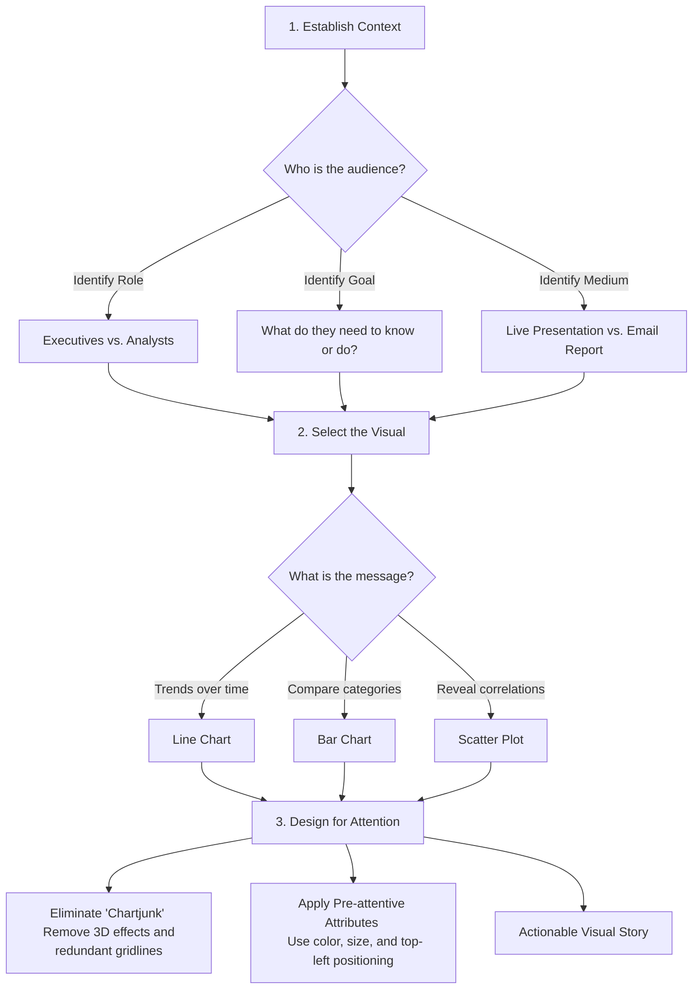
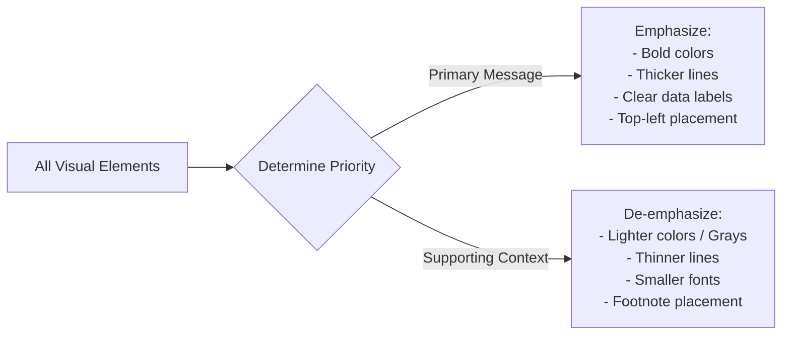

### **Core Principle: Intentional Design**

The foundation of effective data visualization is **intentional design**, where every single element—including color, line thickness, text, alignment, and labeling—is chosen for a specific purpose. Rather than simply displaying raw data, a model visual is structured to minimize cognitive strain and directly guide the audience's attention toward actionable insights.

### **The Audience-Centric Storytelling Workflow**

Simply displaying data is not enough to drive action. To move an audience from viewing an insight to making a decision, you must merge data, visuals, and narrative using the following structured workflow:

### **Key Techniques for Intentional Visual Design**

The provided text highlights several techniques to improve the clarity and impact of a visualization:

#### **1. Manage Visual Contrast (Emphasis vs. De-emphasis)**
This technique involves separating your primary message from the supporting context so the viewer knows exactly where to look first.

*   **Emphasize Key Data:** Use highly visible elements (pre-attentive attributes) such as bright or bold colors, thicker lines, and direct labels to highlight the most critical data points (such as "Progress to Date" on a trend line).
*   **De-emphasize Context:** Keep background or comparative data (like last year's benchmarks or reference lines) visible but secondary. Use thin, light gray lines or smaller, muted fonts to prevent them from competing with the main message.

#### **2. Direct Annotation**
*   Avoid forcing the viewer to search through separate blocks of text to understand the chart.
*   Add short explanatory text and annotations **directly onto the plot area** to clarify key events, trends, or forecast assumptions.

#### **3. Adapt Layout to Data Structure**
*   **Horizontal Bar Charts:** When category names are long, use a horizontal layout instead of vertical bars. This prevents angled or vertical text, making labels much easier to read from left to right.
*   **Targeted Color in Stacked Charts:** In a stacked bar chart, keep most segments in neutral colors and apply a single, attention-grabbing color to the segment that requires immediate action (such as "Missed target").
*   **Bi-directional Bars:** Use positive (above the axis) and negative (below the axis) bars to intuitively represent contrasting concepts, such as employee growth versus attrition.

#### **4. Maintain Visual Clarity**
*   **Eliminate "Chartjunk":** Actively remove elements that do not add analytical value, such as 3D effects, heavy background shading, or excessive gridlines. If a design element doesn't help explain the data, it is a distraction.
*   **Minimalist Labeling:** Avoid cluttering the chart by labeling every single data point. Label only the key points of interest (like start points, end points, or peaks) and keep axis titles short and direct.

Tags: #statistics #machine-learning #data-science #statistical-modelling