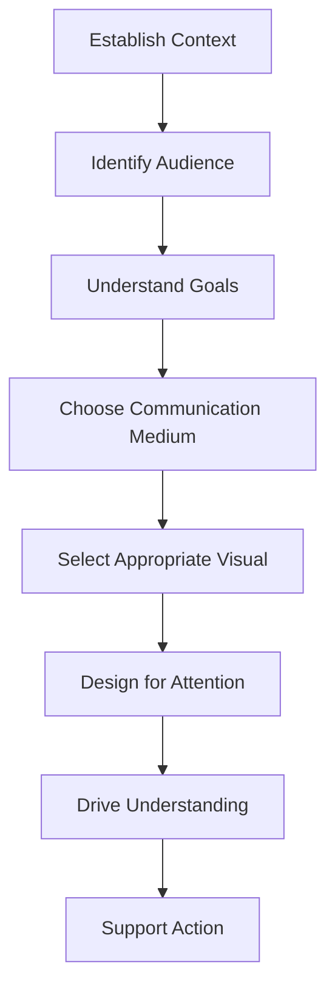
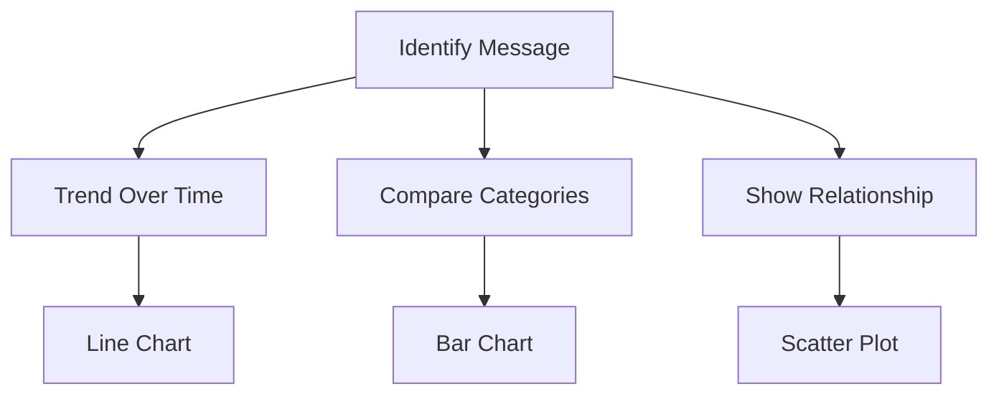
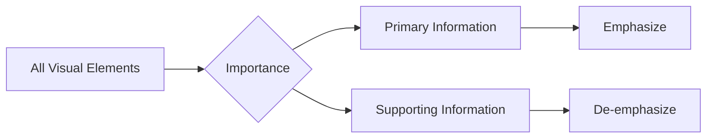

# Intentional Design and Visual Storytelling

**Module:** Statistical Modelling and Inferencing
**Topic:** Intentional Design, Visual Attention, and Storytelling in Data Visualization

## Learning Objectives

After studying this module, you should be able to:

* Understand the principle of intentional design
* Explain how visualization supports decision-making
* Design visuals that direct audience attention
* Apply emphasis and de-emphasis techniques effectively
* Use annotations to improve communication
* Adapt chart layouts to different data structures
* Eliminate unnecessary visual clutter
* Build visualizations that support storytelling

## 1. Introduction

Most data visualization tools can create charts automatically.

However, effective visualizations are never accidental.

Every successful chart is the result of deliberate design decisions.

These decisions include:

* Color selection
* Line thickness
* Positioning
* Labels
* Annotations
* Layout
* Visual hierarchy

The goal is not merely to display data.

The goal is to help the audience understand and act on information.

This approach is known as:

> Intentional Design

Intentional design ensures that every visual element serves a communication purpose.

[!IMPORTANT]

In effective visualizations, nothing exists by accident.

Every element should either improve understanding or be removed.

## 2. What is Intentional Design?

### Definition

Intentional design is the practice of deliberately selecting and arranging visual elements to support a specific communication objective.

Instead of asking:

> How can I display this data?

the designer asks:

> What should the audience understand from this data?

The answer determines:

* Which chart to use
* What to emphasize
* What to remove
* How the story should unfold

### Core Principle

```text
Data
  ↓
Insight
  ↓
Decision
```

The visualization acts as the bridge between insight and decision-making.

## 3. Visualization as Storytelling

Many people believe a chart's purpose is simply to present information.

In reality, effective charts tell stories.

The story should answer:

* What happened?
* Why did it happen?
* Why should the audience care?
* What action should be taken?

A visualization that only displays numbers provides information.

A visualization that drives decisions provides value.

## 4. The Audience-Centric Storytelling Framework

Successful visualizations begin with understanding the audience.


```mermaid
flowchart TD

A[Establish Context]
--> B[Identify Audience]

B --> C[Understand Goals]

C --> D[Choose Communication Medium]

D --> E[Select Appropriate Visual]

E --> F[Design for Attention]

F --> G[Drive Understanding]

G --> H[Support Action]
```

### Step 1: Understand the Audience

Different audiences require different presentations.

| Audience  | Typical Need           |
| --------- | ---------------------- |
| Executive | Quick decisions        |
| Manager   | Performance monitoring |
| Analyst   | Detailed exploration   |
| Customer  | Simple interpretation  |

### Step 2: Define the Goal

Ask:

> What should the audience know after seeing this visual?

Examples:

* Detect a trend
* Compare performance
* Identify risk
* Prioritize action

### Step 3: Consider the Medium

The delivery format affects design.

| Medium         | Design Considerations       |
| -------------- | --------------------------- |
| Presentation   | Large visuals, minimal text |
| Dashboard      | Interactive exploration     |
| Email Report   | Self-explanatory visuals    |
| Printed Report | Detailed annotations        |

[!NOTE]

A visualization designed for a live presentation may fail when viewed independently in a report.

## 5. Selecting the Appropriate Visual

After establishing context, choose the visual based on the message.


```mermaid
flowchart TD

A[Identify Message]

A --> B[Trend Over Time]
A --> C[Compare Categories]
A --> D[Show Relationship]

B --> E[Line Chart]

C --> F[Bar Chart]

D --> G[Scatter Plot]
```

The visualization must support the message.

Not the other way around.

### Common Mapping

| Message       | Recommended Visual |
| ------------- | ------------------ |
| Trends        | Line Chart         |
| Comparisons   | Bar Chart          |
| Relationships | Scatter Plot       |
| Composition   | Stacked Bar        |
| Distribution  | Histogram          |

## 6. Designing for Attention

People do not examine charts systematically.

Instead, their eyes are drawn toward certain visual features automatically.

These features are called:

> Pre-attentive Attributes

Pre-attentive attributes influence attention before conscious analysis begins.

Examples include:

* Color
* Size
* Position
* Shape
* Orientation

Effective designers use these attributes intentionally.

## 7. Managing Visual Contrast

### Purpose

Not all information should receive equal attention.

Important information should stand out.

Supporting information should remain visible but secondary.

This process is called:

> Visual Contrast Management

### The Two Components

#### Emphasis

Highlight what matters.

#### De-emphasis

Reduce attention toward supporting information.


```mermaid
flowchart LR

A[All Visual Elements]
--> B{Importance}

B --> C[Primary Information]

B --> D[Supporting Information]

C --> E[Emphasize]

D --> F[De-emphasize]
```

## 8. Emphasis Techniques

### Purpose

Guide the audience directly toward the intended insight.

### Common Methods

#### Color

Bright or saturated colors attract attention.

Example:

```text
Sales Growth = Blue

Target Metric = Orange
```

The orange immediately becomes the focal point.

#### Size

Larger objects appear more important.

Examples:

* Larger text
* Larger markers
* Larger annotations

#### Thickness

Thicker lines naturally attract attention.

Example:

```text
Current Year ━━━━━━

Previous Year ────
```

#### Position

The top-left region often receives attention first.

Place critical information accordingly.

### Goal

The audience should immediately know:

> Where should I look first?

## 9. De-emphasis Techniques

### Purpose

Keep supporting information available without allowing it to compete with the main message.

### Common Methods

#### Use Neutral Colors

Examples:

* Light gray
* Muted blue
* Soft background colors

#### Reduce Thickness

Thin lines create context without dominating attention.

#### Reduce Label Density

Only label key points.

#### Move Details to Footnotes

Preserve information without cluttering the chart.

### Example

Current Year:

```text
━━━━━━━
```

Previous Year:

```text
───────
```

The comparison remains visible while maintaining focus.

[!TIP]

Every emphasized element reduces the impact of all other emphasized elements.

If everything is highlighted, nothing is highlighted.

## 10. Direct Annotation

### Definition

Annotations are explanatory notes placed directly within the visualization.

### Purpose

Reduce the need for viewers to interpret patterns independently.

### Example

Instead of writing:

```text
Revenue increased substantially during Q3.
```

in a separate paragraph, place the note directly on the chart.

```text
Q3 Revenue Spike
        ↑
```

### Benefits

* Faster understanding
* Reduced eye movement
* Stronger storytelling

### Best Practice

Annotations should explain:

* Significant events
* Unexpected changes
* Business implications

## 11. Adapting Layout to Data Structure

Not every dataset should be visualized the same way.

Layout should reflect the structure of the data.

### Horizontal Bar Charts

Best for:

* Long category names
* Survey responses
* Ranking lists

Example:

```text
Customer Satisfaction       ██████████

Product Quality             ████████

Delivery Speed              ██████
```

### Advantages

* Natural reading flow
* Better label visibility
* Easier comparison

### Vertical Bar Limitations

Long labels often require:

* Rotation
* Wrapping
* Abbreviation

These increase cognitive effort.

[!IMPORTANT]

If category labels are long, horizontal bars are usually the better choice.

## 12. Targeted Color in Stacked Charts

Stacked charts often contain multiple categories.

A common mistake is assigning equal visual weight to every segment.

### Better Approach

Use:

* Neutral colors for supporting segments
* Strong color for the critical segment

Example:

```text
Exceeded Target  = Gray

Met Target       = Gray

Missed Target    = Red
```

The audience immediately identifies the problem area.

### Benefit

Attention becomes aligned with business priorities.

## 13. Bidirectional Visual Design

Some metrics naturally move in opposite directions.

Examples:

* Revenue vs Cost
* Gains vs Losses
* Hiring vs Attrition

In these situations:

* Positive values should appear above the axis
* Negative values should appear below the axis

### Benefits

The layout reinforces meaning.

```text
Positive
    ↑

Baseline

    ↓
Negative
```

This reduces interpretation effort.

## 14. Eliminating Chartjunk

### Definition

Chartjunk refers to visual elements that do not improve understanding.

The term was popularized by data visualization expert
Edward Tufte.

### Examples

#### 3D Effects

```text
Bad:
3D Bars

Better:
Flat Bars
```

#### Excessive Gridlines

Too many reference lines distract from the data.

#### Decorative Backgrounds

Background patterns often reduce readability.

#### Unnecessary Icons

Icons should only be used when they improve understanding.

### Design Rule

Ask:

> Does this element improve communication?

If the answer is no, remove it.

## 15. Minimalist Labeling

### Purpose

Reduce clutter while maintaining clarity.

### Poor Example

Labeling every single point.

```text
10
12
14
15
16
17
18
19
```

This quickly becomes overwhelming.

### Better Example

Label only:

* Start point
* End point
* Peak value
* Important milestone

### Benefits

* Cleaner visuals
* Faster interpretation
* Stronger emphasis

## 16. Practical Design Checklist

Before finalizing a visualization, ask:

### Context

* Who is the audience?
* What action should result?

### Attention

* Is the key message obvious?

### Contrast

* Have I emphasized the important information?

### Clarity

* Can anything be removed?

### Annotation

* Does the chart explain itself?

### Layout

* Is the chosen orientation optimal?

### Labeling

* Are labels concise and useful?

## Common Mistakes

### Mistake 1

Designing for aesthetics before communication.

### Mistake 2

Highlighting too many elements simultaneously.

### Mistake 3

Using strong colors everywhere.

### Mistake 4

Separating explanations from the visual.

### Mistake 5

Using vertical charts for long text labels.

### Mistake 6

Adding unnecessary decorative effects.

### Mistake 7

Labeling every available data point.

## Examination Notes

### What is intentional design?

The deliberate use of visual elements to communicate a specific message.

### What are pre-attentive attributes?

Visual features that attract attention before conscious analysis.

### What is the purpose of emphasis?

To direct audience attention toward important information.

### What is de-emphasis?

Reducing the visual prominence of supporting information.

### What is chartjunk?

Visual elements that add clutter without improving understanding.

### Why are annotations useful?

They explain important insights directly within the chart.

### When should horizontal bar charts be preferred?

When category labels are long or text-heavy.

## Final Takeaways

[!IMPORTANT]

The best visualizations are intentionally designed to make important information immediately obvious.

Remember:

1. Start with audience needs.
2. Design for decisions, not decoration.
3. Use emphasis strategically.
4. Keep supporting information secondary.
5. Annotate important insights directly.
6. Match layout to data structure.
7. Remove chartjunk aggressively.
8. Label selectively.
9. Prioritize clarity over visual complexity.

### One-Line Summary

> Intentional design transforms a chart from a collection of data points into a focused visual story that guides the audience toward understanding and action.
