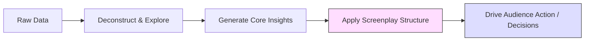
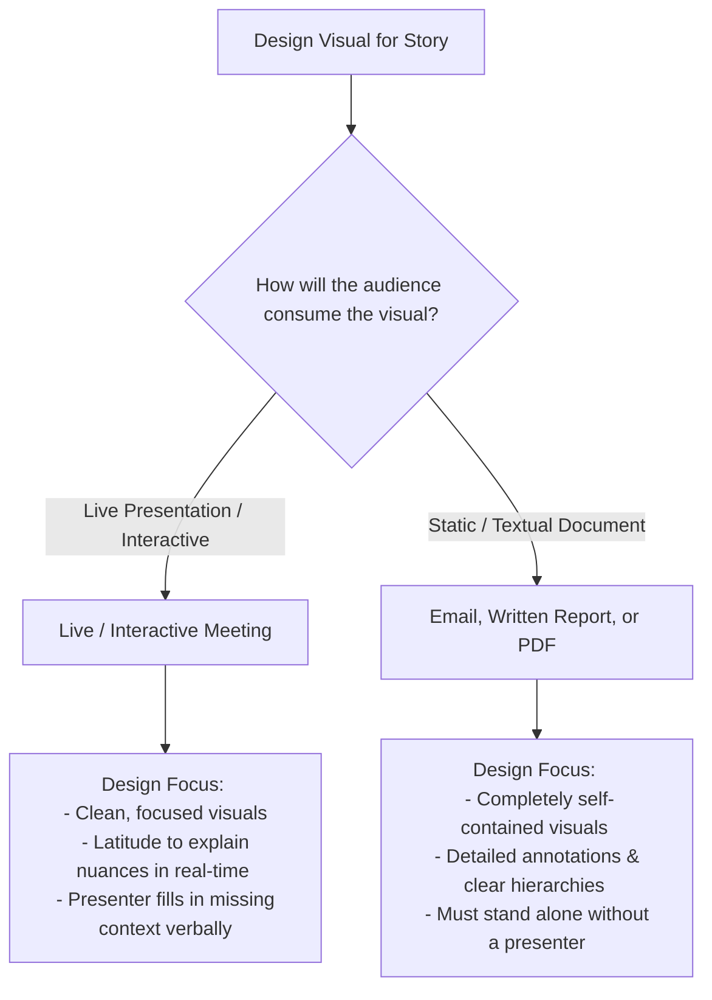

![[Pasted image 20260527233307.png]]
The core thesis of this lecture is that **data alone does not inspire action.** To bridge the gap between analysis and business impact, visualizations must be wrapped in a structured, compelling story. Data visualization should always be **audience-centric, not data-centric**.

### **The Insight-to-Action Pipeline**

The ultimate objective of any data visualization exercise is to move the audience along a structured cognitive path: from raw data to exploratory insights, and finally to business action.

Like a good screenplay, a visual narrative structures data through a specific sequence:

$$
\text{Incident (The Challenge)} \longrightarrow \text{Rising Action (The Analysis)} \longrightarrow \text{Peak Climax (The Core Insight)} \longrightarrow \text{Resolution (The Call to Action)}
$$

### **Step 1: Context & Audience Analysis**

Before selecting a chart type, you must define the contextual boundaries of your presentation. This involves answering three key questions:

#### **1. Who is the audience?**
*   What is their level of technical expertise?
*   What are their pre-existing biases or viewpoints?

#### **2. What is the expected reaction?**
*   Do you want them to simply absorb the state of affairs?
*   Do you want to prompt immediate business decisions?
*   Do you want to incite debate and receive constructive, exploratory questions?

#### **3. How will they consume the information?**
The delivery format dictates how self-explanatory your visual needs to be:

### **Step 2: Matching Visual Format to Intent**

Selecting the wrong visual risks miscommunicating your message or introducing unintended assumptions. Your visual choice should reflect your analytical intent:

*   **To Prove a Trend / Present Clear Evidence:** 
    *   *Visual Choice:* **Line Chart** [1].
    *   *Why:* Connects points continuously, leveraging Gestalt principles to guide the mind naturally along a definitive trajectory [1].
*   **To Explore Relationships / Incite Feedback:**
    *   *Visual Choice:* **Scatter Plot** [1].
    *   *Why:* Highlights distribution and correlations, prompting the audience to ask exploratory questions and suggest deeper data-mining paths [1, 2].
*   **To Compare Quantities:**
    *   *Visual Choice:* **Bar Chart** [1].
    *   *Why:* Instantly communicates differences in volume or category sizes [1].

### **Step 3: Enhancing the Narrative with Design Elements**

Once the core chart is chosen, use subtle visual mechanisms to guide the audience through the narrative arc:

*   **Visual Hierarchy:** Establish clear layers of data importance. Segregate complex charts into distinct buckets (e.g., categorizing scatter plot zones into quadrants) to organize the information [2].
*   **Gestalt Principles:** Rely on these natural principles of visual perception as your guiding force to organize shapes, groupings, and layout [2, 3].
*   **Pre-Attentive Attributes:** Strategically deploy variations in **color, shape, and size** to direct the viewer’s attention instantly to the most critical area of the slide [2].
*   **Keep It Simple:** Avoid artificial complexity. Eliminate 3D effects, over-cluttered axes, and excessive, non-supporting visual details [2]. 

> **Important Limit:** Do not overdo design elements. Visual hierarchies, annotations, and colors should *only* be added if they actively support the narrative. If an element does not help tell the story, leave it out [2].

Tags: #statistics #machine-learning #data-science #statistical-modelling
