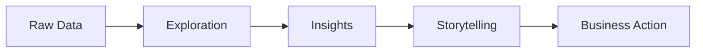
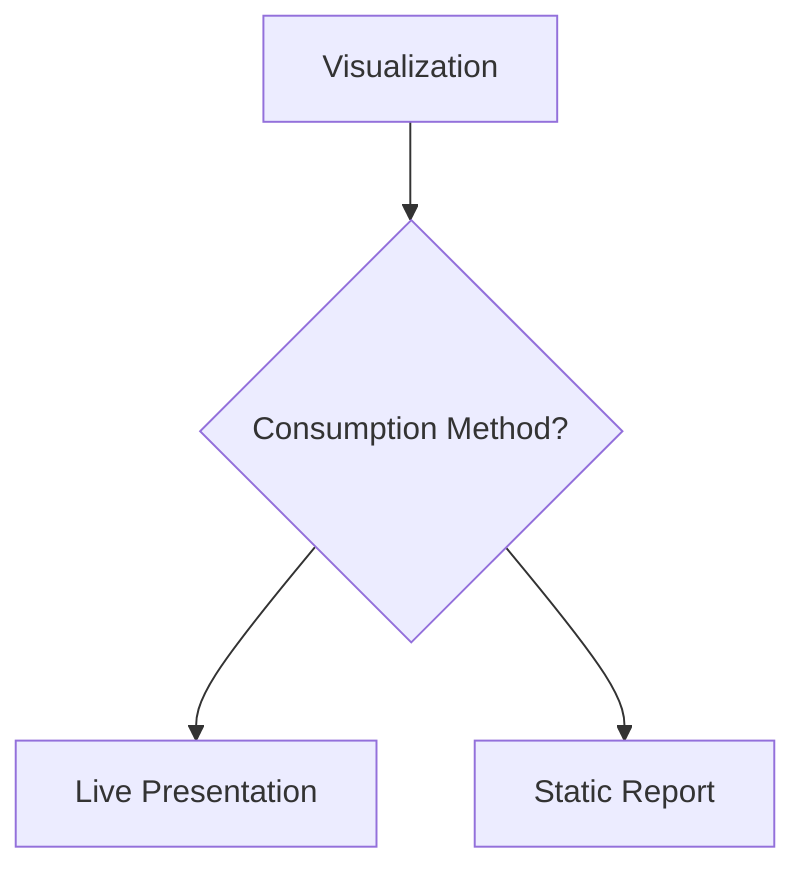

# Data Storytelling and the Insight-to-Action Framework

**Module:** Statistical Modelling and Inferencing
**Topic:** Data Storytelling, Audience-Centric Visualization, and Driving Business Action

## Learning Objectives

After studying this module, you should be able to:

* Understand why data alone rarely drives decisions
* Explain the role of storytelling in data visualization
* Apply an audience-centric approach to communication
* Structure visual narratives using a storytelling framework
* Match visualization types to communication objectives
* Design visuals that move audiences from insight to action
* Apply visual hierarchy and attention-directing techniques effectively

## 1. Introduction

A common misconception in analytics is:

> If the data is correct, people will automatically make the right decision.

In reality, this rarely happens.

Organizations generate enormous volumes of data every day, yet many insights never translate into action.

The reason is simple:

> Data informs, but stories persuade.

A dataset can contain valuable insights.

A chart can reveal patterns.

However, unless those insights are presented within a meaningful narrative, audiences often fail to:

* Understand the importance
* Recognize urgency
* Connect the findings to business objectives
* Take action

This is why modern data visualization emphasizes:

> Audience-Centric Storytelling

rather than

> Data-Centric Reporting

>[!IMPORTANT]
>The goal of visualization is not to display data.
>The goal is to influence understanding, decision-making, and action.

## 2. From Data to Action

The ultimate purpose of analytics is not analysis.

The purpose is action.

A successful visualization helps audiences move through a structured decision-making process.


```mermaid
flowchart LR

A[Raw Data]
--> B[Exploration]

B --> C[Insights]

C --> D[Storytelling]

D --> E[Business Action]
```

### Stage 1: Raw Data

Data exists in its original form.

Examples:

* Sales transactions
* Customer records
* Survey responses
* Financial metrics

At this stage, meaning is often hidden.

### Stage 2: Exploration

Analysts investigate:

* Trends
* Patterns
* Outliers
* Relationships

The goal is discovery.

### Stage 3: Insights

Important findings emerge.

Examples:

* Customer churn is increasing.
* Revenue growth is slowing.
* Employee turnover is concentrated in one region.

### Stage 4: Storytelling

Insights are organized into a coherent narrative.

This stage answers:

* Why does the finding matter?
* What is causing it?
* What should happen next?

### Stage 5: Action

The audience:

* Makes decisions
* Changes behavior
* Allocates resources
* Implements solutions

Without storytelling, many insights never reach this stage.

## 3. Why Storytelling Matters

Consider two presentations.

### Presentation A

Shows:

* Charts
* Tables
* Metrics

but provides no narrative.

The audience sees information but struggles to identify priorities.

### Presentation B

Explains:

* The challenge
* The evidence
* The key finding
* The recommended action

The audience understands both the insight and its implications.

Presentation B is more likely to influence decisions.

### Key Principle

```text
Information
    ≠
Action
```

Instead:

```text
Information
    +
Context
    +
Story
    =
Action
```

## 4. The Screenplay Model of Data Storytelling

The lecture compares effective visualization to a screenplay.

Just as movies follow a structured narrative, visual stories should follow a predictable flow.

The recommended structure is:

```text
Incident
    ↓
Rising Action
    ↓
Climax
    ↓
Resolution
```

### Incident (The Challenge)

What problem exists?

Examples:

* Customer churn increased.
* Revenue declined.
* Costs exceeded budget.

### Rising Action (The Analysis)

Present supporting evidence.

Examples:

* Trend analysis
* Regional comparisons
* Customer segmentation

### Climax (The Core Insight)

Reveal the most important finding.

Examples:

* 70% of churn originates from one customer segment.
* Revenue decline is concentrated in one product category.

### Resolution (The Recommendation)

Explain what should happen next.

Examples:

* Launch retention programs.
* Increase staffing.
* Reallocate budget.

[!TIP]

A visualization without a recommendation is often incomplete from a business perspective.

## 5. Audience-Centric Thinking

Before selecting a chart, understand the audience.

The same data may require completely different presentations depending on who receives it.

### Question 1: Who is the Audience?

Audience expertise determines complexity.

| Audience       | Preferred Communication Style |
| -------------- | ----------------------------- |
| Executive      | Summary and recommendations   |
| Manager        | Performance-focused insights  |
| Analyst        | Detailed exploratory analysis |
| Technical Team | Data and methodology          |

### Consider Existing Biases

Audiences may already have assumptions.

Examples:

* Management believes a strategy is working.
* Teams believe a process is effective.
* Stakeholders believe a department is underperforming.

Understanding these assumptions helps shape communication.

## 6. Expected Audience Response

Different presentations seek different outcomes.

### Inform

Objective:

```text
Understand the situation
```

Example:

Quarterly business review.

### Decide

Objective:

```text
Take action immediately
```

Example:

Budget approval meeting.

### Explore

Objective:

```text
Generate discussion
```

Example:

Strategy workshop.

### Challenge Assumptions

Objective:

```text
Reconsider existing beliefs
```

Example:

Market research presentation.

The expected reaction influences both chart design and storytelling structure.

## 7. Delivery Medium Matters

The same visualization may need redesign depending on how it is consumed.


```mermaid
flowchart TD

A[Visualization]
--> B{Consumption Method?}

B --> C[Live Presentation]

B --> D[Static Report]
```

### Live Presentations

Characteristics:

* Presenter provides explanation
* Questions can be answered immediately
* Context can be added verbally

Design Focus:

* Simplicity
* Large visuals
* Minimal text

### Static Documents

Examples:

* Email reports
* PDFs
* Executive summaries

Characteristics:

* No presenter available
* Audience reads independently

Design Focus:

* Detailed annotations
* Self-contained explanations
* Clear labels and hierarchy

[!NOTE]

A chart designed for a presentation often fails when copied directly into a report.

## 8. Matching Visuals to Communication Intent

Visualization selection should support the story.

### When the Goal is Demonstrating a Trend

Use:

### Line Charts

Reason:

The connected structure naturally communicates movement over time.

Example:

```text
Revenue Growth
      /
     /
    /
```

Line charts encourage the audience to focus on direction and trajectory.

### When the Goal is Exploring Relationships

Use:

### Scatter Plots

Reason:

Scatter plots reveal:

* Correlations
* Clusters
* Outliers

They naturally encourage discussion.

Example questions:

* Why are these points separated?
* What causes this cluster?
* Why does this outlier exist?

### When the Goal is Comparing Quantities

Use:

### Bar Charts

Reason:

Humans compare lengths accurately.

Bar charts immediately communicate:

* Larger
* Smaller
* Highest
* Lowest

This makes them ideal for comparison tasks.

## 9. Storytelling Through Visual Design

After selecting the chart type, the next step is designing attention pathways.

The audience should naturally follow the intended story.

### Objective

Control visual attention.

Guide interpretation.

Support conclusions.

## 10. Visual Hierarchy

### Definition

Visual hierarchy is the arrangement of elements according to importance.

The audience should know:

* Where to look first
* What is most important
* What is secondary

### Example

Poor hierarchy:

```text
Everything appears equally important
```

Good hierarchy:

```text
KEY INSIGHT

Supporting Evidence

Additional Context
```

### Benefits

* Faster understanding
* Reduced cognitive effort
* Better retention

## 11. Gestalt Principles

Gestalt psychology explains how humans naturally organize visual information.

### Core Idea

People perceive patterns before individual elements.

### Examples

#### Proximity

Objects close together appear related.

#### Similarity

Objects sharing color or shape appear grouped.

#### Continuity

The eye naturally follows connected paths.

#### Enclosure

Objects within boundaries appear associated.

[!IMPORTANT]

Good visualizations work with natural human perception rather than against it.

## 12. Pre-Attentive Attributes

Pre-attentive attributes are visual properties processed almost instantly.

Examples include:

* Color
* Size
* Shape
* Orientation
* Position

### Example

Imagine a table of 100 numbers.

If one number is red:

```text
12 14 15 11 18

13 15 16 22 14

17 19 42 16 12
       ↑
```

The red value is noticed immediately.

No conscious searching is required.

### Applications

Use pre-attentive attributes to:

* Highlight outliers
* Identify risks
* Emphasize targets
* Focus attention

## 13. Simplicity as a Design Principle

One of the strongest lessons in visualization is:

> Simplicity increases comprehension.

Many charts become ineffective because they contain unnecessary elements.

### Examples of Unnecessary Complexity

* 3D effects
* Excessive gridlines
* Decorative graphics
* Redundant labels
* Unnecessary color schemes

### Better Approach

Include only elements that support the story.

Ask:

> Does this help communicate the insight?

If not, remove it.

## 14. Balancing Design and Story

Design elements should support the narrative.

They should never become the narrative.

### Good Design

Supports:

* Understanding
* Attention
* Interpretation

### Poor Design

Creates:

* Distraction
* Confusion
* Cognitive overload

[!WARNING]

Visual hierarchy, annotations, and color should be added only when they strengthen the story.

Over-design can be just as harmful as poor design.

## Practical Storytelling Checklist

Before presenting a visualization, ask:

### Context

* Who is the audience?
* What do they care about?

### Purpose

* What action should result?

### Medium

* Will I be present to explain it?

### Visual Choice

* Does the chart support the message?

### Narrative

* Is there a clear beginning, middle, and conclusion?

### Design

* Have I highlighted only what matters?

### Simplicity

* Can anything be removed?

## Common Mistakes

### Mistake 1

Assuming data automatically drives decisions.

### Mistake 2

Creating charts without understanding the audience.

### Mistake 3

Selecting visuals before defining the message.

### Mistake 4

Using scatter plots when a simple comparison is needed.

### Mistake 5

Overloading charts with annotations and colors.

### Mistake 6

Ignoring how the visualization will be consumed.

### Mistake 7

Presenting findings without recommendations.

## Examination Notes

### What is the ultimate goal of data visualization?

To drive understanding and business action.

### What is audience-centric storytelling?

Designing visualizations around audience needs rather than data availability.

### What are the stages of the insight-to-action pipeline?

1. Data
2. Exploration
3. Insights
4. Storytelling
5. Action

### What screenplay structure is recommended for visual storytelling?

1. Incident
2. Rising Action
3. Climax
4. Resolution

### Which chart is best for trends?

Line Chart.

### Which chart is best for relationships?

Scatter Plot.

### Which chart is best for comparing quantities?

Bar Chart.

### What are pre-attentive attributes?

Visual properties that attract attention immediately before conscious processing.

## Final Takeaways

[!IMPORTANT]

The value of analytics is realized only when insights lead to decisions.

Effective visualizations:

1. Start with the audience.
2. Focus on action.
3. Use storytelling to create meaning.
4. Select visuals that support intent.
5. Guide attention using hierarchy and pre-attentive attributes.
6. Keep designs simple.
7. End with a clear recommendation.

### One-Line Summary

> Data becomes valuable only when it is transformed into a compelling story that helps the audience understand, decide, and act.
