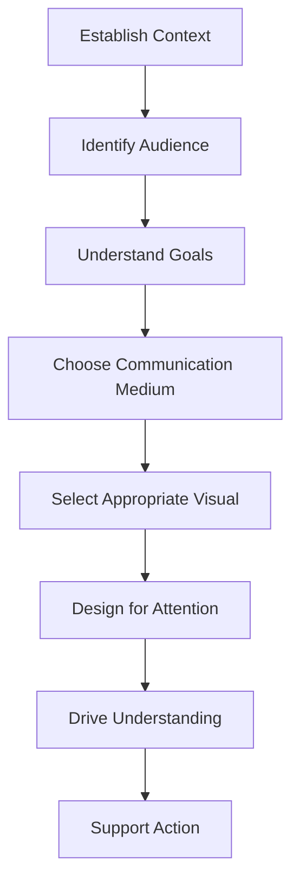

# 4. The Audience-Centric Storytelling Framework

Successful visualizations begin with understanding the audience.

### Step 1: Understand the Audience

Different audiences require different presentations.

| Audience  | Typical Need           |
| --------- | ---------------------- |
| Executive | Quick decisions        |
| Manager   | Performance monitoring |
| Analyst   | Detailed exploration   |
| Customer  | Simple interpretation  |

### Step 2: Define the Goal

Ask:

> What should the audience know after seeing this visual?

Examples:

* Detect a trend
* Compare performance
* Identify risk
* Prioritize action

### Step 3: Consider the Medium

The delivery format affects design.

| Medium         | Design Considerations       |
| -------------- | --------------------------- |
| Presentation   | Large visuals, minimal text |
| Dashboard      | Interactive exploration     |
| Email Report   | Self-explanatory visuals    |
| Printed Report | Detailed annotations        |

[!NOTE]

A visualization designed for a live presentation may fail when viewed independently in a report.
