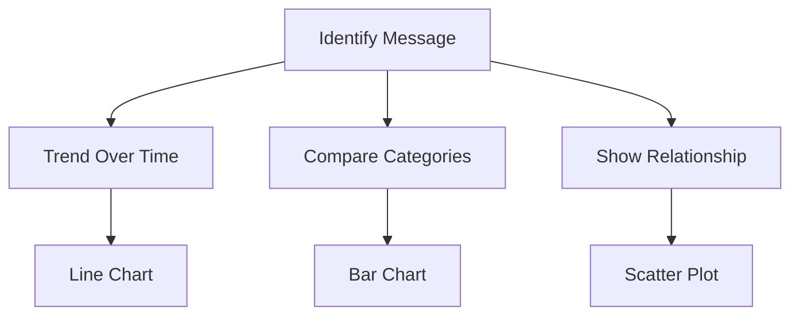

# 5. Selecting the Appropriate Visual

After establishing context, choose the visual based on the message.

The visualization must support the message.

Not the other way around.

### Common Mapping

| Message       | Recommended Visual |
| ------------- | ------------------ |
| Trends        | Line Chart         |
| Comparisons   | Bar Chart          |
| Relationships | Scatter Plot       |
| Composition   | Stacked Bar        |
| Distribution  | Histogram          |
