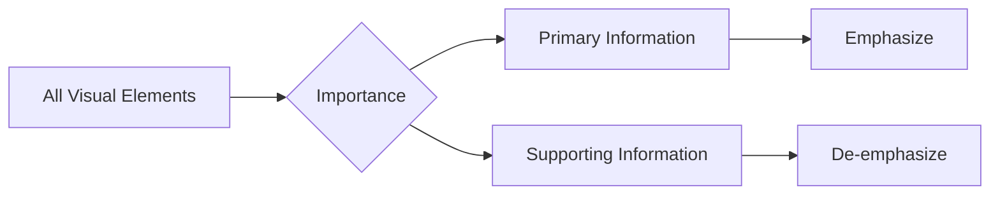

# 7. Managing Visual Contrast

### Purpose

Not all information should receive equal attention.

Important information should stand out.

Supporting information should remain visible but secondary.

This process is called:

> Visual Contrast Management

### The Two Components

#### Emphasis

Highlight what matters.

#### De-emphasis

Reduce attention toward supporting information.

