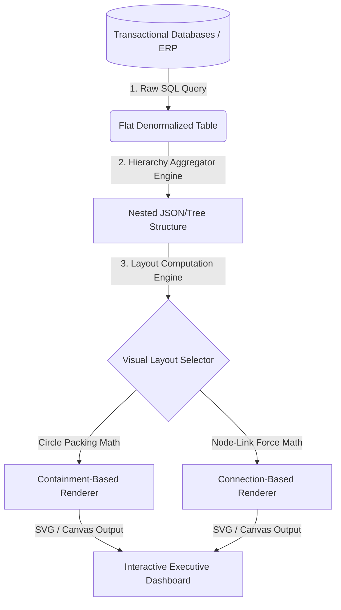
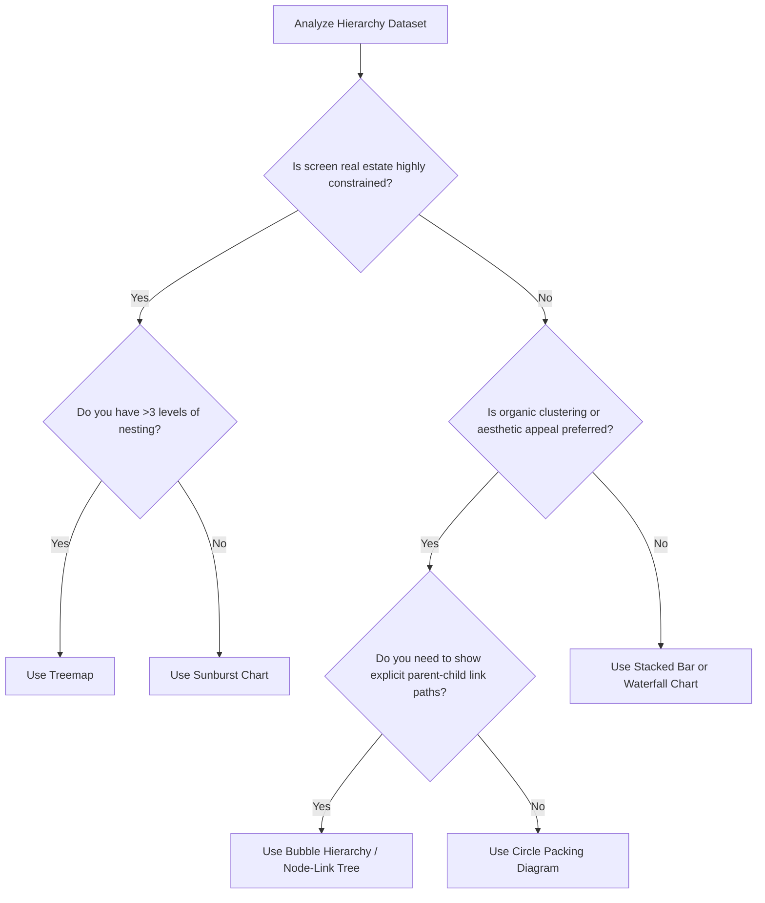

# 1. Foundations of Hierarchical & Part-to-Whole Relationships

Understanding how individual sub-components aggregate into a unified whole is critical for diagnosing systemic issues, allocating resources, and recognizing operational concentrations. 

### High-Level Architectural Flow: Data to Visualization
The process of transforming unstructured transactional data into a hierarchical visualization involves distinct ETL, structure-mapping, and layout calculation stages:

### Visual Selector Decision Tree
Selecting the correct chart depends on the depth of your hierarchy, the importance of exact area comparison, and the available dashboard canvas space. Use this decision tree to guide your architecture:

### Summary of Hierarchical Archetypes
* **Containment-based layouts** (e.g., Circle Packing, Treemaps) use nesting to show relationship boundaries.
* **Adjacency layouts** (e.g., Sunbursts) use physical proximity and concentric rings.
* **Connection-based layouts** (e.g., Bubble Hierarchies, Node-link trees) use lines to show relational bonds.
