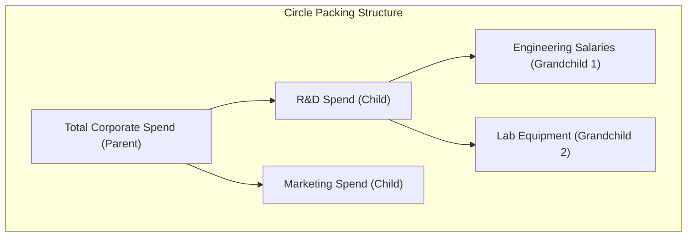

# 2. Deep Dive: Circle Packing Diagrams



### Concept Breakdown

* **Definition**  
  A Circle Packing Diagram is a containment-based visualization where hierarchical nodes are represented as circles, and nested child nodes are packed tightly within parent circles [1]. The area of each circle is proportional to its quantitative value (e.g., budget allocation, revenue, or server load) [1].

* **Why It Matters**  
  Traditional tree diagrams show relationships but fail to intuitively represent weight or volume. Circle packing displays both the nested structure and the proportional scale simultaneously, allowing viewers to see which sub-categories dominate a parent category [1].

* **Real-World Use Case**  
  *Philanthropic Fund Allocation:* Visualizing the Bill & Melinda Gates Foundation educational spending [1]. The outermost circle represents the total annual budget [1]. Nested within are circles for different program types (e.g., K-12 education vs. Higher Ed), and inside those are circles for individual regional grants [1].

* **Advantages**  
  * **Strong Gestalt Association:** Enclosure naturally represents grouping, making it easy to identify system boundaries.
  * **Aesthetic Engagement:** Highly organic layout that draws user attention more effectively than standard grids.
  * **Path Discovery:** Easy to spot anomalous "heavy" child nodes nested deep within otherwise low-priority categories.

* **Limitations**  
  * **Space Inefficiency:** Due to the geometry of circles, there is unused "white space" between packed boundaries, meaning they use screen space less efficiently than Treemaps.
  * **Inexact Comparisons:** Humans struggle to accurately compare the areas of circles compared to rectangles or bars.
  * **Deep Nesting Clutter:** Hierarchies deeper than three levels become unreadable without interactive "zoom-to-node" functionality.

* **Common Mistakes**  
  * **Mapping Data to Radius Instead of Area:** Scaling circle sizes by radius ($r$) rather than area ($\pi r^2$) quadratically distorts the perceived differences between values.
  * **Static rendering of deep hierarchies:** Trying to show 5+ levels on a static screen, making the leaf nodes look like unreadable pixel dust.

* **Best Practices**  
  * Always implement dynamic zoom-on-click functionality to let users drill down into nested levels.
  * Pair the visualization with a tool-tip hover state to display exact numeric values, compensating for human difficulty in comparing circle areas.
  * Limit the initial render to 2-3 levels of hierarchy to prevent cognitive overload.

* **Practical Implementation Notes**  
  Standard office suites like Microsoft Excel do not natively support circle packing layouts [1]. Implementation requires advanced visualization tools:
  * **BI Tools:** Power BI (via custom D3.js visual imports or AppSource custom visuals) [1] or Tableau (utilizing calculated coordinate files or extension APIs) [1].
  * **Web/Code Engines:** D3.js (`d3.pack`) or Python (`circlify` library plotted via `matplotlib`).

### Concrete Business Scenario: Global IT Infrastructure Cost Allocation
Consider a enterprise technology organization mapping its multi-million dollar cloud infrastructure spend. 

#### Flat Data Representation (Source)

| Grandparent (Cloud) | Parent (Service Category) | Child (Resource / Service) | Monthly Cost (USD) | Cost Health Status |
| :--- | :--- | :--- | :--- | :--- |
| AWS | Compute | EC2 Production Cluster | \$450,000 | Normal |
| AWS | Compute | Lambda Serverless API | \$50,000 | Normal |
| AWS | Database | RDS Aurora Main | \$300,000 | Critical (Over-provisioned) |
| GCP | Compute | GKE Kubernetes Dev | \$150,000 | Normal |
| GCP | Storage | Cloud Storage Cold Archive | \$250,000 | Warning (Under-utilized) |

#### Transformed JSON Structure for Layout Engine
This nested tree structure is required for engines like D3.js or Power BI JSON parsers:

```json
{
  "name": "Global Cloud Infrastructure",
  "value": 1200000,
  "children": [
    {
      "name": "AWS",
      "children": [
        {
          "name": "Compute",
          "children": [
            {"name": "EC2 Production Cluster", "value": 450000, "status": "normal"},
            {"name": "Lambda Serverless API", "value": 50000, "status": "normal"}
          ]
        },
        {
          "name": "Database",
          "children": [
            {"name": "RDS Aurora Main", "value": 300000, "status": "critical"}
          ]
        }
      ]
    },
    {
      "name": "GCP",
      "children": [
        {
          "name": "Compute",
          "children": [
            {"name": "GKE Kubernetes Dev", "value": 150000, "status": "normal"}
          ]
        },
        {
          "name": "Storage",
          "children": [
            {"name": "Cloud Storage Cold Archive", "value": 250000, "status": "warning"}
          ]
        }
      ]
    }
  ]
}
```
