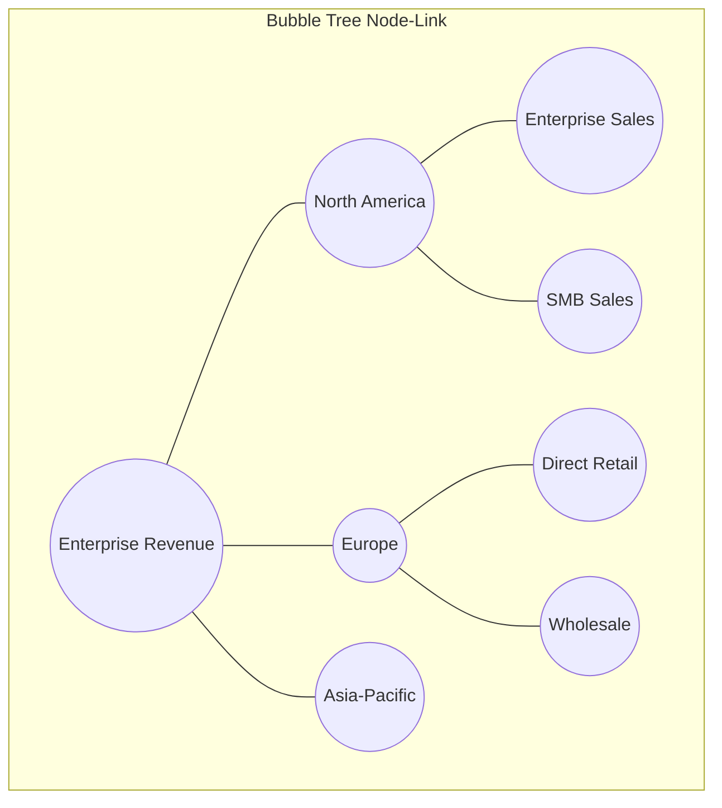
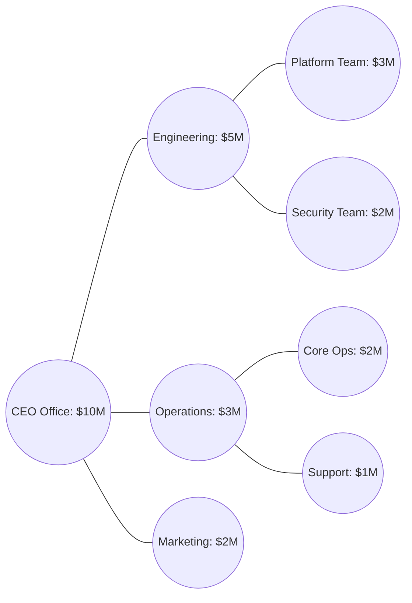

# 3. Deep Dive: Bubble Hierarchies (Hierarchical Bubble Trees)



### Concept Breakdown

* **Definition**  
  A Bubble Hierarchy (or Node-Link Bubble Tree) is a connection-based layout [1]. Instead of nesting circles inside one another, it places a central node representing the whole, with branch lines (offshoots) extending to categorical bubbles [1]. These category bubbles then branch out into further subdivisions [1]. The physical size of each bubble corresponds to its value relative to the system [1].

* **Why It Matters**  
  When hierarchies have deep structures with complex connections, nested containment diagrams (like circle packing) can obscure parent-child paths. A bubble hierarchy uses clear lines to keep these structural connections visible, showing both the flow of the network and the weight of each node [1].

* **Real-World Use Case**  
  *Enterprise Regional Sales Analysis:* A multinational company maps sales revenue across 100+ sub-regions [1, 2]. The central bubble represents total global revenue [1]. Offshoots connect to continental regions (Americas, EMEA, APAC), which branch out into national offices, and finally into individual city-level sales teams [1, 2]. 

* **Advantages**  
  * **Explicit Relationship Paths:** The connecting lines remove any ambiguity about which child node belongs to which parent.
  * **Relational Comparison:** It is easy to compare two distant sub-nodes (e.g., comparing Paris branch sales to Tokyo branch sales) because they are both visible on the same plain rather than hidden inside different nested circles [2].
  * **High Structural Flexibility:** The model easily supports unbalanced trees (where some branches are much deeper than others).

* **Limitations**  
  * **Visual Clutter / Sprawl:** A large number of nodes can cause branches to overlap or extend off the screen, requiring panning and zooming controls.
  * **Inefficient Canvas Use:** The layout leaves empty white space between branches to prevent overlap.
  * **Physics Engine Overload:** Interactive bubble trees often run on force-directed layout algorithms, which can cause performance lag when recalculating positions for more than 500 nodes.

* **Common Mistakes**  
  * **Missing Size Scale Consistency:** Failing to scale the parent bubble proportionally to the sum of its children, which distorts the visual hierarchy.
  * **Overlapping Nodes:** Using static coordinates that cause bubbles to render on top of each other, making the labels unreadable.

* **Best Practices**  
  * Use a radial or force-directed layout algorithm with collision detection to prevent bubble overlap.
  * Implement dynamic node collapsing: let users click on a parent node to fold/hide its child branches and clean up the view.
  * Use color coding to represent performance metrics (e.g., green for revenue growth, red for decline) and bubble size for volume.

* **Practical Implementation Notes**  
  * Requires dynamic canvas libraries that support network node-link rendering.
  * **Python Ecosystem:** Use `networkx` for calculating tree structures combined with `pyvis` or `plotly` for interactive web rendering.
  * **JavaScript Ecosystem:** Use D3's `d3-force` or `GoJS` for advanced custom layouts.

### Concrete Business Scenario: Organizational Capacity & Salary Mapping
Consider a human resources department analyzing personnel cost distribution across business units.



#### Node/Edge Schema for Layout Generation
To render this connection-based tree, layout engines require distinct definitions for the nodes (bubbles) and the edges (connecting lines):

```json
{
  "nodes": [
    {"id": "N1", "label": "CEO Office", "size": 100, "color": "#1f77b4"},
    {"id": "N2", "label": "Engineering", "size": 50, "color": "#ff7f0e"},
    {"id": "N3", "label": "Operations", "size": 30, "color": "#2ca02c"},
    {"id": "N4", "label": "Marketing", "size": 20, "color": "#d62728"},
    {"id": "N5", "label": "Platform Team", "size": 30, "color": "#ffbb78"},
    {"id": "N6", "label": "Security Team", "size": 20, "color": "#ffbb78"},
    {"id": "N7", "label": "Core Ops", "size": 20, "color": "#98df8a"},
    {"id": "N8", "label": "Support", "size": 10, "color": "#98df8a"}
  ],
  "edges": [
    {"source": "N1", "target": "N2"},
    {"source": "N1", "target": "N3"},
    {"source": "N1", "target": "N4"},
    {"source": "N2", "target": "N5"},
    {"source": "N2", "target": "N6"},
    {"source": "N3", "target": "N7"},
    {"source": "N3", "target": "N8"}
  ]
}
```
