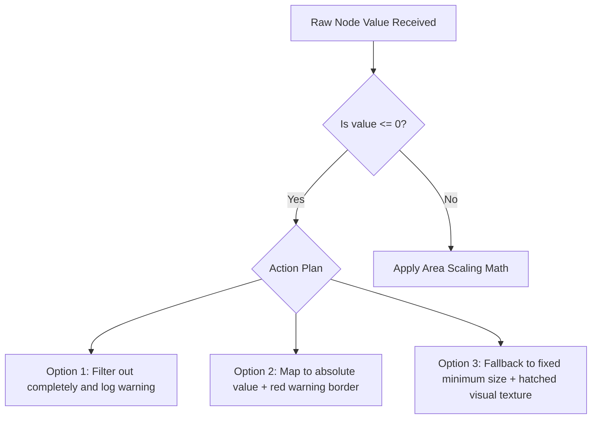

# 7. Advanced Engineering Considerations & Edge Cases

When designing enterprise visualizations for large datasets, engineers must plan for system constraints, data edge cases, and layout limitations.

### Performance & Client-Side Rendering Bottlenecks
* **The DOM Bottleneck:** Rendering over 1,000 interactive nodes as SVGs can slow down the browser, leading to sluggish UI performance.
* **Mitigation:**
  * For datasets with more than 500 nodes, use an **HTML5 Canvas** renderer instead of standard SVG. Canvas draws pixels directly to the screen, bypassing the DOM overhead.
  * Implement **Virtualization / Level of Detail (LOD) Rendering**: Only draw nodes that are visible in the user's current zoom level. Hide deeper nested nodes until the user clicks and zooms into their parent category.

### Mathematical Scaling & Size Distortion
* **The Radius Pitfall:** Programmers often mistakenly map numeric values to a circle's radius instead of its area.
  ```python
  # INCORRECT: Linear mapping to radius distorts scale
  radius = value 
  
  # CORRECT: Area-proportional mapping preserves visual accuracy
  radius = math.sqrt(value / math.pi)
  ```
  Scaling the radius linearly makes a value of $400$ look sixteen times larger than a value of $100$, rather than four times larger.

### Zero-Value, Negative-Value, and Outlier Handling
Real-world enterprise financial systems often include negative numbers (e.g., net losses) and zero values.



* **Zero Values:** If a business division generated \$0 in revenue, it cannot be rendered as a circle with an area of zero, as it would disappear from the chart entirely.
* **Negative Values:** Circle packing and bubble areas require positive values. You cannot render a circle with a negative area.
* **Solutions:**
  * **Absolute Value Mapping with Color Alert:** Convert negative values to positive areas, but use a distinct color (like bright red) or a patterned fill to flag them as negative balances.
  * **Hatched Fills for Underperforming Nodes:** Use specific visual textures to mark divisions with no active budget or negative balances, keeping them on the chart without skewing the scaling math.
  * **Implicit Logarithmic Scaling:** When dealing with massive outliers (e.g., one division making \$1B and another making \$10k), use log scaling to keep the smaller bubbles large enough to remain visible and interactive.

### Debugging Strategies
* **Mismatched Totals:** A common bug occurs when the computed sum of all child circles is larger than the parent circle. Validate your data pipeline to ensure parent nodes are always calculated as the exact sum of their active children:

$$
\text{Value}_{\text{Parent}} = \sum_{i=1}^{n} \text{Value}_{\text{Child}_i}
$$

* **Layout Instability:** Force-directed bubble layouts can sometimes bounce or wobble endlessly on the screen without settling. To fix this, adjust the layout engine's velocity decay and set a cooling parameter threshold. This forces the physics simulation to stop calculation frames once the node movement falls below a set limit.
