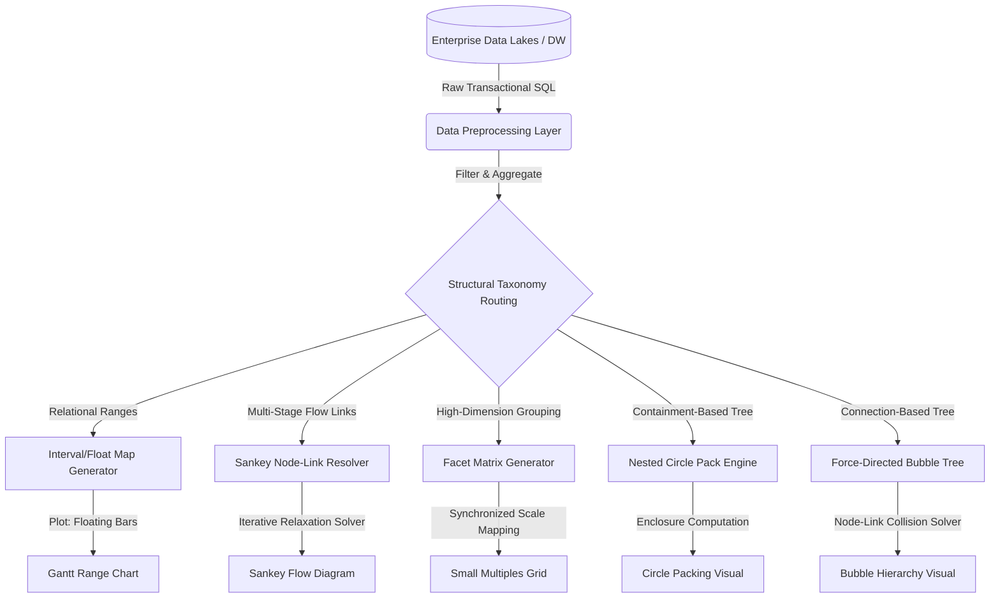

# 1. Unified Architectural Pipeline & Decision Framework

Creating high-fidelity, interactive visuals requires moving data through a structured pipeline: extracting raw transactional records, modeling relationships, and executing a layout algorithm.

### Global Selection Matrix

Use this matrix to identify the correct visual paradigm based on your data structure and analytical goals:

| Visual Paradigm | Input Data Structure | Primary Analytical Task | Key Visual Encoding | Space Efficiency |
| :--- | :--- | :--- | :--- | :--- |
| **Gantt Range Chart** [1, 2] | Categories with `Start` and `End` (Intervals) [2] | Compare absolute ranges and relative overlaps across categories [2] | Floating horizontal bars on a shared scale [2] | High |
| **Sankey Diagram** [2] | Source-Target Node-Link pairs with `Weight` values [2] | Track volumes and allocation paths across multiple categories [2] | Directed flow bands where width matches volume [2] | Moderate |
| **Small Multiples** [3] | High-dimensional tables with multiple category groupings [3] | Compare trends across groups without cluttering a single chart [3] | Synchronized grid of isolated charts [3] | High |
| **Circle Packing** [1] | Hierarchical nested JSON tree with leaf node weights [1] | Show nested groupings and spot size differences within categories [1] | Concentric nested circles scaled by area [1] | Moderate |
| **Bubble Hierarchy** [1] | Parent-Child pairs with node weights [1] | Map explicit hierarchical structures alongside node scale [1] | Linked nodes scaled by area [1] | Low |
