# 2. Gantt Category Range Charts (Floating Bar Charts)

```mermaid
gantt
    title Categorical Range Distribution Example
    dateFormat  X
    axisFormat %s
    section Category A
    Range 1           :active, 10, 50
    section Category B
    Range 2           :active, 40, 90
    section Category C
    Range 3           :active, 60, 110
```

* **Definition**  
  A Gantt Category Range Chart (also called a Floating Bar Chart) is a visual layout where categories are arranged along one axis, and the other axis maps a continuous variable [2]. Unlike standard bar charts that must start at a zero baseline, the bars in this chart float freely between custom starting and ending values [2].

* **Why It Matters**  
  Standard bar charts are designed to measure values from a zero baseline. When comparing ranges where the starting point itself varies across categories, standard bar charts fall short. Floating bars allow observers to analyze both the **relative span** (the size of the bar) and the **absolute position** (where the bar sits on the axis) at the same time [2].

* **Real-World Use Case**  
  *Global Market Price Spread:* A commodity trading desk uses floating bars to track price ranges for energy products across various regional hubs. For example, South Korea's natural gas import prices might fluctuate within a tight range (\$10 to \$25), while prices in Germany and France show much wider volatility and higher absolute spreads (\$40 to \$90) [2].

* **Advantages**  
  * **Dual-Variable Comparison:** Shows both the total span of a range and its absolute limits on a single scale [2].
  * **Clear Overlap Analysis:** Helps viewers quickly spot where ranges overlap or diverge across different categories [2].
  * **Flexible Baselines:** Removes the constraint of starting every bar at zero, preventing visual distortion when values sit far from the baseline [2].

* **Limitations**  
  * **No Direct Cumulative Comparison:** Because the bars do not start at a shared baseline, it is difficult for viewers to sum up total volumes across categories.
  * **Risk of Label Clutter:** Long category names on the y-axis can limit the space available for the actual data visualization on the canvas.

* **Common Mistakes**  
  * **Accidental Zero-Baseline Clipping:** Forcing the chart's axis to start at zero when all data points sit between 1,000 and 1,200. This squishes the bars and makes it hard to see the differences between ranges.
  * **Ordering Categories Randomly:** Arranging categories without a logical sequence makes the chart difficult to read. It is better to sort categories by their minimum value, maximum value, or span width.

* **Best Practices**  
  * Sort your categories programmatically by a meaningful metric (such as the range minimum or total span) to reveal trends.
  * Add reference lines across the background grid to help viewers compare absolute values across categories.
  * Place text labels inside or directly adjacent to the floating bars to display the precise minimum and maximum values.

* **Practical Implementation Notes**  
  * In standard business intelligence tools like Tableau, you can build this chart using a **Gantt Bar** mark type, mapping your start value to the axis and using the range span to define the bar size.
  * In Python, you can generate this layout by passing `left` (horizontal) or `bottom` (vertical) parameter arrays to `matplotlib.pyplot.barh` or `matplotlib.pyplot.bar`.
