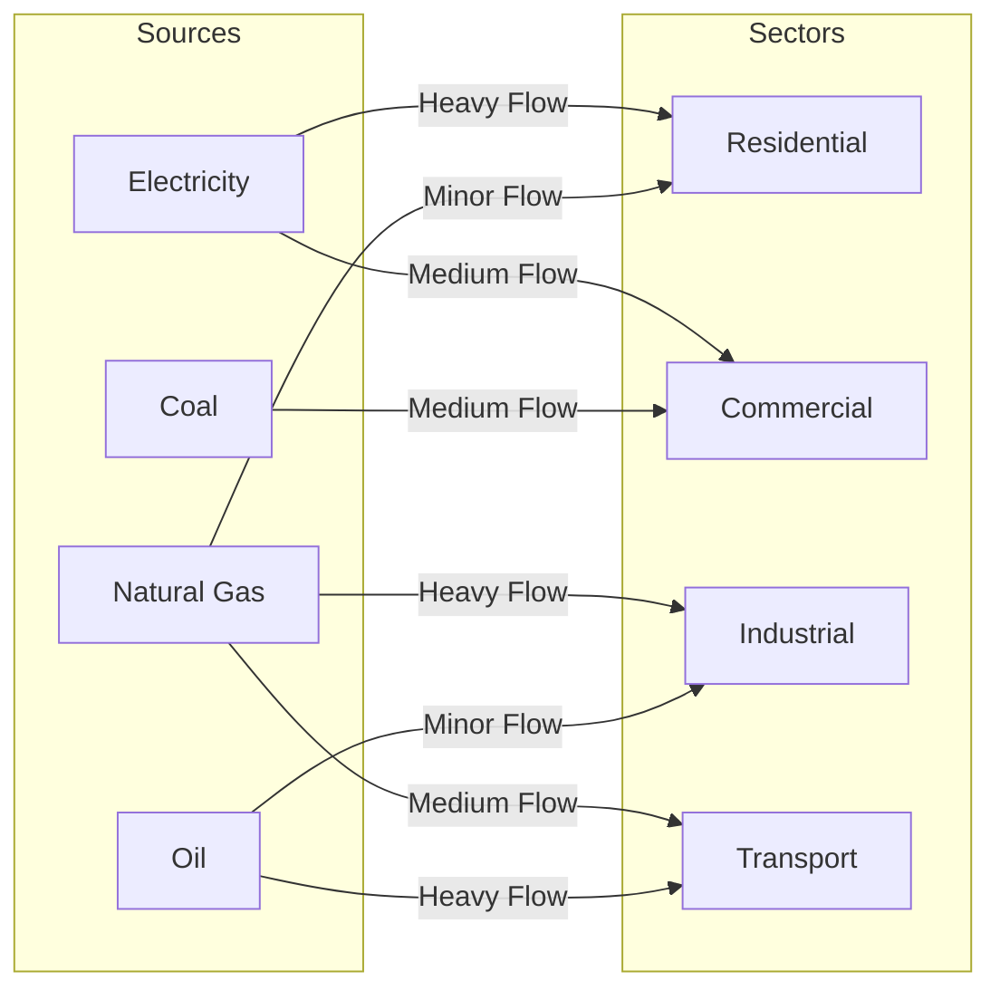

# 3. Sankey Diagrams (Flow Networks)

* **Definition**  
  A Sankey Diagram is a flow-based visualization where categories are represented as vertical blocks (nodes) connected by horizontal bands (links) [2]. The width of each band is directly proportional to the flow volume passing between those nodes [2].

* **Why It Matters**  
  Traditional stacked bar charts can show how a single category is broken down, but they struggle to track how resources split, combine, and flow across multiple stages [2]. Sankey diagrams solve this by visualizing resource paths, showing both source allocations and final destinations in a single view [2, 3].

* **Real-World Use Case**  
  *National Energy Flow Mapping:* Visualizing how primary energy sources (electricity, natural gas, coal, oil) feed into different consumer sectors (residential, commercial, industrial, transport) [2]. A quick glance shows that residential and commercial spaces depend heavily on electricity, while heavy industry and transport are powered almost entirely by natural gas and oil [2].

* **Advantages**  
  * **Highly Intuitive Flows:** The visual bands make it easy to see major pathways, system dependencies, and resource allocations at a glance [2, 3].
  * **Maintains Resource Conservation:** The total width entering a stage matches the total width exiting it, preserving balance across the system.
  * **Reduces Multi-Step Complexity:** Replaces complex, multi-page reports with a single diagram that tracks transactions from start to finish [2, 3].

* **Limitations**  
  * **Visual Congestion:** When dealing with highly connected networks, crossing flow lines can create a tangled "spaghetti" effect that is difficult to read.
  * **Sensitive to Axis Limits:** If node heights are too small, minor but critical flows can shrink to thin, unreadable lines.
  * **Difficulty with Feedback Loops:** Standard Sankey layout algorithms can break down or produce rendering errors if the data contains circular loops (e.g., flow moving from Node A to B, and then back to A).

* **Common Mistakes**  
  * **Ignoring Flow Direction:** Generating a flow diagram without clear directional cues, leaving users confused about which way the data is moving.
  * **Unfiltered Low-Value Flows:** Leaving hundreds of tiny, insignificant transactions in the dataset, which litters the canvas with thin, distracting lines.

* **Best Practices**  
  * Filter out minor transactions or group them into an "Other" category to keep the visual clean.
  * Use a dynamic layout solver (such as D3's iterative relaxation algorithm) to position nodes in a way that minimizes crossing paths.
  * Color-code flow bands based on their source node to make it easy to track paths across different stages of the diagram.

* **Practical Implementation Notes**  
  * **D3.js Implementation:** Use the `d3-sankey` plugin to calculate node and link coordinates.
  * **Python Implementation:** Use the `plotly.graph_objects.Sankey` module, which offers interactive, draggable nodes out of the box.
