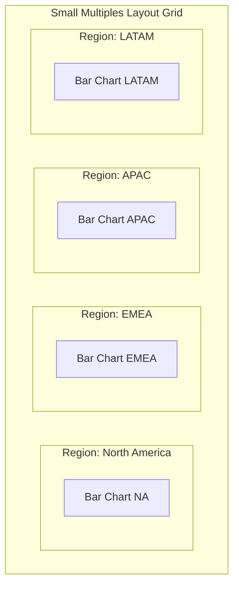

# 4. Small Multiples (Grid / Facet Plots)

* **Definition**  
  Small Multiples (also called Trellis, Lattice, or Facet plots) are a grid-based visualization layout where the same basic chart type is repeated across a categorical variable [3]. Every chart in the grid uses identical scales, axes, and visual designs, allowing users to compare different slices of the dataset [3].

* **Why It Matters**  
  When plotting multiple categories with several series on a single chart, the visual can quickly become cluttered. For instance, a single line chart with 20 different colored lines is almost impossible to read. Small multiples solve this by separating the data into a clean, organized grid of individual charts, making it easy to spot trends and compare patterns across different groups [3].

* **Real-World Use Case**  
  *Global Product Category Performance:* A multinational retail toy brand tracks product sales (e.g., action figures, Lego blocks) across several countries [3]. Instead of cramming all this data into one giant, hard-to-read grouped bar chart, they use small multiples [3]. They create a grid where each cell shows a clean, simple bar chart for a single country, allowing stakeholders to compare local sales trends and identify top-performing products across different regions [3].

* **Advantages**  
  * **Prevents Visual Clutter:** Spreads data out into a clean grid, making complex datasets easy to read without overlapping elements [3].
  * **Enables Rapid Comparison:** Because every chart in the grid shares the same axes and scales, users can quickly compare values across charts [3].
  * **Supports Multivariable Analysis:** Allows users to analyze trends across three or more variables (e.g., product type on the x-axis, sales on the y-axis, and country across the grid columns) [3].

* **Limitations**  
  * **Demands Screen Space:** Needs a larger layout canvas to display the grid of charts clearly.
  * **Harder to Compare Exact Values:** Comparing the exact height of two bars in separate grid cells is slightly more difficult than comparing them side-by-side on a single chart.

* **Common Mistakes**  
  * **Using Unsynchronized Scales:** Allowing each chart in the grid to calculate its own y-axis limits. This makes visual comparisons highly misleading, as a small value in one chart can look visually larger than a massive value in another.
  * **Adding Too Many Facets:** Creating a grid with too many cells (e.g., a $12 \times 12$ grid), which shrinks the individual charts and makes them unreadable.

* **Best Practices**  
  * Always lock the x- and y-axes to the same scales across all charts in the grid.
  * Sort the individual grid cells by a meaningful metric (such as total sales or growth rate) so that key insights bubble up to the top-left of the grid.
  * Simplify the design of the individual charts by removing redundant axis labels and gridlines to keep the overall layout clean.

* **Practical Implementation Notes**  
  * **Python Data Science Stack:** Extremely simple to implement using Seaborn (`FacetGrid` or `sns.relplot(..., col="region")`) or Plotly Express (`facet_col`).
  * **BI Tools:** Native support is built into Power BI (via the "Small Multiples" field well on standard charts) and Tableau (by dragging a categorical dimension onto the Rows or Columns shelves).
