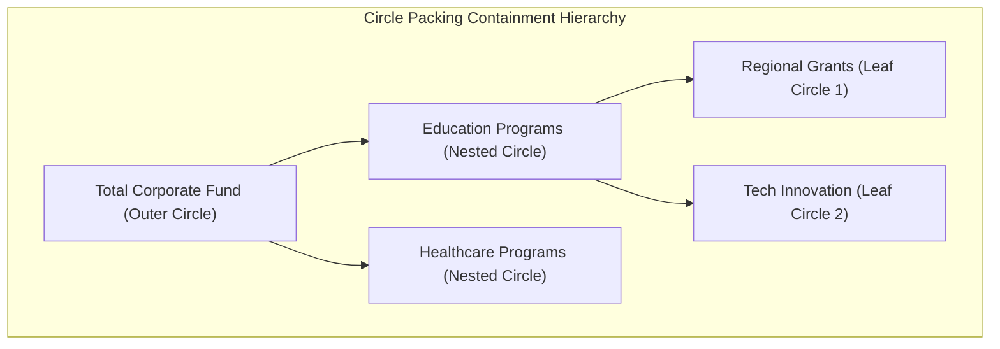

# 5. Circle Packing Diagrams (Containment-Based Hierarchies)

* **Definition**  
  A Circle Packing Diagram is a containment-based visualization where hierarchical nodes are represented as circles, and nested child categories are packed tightly inside their parent circles [1]. The area of each circle is scaled to represent a specific quantitative value [1].

* **Why It Matters**  
  Standard tree diagrams show hierarchical relationships but fail to intuitively represent weight or volume. Circle packing displays both the nested structure and the proportional scale simultaneously, allowing viewers to see which sub-categories dominate a parent category [1].

* **Real-World Use Case**  
  *Philanthropic Fund Allocation:* Visualizing educational spending by the Gates Foundation [1]. The outer circle represents the total program budget [1]. Inside it, nested circles represent main program areas (like K-12 education or Higher Ed), which contain smaller circles representing individual regional grants [1].

* **Advantages**  
  * **Clear Group Boundaries:** Enclosure naturally represents grouping, making it easy to identify system boundaries.
  * **High Aesthetic Appeal:** Highly organic layout that draws user attention more effectively than standard grids.
  * **Path Discovery:** Easy to spot anomalous "heavy" child nodes nested deep within otherwise low-priority categories.

* **Limitations**  
  * **Low Space Efficiency:** Due to the geometry of circles, there is unused "white space" between packed boundaries, meaning they use screen space less efficiently than Treemaps.
  * **Inexact Comparisons:** Humans struggle to accurately compare the areas of circles compared to rectangles or bars.
  * **Deep Nesting Clutter:** Hierarchies deeper than three levels become unreadable without interactive "zoom-to-node" functionality.

* **Common Mistakes**  
  * **Scaling by Radius Instead of Area:** Scaling circle sizes by radius ($r$) rather than area ($\pi r^2$) quadratically distorts the perceived differences between values.
  * **Static Rendering of Deep Trees:** Trying to show 5+ levels on a static screen, making the leaf nodes look like unreadable pixel dust.

* **Best Practices**  
  * Always implement dynamic zoom-on-click functionality to let users drill down into nested levels.
  * Pair the visualization with a tool-tip hover state to display exact numeric values, compensating for human difficulty in comparing circle areas.
  * Limit the initial render to 2-3 levels of hierarchy to prevent cognitive overload.

* **Practical Implementation Notes**  
  * Standard office suites like Microsoft Excel do not natively support circle packing layouts [1]. Implementation requires advanced visualization tools:
  * **BI Tools:** Power BI (via custom D3.js visual imports or AppSource custom visuals) [1] or Tableau (utilizing calculated coordinate files or extension APIs) [1].
  * **Web/Code Engines:** D3.js (`d3.pack`) or Python (`circlify` library plotted via `matplotlib`).
