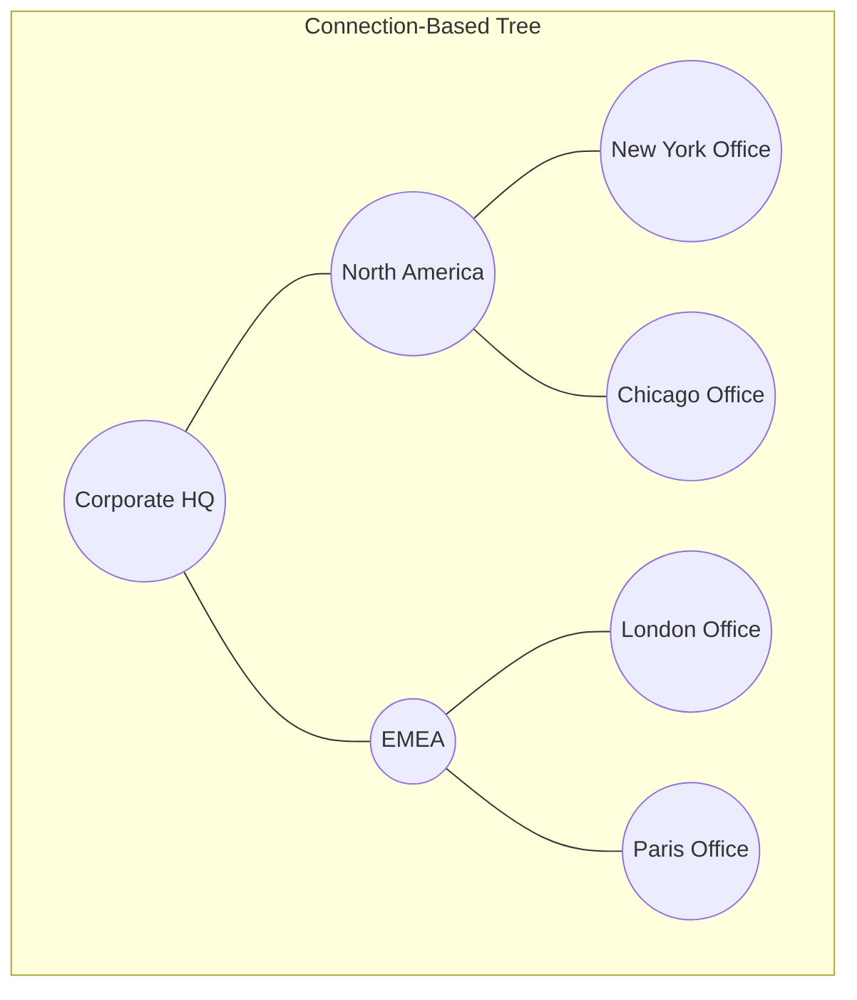

# 6. Bubble Hierarchies (Hierarchical Node-Link Trees)

* **Definition**  
  A Bubble Hierarchy (or Node-Link Bubble Tree) is a connection-based hierarchical visualization [1]. Instead of nesting circles inside one another, this layout displays a central node representing the whole, with explicit branch lines (offshoots) extending to category nodes [1]. These categories then branch out into sub-categories, with the area of each node scaled by its quantitative value [1].

* **Why It Matters**  
  When hierarchies have deep structures with complex connections, nested containment diagrams (like circle packing) can obscure parent-child paths. A bubble hierarchy uses clear lines to keep these structural connections visible, showing both the flow of the network and the weight of each node [1].

* **Real-World Use Case**  
  *Enterprise Revenue Distribution Mapping:* A multinational corporation tracks sales revenue across 100+ sub-regions [1, 2]. The central bubble represents total global revenue [1]. Offshoots connect to continental regions (Americas, EMEA, APAC), which branch out into national offices, and finally into individual city-level sales teams [1, 2].

* **Advantages**  
  * **Explicit Relationship Paths:** The connecting lines remove any ambiguity about which child node belongs to which parent.
  * **Relational Comparison:** It is easy to compare two distant sub-nodes (e.g., comparing Paris branch sales to Tokyo branch sales) because they are both visible on the same plain rather than hidden inside different nested circles [2].
  * **High Structural Flexibility:** The model easily supports unbalanced trees (where some branches are much deeper than others).

* **Limitations**  
  * **Visual Clutter / Sprawl:** A large number of nodes can cause branches to overlap or extend off the screen, requiring panning and zooming controls.
  * **Inefficient Canvas Use:** The layout leaves empty white space between branches to prevent overlap.
  * **Physics Engine Overload:** Interactive bubble trees often run on force-directed layout algorithms, which can cause performance lag when recalculating positions for more than 500 nodes.

* **Common Mistakes**  
  * **Missing Size Scale Consistency:** Failing to scale the parent bubble proportionally to the sum of its children, which distorts the visual hierarchy.
  * **Overlapping Nodes:** Using static coordinates that cause bubbles to render on top of each other, making the labels unreadable.

* **Best Practices**  
  * Use a radial or force-directed layout algorithm with collision detection to prevent bubble overlap.
  * Implement dynamic node collapsing: let users click on a parent node to fold/hide its child branches and clean up the view.
  * Use color coding to represent performance metrics (e.g., green for revenue growth, red for decline) and bubble size for volume.

* **Practical Implementation Notes**  
  * Requires dynamic canvas libraries that support network node-link rendering.
  * **Python Ecosystem:** Use `networkx` for calculating tree structures combined with `pyvis` or `plotly` for interactive web rendering.
  * **JavaScript Ecosystem:** Use D3's `d3-force` or `GoJS` for advanced custom layouts.
