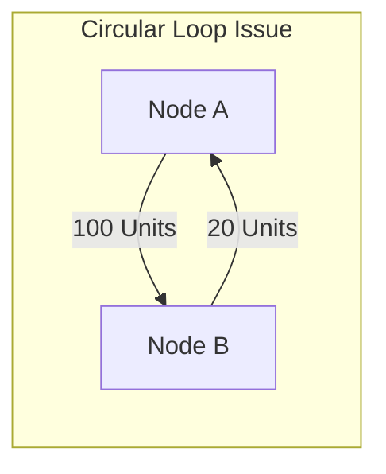
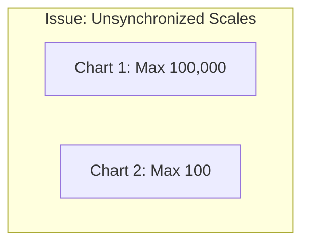

# 7. Performance Engineering & Edge Case Resolutions

When deploying advanced visualizations to production environments, engineers often encounter rendering limits and data-related edge cases. Below are strategies and code implementations designed to address these challenges.

### Edge Case: Resolving Circular Reference Loops in Sankey Data
Standard Sankey layout engines throw stack overflow errors when they encounter circular loops (e.g., Node A flows to Node B, which flows back to Node A).



To prevent layout calculation crashes, implement a preprocessing cycle-detector to find and resolve loops before feeding data to your rendering engine:

```python
def detect_and_resolve_sankey_cycles(links_list):
    """
    Scans a list of links (dictionaries with 'source' and 'target')
    to detect and remove circular dependencies, avoiding rendering engine crashes.
    """
    visited = set()
    path = set()
    safe_links = []
    removed_links = []

    # Map out adjacency list
    adj = {}
    for link in links_list:
        adj.setdefault(link['source'], []).append(link)

    def dfs(node):
        if node in path:
            return False  # Cycle detected
        if node in visited:
            return True

        path.add(node)
        for link in adj.get(node, []):
            if not dfs(link['target']):
                removed_links.append(link)
                continue
            safe_links.append(link)
        
        path.remove(node)
        visited.add(node)
        return True

    all_nodes = set(link['source'] for link in links_list).union(
        set(link['target'] for link in links_list)
    )
    
    for node in all_nodes:
        if node not in visited:
            dfs(node)
            
    return safe_links, removed_links
```

### Edge Case: Scaling and Axis Alignment in Small Multiples
A common issue with Small Multiples is when a single outlier category dominates the scale, making the trends in other facet charts look like flat, unreadable lines.



To resolve this issue without losing the ability to make accurate visual comparisons, use a **Dual-Scale Toggle** or apply a **Percent of Max Segment** normalizer:

$$
\text{Value}_{\text{Normalized}} = \frac{\text{Value}_{\text{Actual}}}{\text{Maximum Value of Local Facet}} \times 100
$$

* This formula allows viewers to compare relative local shapes and trends across categories on a normalized scale, while tool-tips or color shading can be used to represent the absolute differences in scale.
