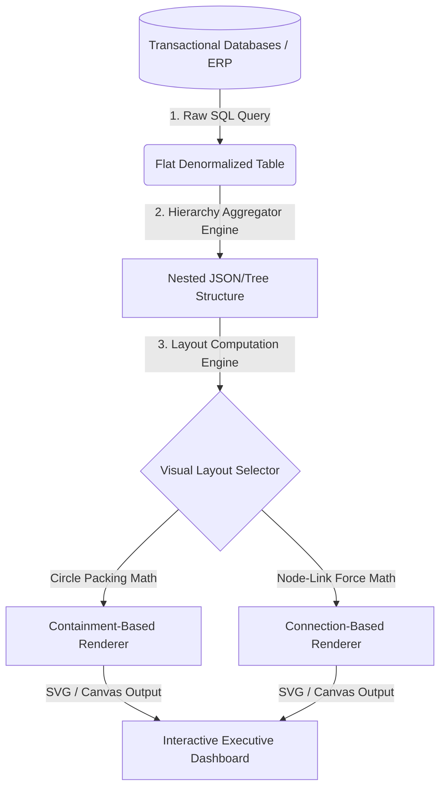
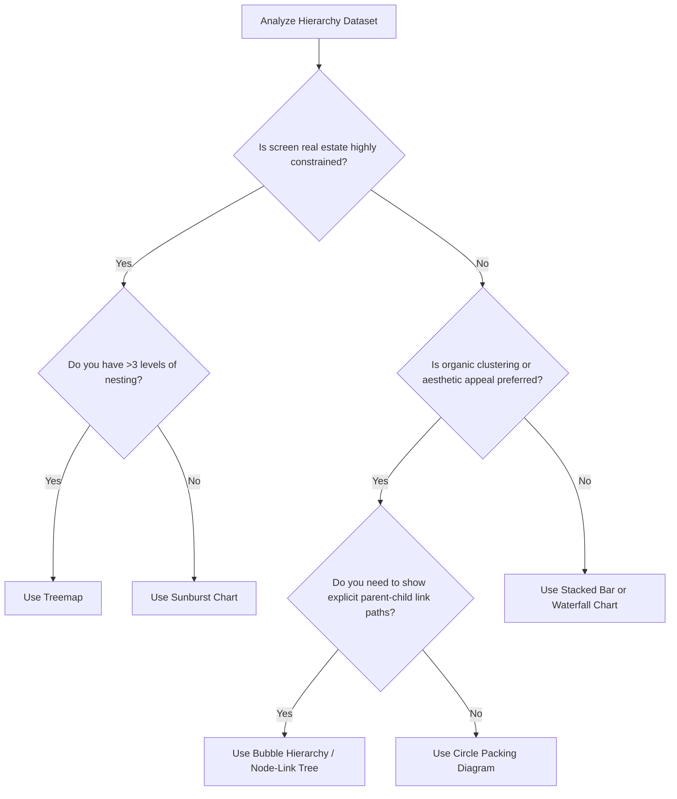
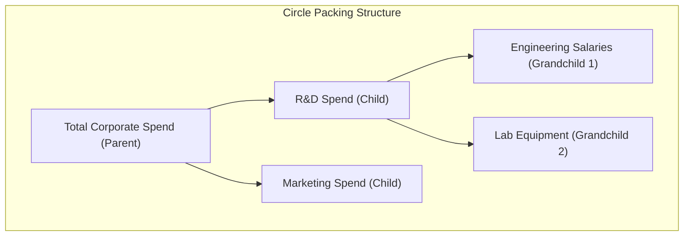
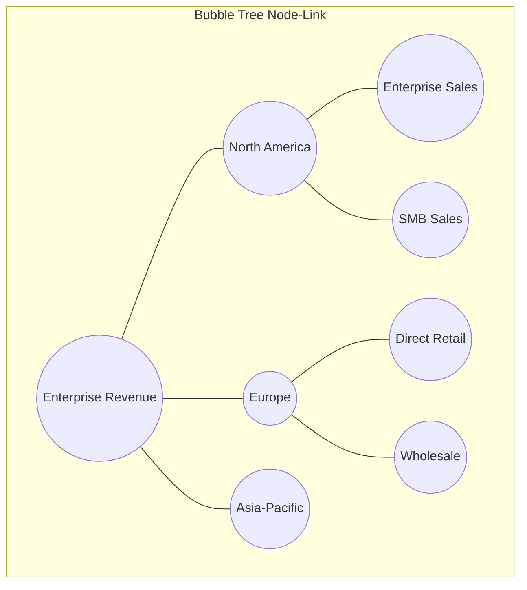
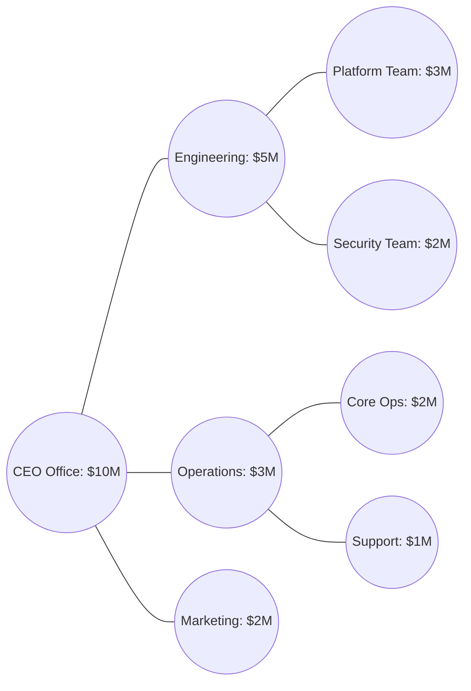
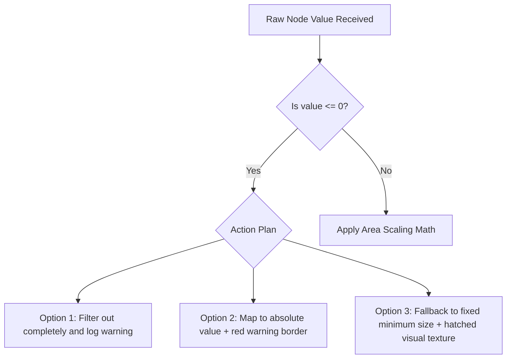

## Enterprise Guide to Hierarchical Data Visualization: Circle Packing and Bubble Hierarchies

Hierarchical data structures are pervasive across modern enterprise domains, representing everything from organizational charts and corporate spend portfolios to software dependency trees and regional sales breakdowns. Visually rendering these structures in a way that preserves both the **structural hierarchy** and the **part-to-whole quantitative relationship** is a common challenge in data engineering and business intelligence.

This document provides a technical blueprint for understanding, selecting, and implementing two advanced hierarchical visual paradigms: **Circle Packing Diagrams** and **Bubble Hierarchies**.

---

## 1. Foundations of Hierarchical & Part-to-Whole Relationships

Understanding how individual sub-components aggregate into a unified whole is critical for diagnosing systemic issues, allocating resources, and recognizing operational concentrations. 

### High-Level Architectural Flow: Data to Visualization
The process of transforming unstructured transactional data into a hierarchical visualization involves distinct ETL, structure-mapping, and layout calculation stages:



### Visual Selector Decision Tree
Selecting the correct chart depends on the depth of your hierarchy, the importance of exact area comparison, and the available dashboard canvas space. Use this decision tree to guide your architecture:



### Summary of Hierarchical Archetypes
* **Containment-based layouts** (e.g., Circle Packing, Treemaps) use nesting to show relationship boundaries.
* **Adjacency layouts** (e.g., Sunbursts) use physical proximity and concentric rings.
* **Connection-based layouts** (e.g., Bubble Hierarchies, Node-link trees) use lines to show relational bonds.

---

## 2. Deep Dive: Circle Packing Diagrams



### Concept Breakdown

* **Definition**  
  A Circle Packing Diagram is a containment-based visualization where hierarchical nodes are represented as circles, and nested child nodes are packed tightly within parent circles [1]. The area of each circle is proportional to its quantitative value (e.g., budget allocation, revenue, or server load) [1].

* **Why It Matters**  
  Traditional tree diagrams show relationships but fail to intuitively represent weight or volume. Circle packing displays both the nested structure and the proportional scale simultaneously, allowing viewers to see which sub-categories dominate a parent category [1].

* **Real-World Use Case**  
  *Philanthropic Fund Allocation:* Visualizing the Bill & Melinda Gates Foundation educational spending [1]. The outermost circle represents the total annual budget [1]. Nested within are circles for different program types (e.g., K-12 education vs. Higher Ed), and inside those are circles for individual regional grants [1].

* **Advantages**  
  * **Strong Gestalt Association:** Enclosure naturally represents grouping, making it easy to identify system boundaries.
  * **Aesthetic Engagement:** Highly organic layout that draws user attention more effectively than standard grids.
  * **Path Discovery:** Easy to spot anomalous "heavy" child nodes nested deep within otherwise low-priority categories.

* **Limitations**  
  * **Space Inefficiency:** Due to the geometry of circles, there is unused "white space" between packed boundaries, meaning they use screen space less efficiently than Treemaps.
  * **Inexact Comparisons:** Humans struggle to accurately compare the areas of circles compared to rectangles or bars.
  * **Deep Nesting Clutter:** Hierarchies deeper than three levels become unreadable without interactive "zoom-to-node" functionality.

* **Common Mistakes**  
  * **Mapping Data to Radius Instead of Area:** Scaling circle sizes by radius ($r$) rather than area ($\pi r^2$) quadratically distorts the perceived differences between values.
  * **Static rendering of deep hierarchies:** Trying to show 5+ levels on a static screen, making the leaf nodes look like unreadable pixel dust.

* **Best Practices**  
  * Always implement dynamic zoom-on-click functionality to let users drill down into nested levels.
  * Pair the visualization with a tool-tip hover state to display exact numeric values, compensating for human difficulty in comparing circle areas.
  * Limit the initial render to 2-3 levels of hierarchy to prevent cognitive overload.

* **Practical Implementation Notes**  
  Standard office suites like Microsoft Excel do not natively support circle packing layouts [1]. Implementation requires advanced visualization tools:
  * **BI Tools:** Power BI (via custom D3.js visual imports or AppSource custom visuals) [1] or Tableau (utilizing calculated coordinate files or extension APIs) [1].
  * **Web/Code Engines:** D3.js (`d3.pack`) or Python (`circlify` library plotted via `matplotlib`).

---

### Concrete Business Scenario: Global IT Infrastructure Cost Allocation
Consider a enterprise technology organization mapping its multi-million dollar cloud infrastructure spend. 

#### Flat Data Representation (Source)

| Grandparent (Cloud) | Parent (Service Category) | Child (Resource / Service) | Monthly Cost (USD) | Cost Health Status |
| :--- | :--- | :--- | :--- | :--- |
| AWS | Compute | EC2 Production Cluster | \$450,000 | Normal |
| AWS | Compute | Lambda Serverless API | \$50,000 | Normal |
| AWS | Database | RDS Aurora Main | \$300,000 | Critical (Over-provisioned) |
| GCP | Compute | GKE Kubernetes Dev | \$150,000 | Normal |
| GCP | Storage | Cloud Storage Cold Archive | \$250,000 | Warning (Under-utilized) |

#### Transformed JSON Structure for Layout Engine
This nested tree structure is required for engines like D3.js or Power BI JSON parsers:

```json
{
  "name": "Global Cloud Infrastructure",
  "value": 1200000,
  "children": [
    {
      "name": "AWS",
      "children": [
        {
          "name": "Compute",
          "children": [
            {"name": "EC2 Production Cluster", "value": 450000, "status": "normal"},
            {"name": "Lambda Serverless API", "value": 50000, "status": "normal"}
          ]
        },
        {
          "name": "Database",
          "children": [
            {"name": "RDS Aurora Main", "value": 300000, "status": "critical"}
          ]
        }
      ]
    },
    {
      "name": "GCP",
      "children": [
        {
          "name": "Compute",
          "children": [
            {"name": "GKE Kubernetes Dev", "value": 150000, "status": "normal"}
          ]
        },
        {
          "name": "Storage",
          "children": [
            {"name": "Cloud Storage Cold Archive", "value": 250000, "status": "warning"}
          ]
        }
      ]
    }
  ]
}
```

---

## 3. Deep Dive: Bubble Hierarchies (Hierarchical Bubble Trees)



### Concept Breakdown

* **Definition**  
  A Bubble Hierarchy (or Node-Link Bubble Tree) is a connection-based layout [1]. Instead of nesting circles inside one another, it places a central node representing the whole, with branch lines (offshoots) extending to categorical bubbles [1]. These category bubbles then branch out into further subdivisions [1]. The physical size of each bubble corresponds to its value relative to the system [1].

* **Why It Matters**  
  When hierarchies have deep structures with complex connections, nested containment diagrams (like circle packing) can obscure parent-child paths. A bubble hierarchy uses clear lines to keep these structural connections visible, showing both the flow of the network and the weight of each node [1].

* **Real-World Use Case**  
  *Enterprise Regional Sales Analysis:* A multinational company maps sales revenue across 100+ sub-regions [1, 2]. The central bubble represents total global revenue [1]. Offshoots connect to continental regions (Americas, EMEA, APAC), which branch out into national offices, and finally into individual city-level sales teams [1, 2]. 

* **Advantages**  
  * **Explicit Relationship Paths:** The connecting lines remove any ambiguity about which child node belongs to which parent.
  * **Relational Comparison:** It is easy to compare two distant sub-nodes (e.g., comparing Paris branch sales to Tokyo branch sales) because they are both visible on the same plain rather than hidden inside different nested circles [2].
  * **High Structural Flexibility:** The model easily supports unbalanced trees (where some branches are much deeper than others).

* **Limitations**  
  * **Visual Clutter / Sprawl:** A large number of nodes can cause branches to overlap or extend off the screen, requiring panning and zooming controls.
  * **Inefficient Canvas Use:** The layout leaves empty white space between branches to prevent overlap.
  * **Physics Engine Overload:** Interactive bubble trees often run on force-directed layout algorithms, which can cause performance lag when recalculating positions for more than 500 nodes.

* **Common Mistakes**  
  * **Missing Size Scale Consistency:** Failing to scale the parent bubble proportionally to the sum of its children, which distorts the visual hierarchy.
  * **Overlapping Nodes:** Using static coordinates that cause bubbles to render on top of each other, making the labels unreadable.

* **Best Practices**  
  * Use a radial or force-directed layout algorithm with collision detection to prevent bubble overlap.
  * Implement dynamic node collapsing: let users click on a parent node to fold/hide its child branches and clean up the view.
  * Use color coding to represent performance metrics (e.g., green for revenue growth, red for decline) and bubble size for volume.

* **Practical Implementation Notes**  
  * Requires dynamic canvas libraries that support network node-link rendering.
  * **Python Ecosystem:** Use `networkx` for calculating tree structures combined with `pyvis` or `plotly` for interactive web rendering.
  * **JavaScript Ecosystem:** Use D3's `d3-force` or `GoJS` for advanced custom layouts.

---

### Concrete Business Scenario: Organizational Capacity & Salary Mapping
Consider a human resources department analyzing personnel cost distribution across business units.



#### Node/Edge Schema for Layout Generation
To render this connection-based tree, layout engines require distinct definitions for the nodes (bubbles) and the edges (connecting lines):

```json
{
  "nodes": [
    {"id": "N1", "label": "CEO Office", "size": 100, "color": "#1f77b4"},
    {"id": "N2", "label": "Engineering", "size": 50, "color": "#ff7f0e"},
    {"id": "N3", "label": "Operations", "size": 30, "color": "#2ca02c"},
    {"id": "N4", "label": "Marketing", "size": 20, "color": "#d62728"},
    {"id": "N5", "label": "Platform Team", "size": 30, "color": "#ffbb78"},
    {"id": "N6", "label": "Security Team", "size": 20, "color": "#ffbb78"},
    {"id": "N7", "label": "Core Ops", "size": 20, "color": "#98df8a"},
    {"id": "N8", "label": "Support", "size": 10, "color": "#98df8a"}
  ],
  "edges": [
    {"source": "N1", "target": "N2"},
    {"source": "N1", "target": "N3"},
    {"source": "N1", "target": "N4"},
    {"source": "N2", "target": "N5"},
    {"source": "N2", "target": "N6"},
    {"source": "N3", "target": "N7"},
    {"source": "N3", "target": "N8"}
  ]
}
```

---

## 4. Section Summary and Key Takeaways

* **Scale Matters:** Both visualization styles use circle areas to represent quantitative data, meaning standard radial scaling math errors can lead to misleading reports.
* **Structural Differences:** Circle Packing uses nested boundaries to show containment, while Bubble Hierarchies use explicit connecting lines [1].
* **Setup Requirements:** These advanced charts cannot be built natively with basic Excel grids [1]. Designing and using them effectively requires programmatic tools (D3.js, Python) or specialized BI configurations [1].

---

## 5. Architectural Comparison: Circle Packing vs. Bubble Hierarchies

This table compares both methods to help you choose the right design for your system architecture:

| Architectural Evaluation Metric | Circle Packing Diagrams [1] | Bubble Hierarchies (Node-Link) [1] |
| :--- | :--- | :--- |
| **Primary Structural Metaphor** | Containment & Nesting [1] | Node-Link Connection (Offshoots) [1] |
| **Max Practical Depth Limit** | 3 Levels (before nested circles become unreadable) | 5+ Levels (mitigated by collapsing/expanding nodes) |
| **Data Structure Input** | Single nested JSON object tree | Flat tables, or separate Nodes and Edges tables |
| **Canvas Space Efficiency** | Moderate (some space lost to circle geometry) | Low (significant space required to avoid overlapping branches) |
| **Computational Complexity** | $O(N \log N)$ (Circle packing boundary math) | $O(N^2)$ (Force-directed physics calculations per frame) |
| **Best Analytical Lens** | Spotting concentration issues and seeing relative scale [1] | Tracking paths and comparing distant branches [2] |
| **Common Customizations** | Zoom-to-node animations, CSS-based color styling | Interactive physics controls, node grouping, drag-to-restructure |

---

## 6. Implementation Guide & Code Blueprint

The following sections provide practical blueprints for building these visualizations using modern programming environments.

### Programmatic Implementation: Python Engine
This script shows how to transform a flat dataset and generate a local **Circle Packing** coordinates map using Python's `circlify` and `matplotlib` packages.

```python
import matplotlib.pyplot as plt
import circlify

## 1. Define flat hierarchical data structure
data = [
    {
        'id': 'Global Operations',
        'datum': 1000,
        'children': [
            {
                'id': 'Americas Region',
                'datum': 600,
                'children': [
                    {'id': 'US East', 'datum': 350},
                    {'id': 'US West', 'datum': 150},
                    {'id': 'Canada', 'datum': 100}
                ]
            },
            {
                'id': 'EMEA Region',
                'datum': 400,
                'children': [
                    {'id': 'Germany', 'datum': 250},
                    {'id': 'UK', 'datum': 150}
                ]
            }
        ]
    }
]

## 2. Compute circle packing positions using circlify algorithm
circles = circlify.circlify(
    data, 
    show_enclosure=True, 
    target_enclosure=circlify.Circle(x=0, y=0, r=1)
)

## 3. Configure the matplotlib canvas
fig, ax = plt.subplots(figsize=(10, 10))
ax.axis('off')

## Set limits to prevent rendering issues
lim = max(
    max(
        abs(circle.x) + circle.r,
        abs(circle.y) + circle.r
    )
    for circle in circles
)
plt.xlim(-lim, lim)
plt.ylim(-lim, lim)

## 4. Render circles on screen
for circle in circles:
    if circle.level == 1:
        # Parent level styling
        ax.add_patch(plt.Circle((circle.x, circle.y), circle.r, alpha=0.2, linewidth=2, color="#1f77b4"))
    elif circle.level == 2:
        # Child level styling
        ax.add_patch(plt.Circle((circle.x, circle.y), circle.r, alpha=0.4, linewidth=1, color="#aec7e8"))
    elif circle.level == 3:
        # Leaf level styling
        ax.add_patch(plt.Circle((circle.x, circle.y), circle.r, alpha=0.7, linewidth=0.5, color="#ffbb78"))
        # Add labels only to the leaf nodes to avoid text clutter
        if circle.ex is not None and 'id' in circle.ex:
            plt.annotate(circle.ex['id'], (circle.x, circle.y), va='center', ha='center', fontsize=8)

plt.title('Enterprise Cost Distribution (Circle Packed)', fontsize=14, pad=20)
plt.show()
```

---

## 7. Advanced Engineering Considerations & Edge Cases

When designing enterprise visualizations for large datasets, engineers must plan for system constraints, data edge cases, and layout limitations.

### Performance & Client-Side Rendering Bottlenecks
* **The DOM Bottleneck:** Rendering over 1,000 interactive nodes as SVGs can slow down the browser, leading to sluggish UI performance.
* **Mitigation:**
  * For datasets with more than 500 nodes, use an **HTML5 Canvas** renderer instead of standard SVG. Canvas draws pixels directly to the screen, bypassing the DOM overhead.
  * Implement **Virtualization / Level of Detail (LOD) Rendering**: Only draw nodes that are visible in the user's current zoom level. Hide deeper nested nodes until the user clicks and zooms into their parent category.

### Mathematical Scaling & Size Distortion
* **The Radius Pitfall:** Programmers often mistakenly map numeric values to a circle's radius instead of its area.
  ```python
  # INCORRECT: Linear mapping to radius distorts scale
  radius = value 
  
  # CORRECT: Area-proportional mapping preserves visual accuracy
  radius = math.sqrt(value / math.pi)
  ```
  Scaling the radius linearly makes a value of $400$ look sixteen times larger than a value of $100$, rather than four times larger.

### Zero-Value, Negative-Value, and Outlier Handling
Real-world enterprise financial systems often include negative numbers (e.g., net losses) and zero values.



* **Zero Values:** If a business division generated \$0 in revenue, it cannot be rendered as a circle with an area of zero, as it would disappear from the chart entirely.
* **Negative Values:** Circle packing and bubble areas require positive values. You cannot render a circle with a negative area.
* **Solutions:**
  * **Absolute Value Mapping with Color Alert:** Convert negative values to positive areas, but use a distinct color (like bright red) or a patterned fill to flag them as negative balances.
  * **Hatched Fills for Underperforming Nodes:** Use specific visual textures to mark divisions with no active budget or negative balances, keeping them on the chart without skewing the scaling math.
  * **Implicit Logarithmic Scaling:** When dealing with massive outliers (e.g., one division making \$1B and another making \$10k), use log scaling to keep the smaller bubbles large enough to remain visible and interactive.

### Debugging Strategies
* **Mismatched Totals:** A common bug occurs when the computed sum of all child circles is larger than the parent circle. Validate your data pipeline to ensure parent nodes are always calculated as the exact sum of their active children:
  $$\text{Value}_{\text{Parent}} = \sum_{i=1}^{n} \text{Value}_{\text{Child}_i}$$
* **Layout Instability:** Force-directed bubble layouts can sometimes bounce or wobble endlessly on the screen without settling. To fix this, adjust the layout engine's velocity decay and set a cooling parameter threshold. This forces the physics simulation to stop calculation frames once the node movement falls below a set limit.

---

## 8. Section Summary & Operational Checklists

### Architect's Visualization Choice Checklist
* Choose **Circle Packing** [1] when you need a clean, engaging visual that clearly highlights how different categories share budget, space, or resources.
* Choose **Bubble Hierarchies** [1] when you need to display deep, multi-tier organizational structures where tracking relationships and comparing distant branches is a priority [2].
* Use **dynamic zoom-to-node features** and hover tool-tips to keep dashboards clean, clear, and easy for stakeholders to navigate.

---

## References
[1] Assessing Hierarchies and Part-to-Whole Relationships Transcript, Page 1.
[2] Assessing Hierarchies and Part-to-Whole Relationships Transcript, Page 2.

Tags: #statistics #machine-learning #data-science #statistical-modelling