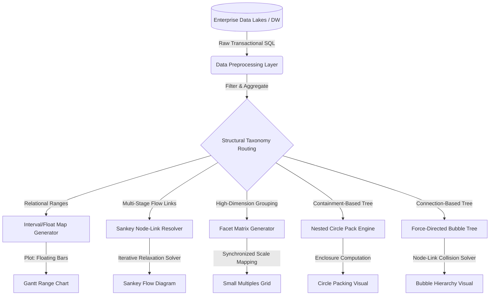
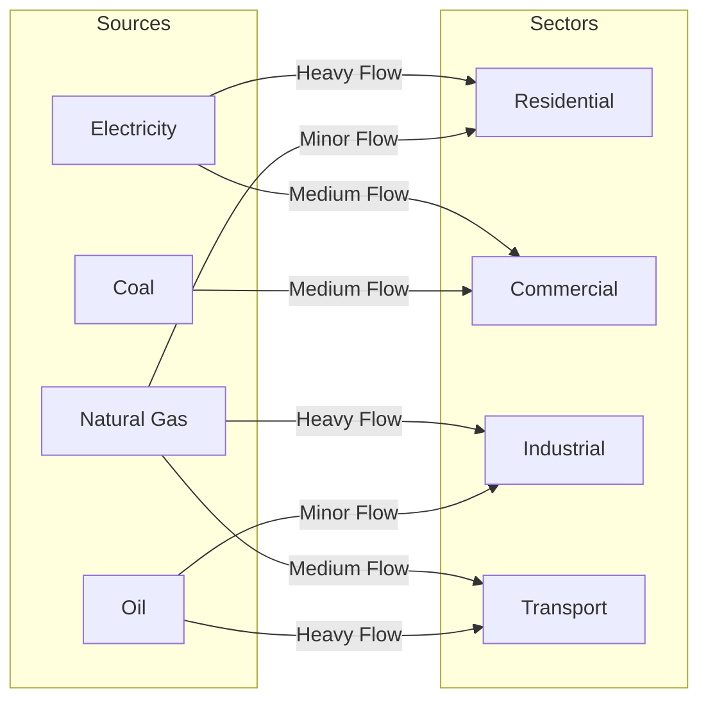
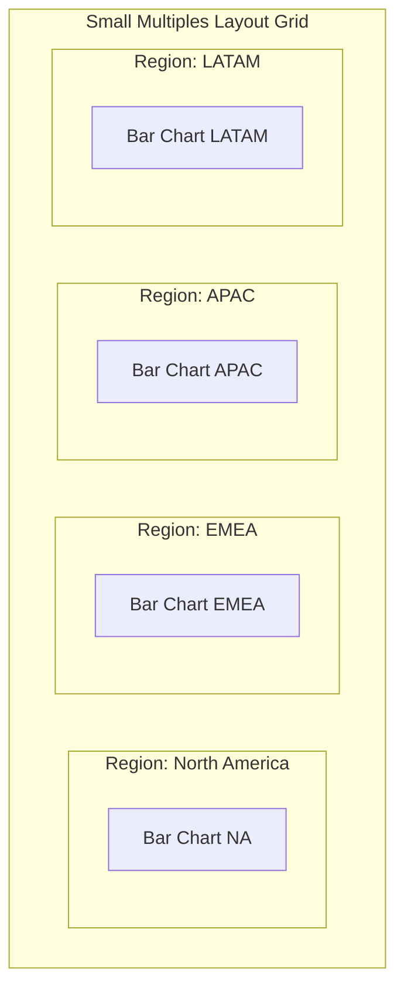
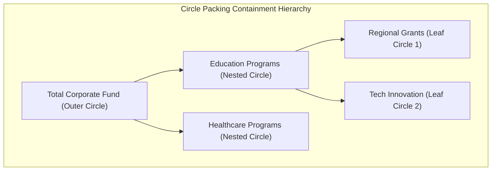
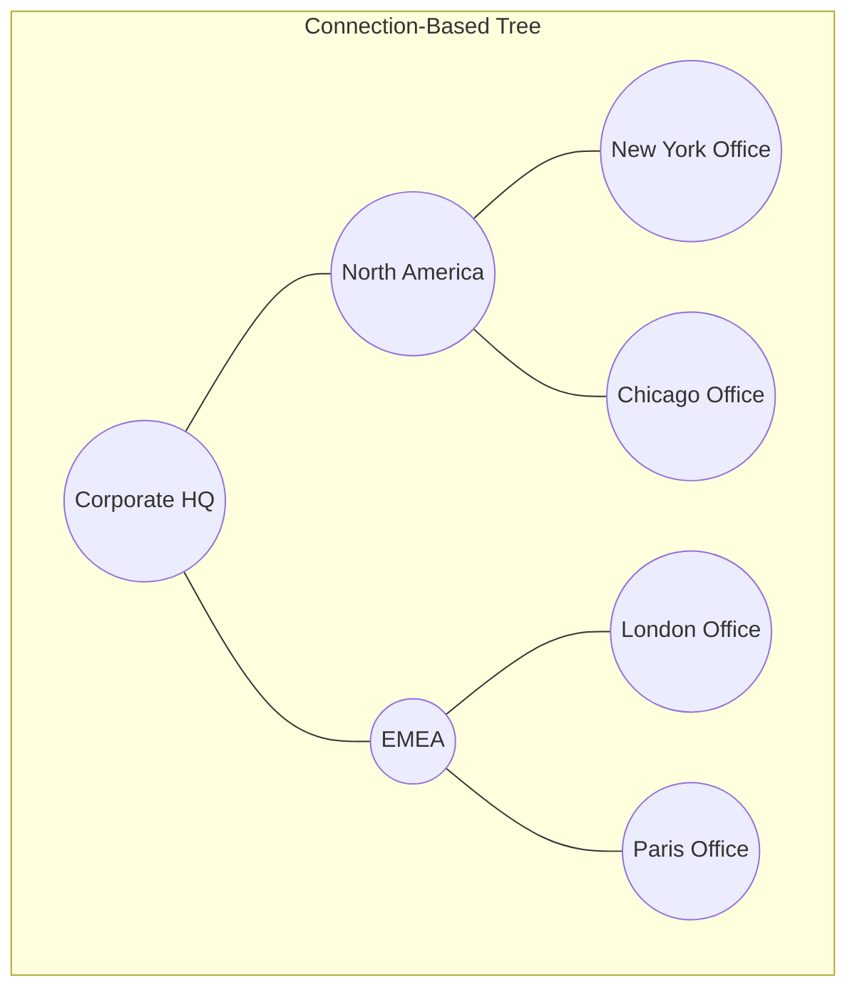
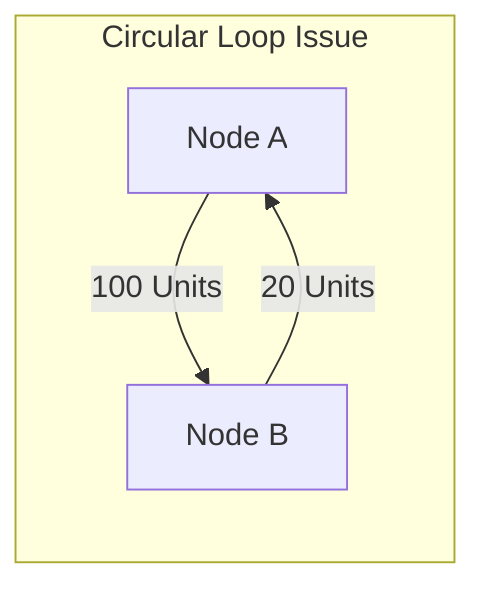
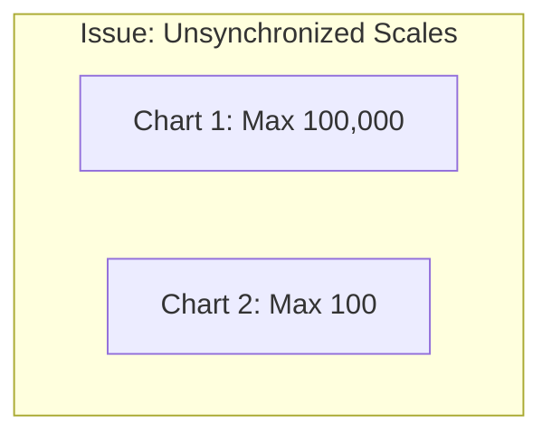

## Enterprise Taxonomy of Data Visualization: Advanced Categorical Comparison, Flow Mapping, and Hierarchical Systems

Modern enterprise analytics demands visual paradigms that go beyond basic charts. As datasets grow in dimension and structural complexity, data professionals must select advanced visual encodings that match specific analytical tasks [1]. Choosing the wrong visual can obscure vital insights and lead to incorrect operational decisions [1].

This document details five advanced visual paradigms designed for **Categorical Comparison**, **Flow Mapping**, and **Hierarchical Composition**:
1. **Gantt Category Range Charts** (Floating bar charts for absolute and relative interval comparisons) [1, 2]
2. **Sankey Diagrams** (Multi-stage flow networks mapping quantities across categories) [2]
3. **Small Multiples** (Grid-based dimensional slicing for multi-variable analysis) [3]
4. **Circle Packing Diagrams** (Containment-based nested part-to-whole hierarchies) [1]
5. **Bubble Hierarchies** (Connection-based node-link trees scaling by quantitative weight) [1]

## 1. Unified Architectural Pipeline & Decision Framework

Creating high-fidelity, interactive visuals requires moving data through a structured pipeline: extracting raw transactional records, modeling relationships, and executing a layout algorithm.



### Global Selection Matrix

Use this matrix to identify the correct visual paradigm based on your data structure and analytical goals:

| Visual Paradigm | Input Data Structure | Primary Analytical Task | Key Visual Encoding | Space Efficiency |
| :--- | :--- | :--- | :--- | :--- |
| **Gantt Range Chart** [1, 2] | Categories with `Start` and `End` (Intervals) [2] | Compare absolute ranges and relative overlaps across categories [2] | Floating horizontal bars on a shared scale [2] | High |
| **Sankey Diagram** [2] | Source-Target Node-Link pairs with `Weight` values [2] | Track volumes and allocation paths across multiple categories [2] | Directed flow bands where width matches volume [2] | Moderate |
| **Small Multiples** [3] | High-dimensional tables with multiple category groupings [3] | Compare trends across groups without cluttering a single chart [3] | Synchronized grid of isolated charts [3] | High |
| **Circle Packing** [1] | Hierarchical nested JSON tree with leaf node weights [1] | Show nested groupings and spot size differences within categories [1] | Concentric nested circles scaled by area [1] | Moderate |
| **Bubble Hierarchy** [1] | Parent-Child pairs with node weights [1] | Map explicit hierarchical structures alongside node scale [1] | Linked nodes scaled by area [1] | Low |

## 2. Gantt Category Range Charts (Floating Bar Charts)

```mermaid
gantt
    title Categorical Range Distribution Example
    dateFormat  X
    axisFormat %s
    section Category A
    Range 1           :active, 10, 50
    section Category B
    Range 2           :active, 40, 90
    section Category C
    Range 3           :active, 60, 110
```



* **Definition**  
  A Gantt Category Range Chart (also called a Floating Bar Chart) is a visual layout where categories are arranged along one axis, and the other axis maps a continuous variable [2]. Unlike standard bar charts that must start at a zero baseline, the bars in this chart float freely between custom starting and ending values [2].

* **Why It Matters**  
  Standard bar charts are designed to measure values from a zero baseline. When comparing ranges where the starting point itself varies across categories, standard bar charts fall short. Floating bars allow observers to analyze both the **relative span** (the size of the bar) and the **absolute position** (where the bar sits on the axis) at the same time [2].

* **Real-World Use Case**  
  *Global Market Price Spread:* A commodity trading desk uses floating bars to track price ranges for energy products across various regional hubs. For example, South Korea's natural gas import prices might fluctuate within a tight range (\$10 to \$25), while prices in Germany and France show much wider volatility and higher absolute spreads (\$40 to \$90) [2].

* **Advantages**  
  * **Dual-Variable Comparison:** Shows both the total span of a range and its absolute limits on a single scale [2].
  * **Clear Overlap Analysis:** Helps viewers quickly spot where ranges overlap or diverge across different categories [2].
  * **Flexible Baselines:** Removes the constraint of starting every bar at zero, preventing visual distortion when values sit far from the baseline [2].

* **Limitations**  
  * **No Direct Cumulative Comparison:** Because the bars do not start at a shared baseline, it is difficult for viewers to sum up total volumes across categories.
  * **Risk of Label Clutter:** Long category names on the y-axis can limit the space available for the actual data visualization on the canvas.

* **Common Mistakes**  
  * **Accidental Zero-Baseline Clipping:** Forcing the chart's axis to start at zero when all data points sit between 1,000 and 1,200. This squishes the bars and makes it hard to see the differences between ranges.
  * **Ordering Categories Randomly:** Arranging categories without a logical sequence makes the chart difficult to read. It is better to sort categories by their minimum value, maximum value, or span width.

* **Best Practices**  
  * Sort your categories programmatically by a meaningful metric (such as the range minimum or total span) to reveal trends.
  * Add reference lines across the background grid to help viewers compare absolute values across categories.
  * Place text labels inside or directly adjacent to the floating bars to display the precise minimum and maximum values.

* **Practical Implementation Notes**  
  * In standard business intelligence tools like Tableau, you can build this chart using a **Gantt Bar** mark type, mapping your start value to the axis and using the range span to define the bar size.
  * In Python, you can generate this layout by passing `left` (horizontal) or `bottom` (vertical) parameter arrays to `matplotlib.pyplot.barh` or `matplotlib.pyplot.bar`.

## 3. Sankey Diagrams (Flow Networks)



* **Definition**  
  A Sankey Diagram is a flow-based visualization where categories are represented as vertical blocks (nodes) connected by horizontal bands (links) [2]. The width of each band is directly proportional to the flow volume passing between those nodes [2].

* **Why It Matters**  
  Traditional stacked bar charts can show how a single category is broken down, but they struggle to track how resources split, combine, and flow across multiple stages [2]. Sankey diagrams solve this by visualizing resource paths, showing both source allocations and final destinations in a single view [2, 3].

* **Real-World Use Case**  
  *National Energy Flow Mapping:* Visualizing how primary energy sources (electricity, natural gas, coal, oil) feed into different consumer sectors (residential, commercial, industrial, transport) [2]. A quick glance shows that residential and commercial spaces depend heavily on electricity, while heavy industry and transport are powered almost entirely by natural gas and oil [2].

* **Advantages**  
  * **Highly Intuitive Flows:** The visual bands make it easy to see major pathways, system dependencies, and resource allocations at a glance [2, 3].
  * **Maintains Resource Conservation:** The total width entering a stage matches the total width exiting it, preserving balance across the system.
  * **Reduces Multi-Step Complexity:** Replaces complex, multi-page reports with a single diagram that tracks transactions from start to finish [2, 3].

* **Limitations**  
  * **Visual Congestion:** When dealing with highly connected networks, crossing flow lines can create a tangled "spaghetti" effect that is difficult to read.
  * **Sensitive to Axis Limits:** If node heights are too small, minor but critical flows can shrink to thin, unreadable lines.
  * **Difficulty with Feedback Loops:** Standard Sankey layout algorithms can break down or produce rendering errors if the data contains circular loops (e.g., flow moving from Node A to B, and then back to A).

* **Common Mistakes**  
  * **Ignoring Flow Direction:** Generating a flow diagram without clear directional cues, leaving users confused about which way the data is moving.
  * **Unfiltered Low-Value Flows:** Leaving hundreds of tiny, insignificant transactions in the dataset, which litters the canvas with thin, distracting lines.

* **Best Practices**  
  * Filter out minor transactions or group them into an "Other" category to keep the visual clean.
  * Use a dynamic layout solver (such as D3's iterative relaxation algorithm) to position nodes in a way that minimizes crossing paths.
  * Color-code flow bands based on their source node to make it easy to track paths across different stages of the diagram.

* **Practical Implementation Notes**  
  * **D3.js Implementation:** Use the `d3-sankey` plugin to calculate node and link coordinates.
  * **Python Implementation:** Use the `plotly.graph_objects.Sankey` module, which offers interactive, draggable nodes out of the box.

## 4. Small Multiples (Grid / Facet Plots)



* **Definition**  
  Small Multiples (also called Trellis, Lattice, or Facet plots) are a grid-based visualization layout where the same basic chart type is repeated across a categorical variable [3]. Every chart in the grid uses identical scales, axes, and visual designs, allowing users to compare different slices of the dataset [3].

* **Why It Matters**  
  When plotting multiple categories with several series on a single chart, the visual can quickly become cluttered. For instance, a single line chart with 20 different colored lines is almost impossible to read. Small multiples solve this by separating the data into a clean, organized grid of individual charts, making it easy to spot trends and compare patterns across different groups [3].

* **Real-World Use Case**  
  *Global Product Category Performance:* A multinational retail toy brand tracks product sales (e.g., action figures, Lego blocks) across several countries [3]. Instead of cramming all this data into one giant, hard-to-read grouped bar chart, they use small multiples [3]. They create a grid where each cell shows a clean, simple bar chart for a single country, allowing stakeholders to compare local sales trends and identify top-performing products across different regions [3].

* **Advantages**  
  * **Prevents Visual Clutter:** Spreads data out into a clean grid, making complex datasets easy to read without overlapping elements [3].
  * **Enables Rapid Comparison:** Because every chart in the grid shares the same axes and scales, users can quickly compare values across charts [3].
  * **Supports Multivariable Analysis:** Allows users to analyze trends across three or more variables (e.g., product type on the x-axis, sales on the y-axis, and country across the grid columns) [3].

* **Limitations**  
  * **Demands Screen Space:** Needs a larger layout canvas to display the grid of charts clearly.
  * **Harder to Compare Exact Values:** Comparing the exact height of two bars in separate grid cells is slightly more difficult than comparing them side-by-side on a single chart.

* **Common Mistakes**  
  * **Using Unsynchronized Scales:** Allowing each chart in the grid to calculate its own y-axis limits. This makes visual comparisons highly misleading, as a small value in one chart can look visually larger than a massive value in another.
  * **Adding Too Many Facets:** Creating a grid with too many cells (e.g., a $12 \times 12$ grid), which shrinks the individual charts and makes them unreadable.

* **Best Practices**  
  * Always lock the x- and y-axes to the same scales across all charts in the grid.
  * Sort the individual grid cells by a meaningful metric (such as total sales or growth rate) so that key insights bubble up to the top-left of the grid.
  * Simplify the design of the individual charts by removing redundant axis labels and gridlines to keep the overall layout clean.

* **Practical Implementation Notes**  
  * **Python Data Science Stack:** Extremely simple to implement using Seaborn (`FacetGrid` or `sns.relplot(..., col="region")`) or Plotly Express (`facet_col`).
  * **BI Tools:** Native support is built into Power BI (via the "Small Multiples" field well on standard charts) and Tableau (by dragging a categorical dimension onto the Rows or Columns shelves).

## 5. Circle Packing Diagrams (Containment-Based Hierarchies)



* **Definition**  
  A Circle Packing Diagram is a containment-based visualization where hierarchical nodes are represented as circles, and nested child categories are packed tightly inside their parent circles [1]. The area of each circle is scaled to represent a specific quantitative value [1].

* **Why It Matters**  
  Standard tree diagrams show hierarchical relationships but fail to intuitively represent weight or volume. Circle packing displays both the nested structure and the proportional scale simultaneously, allowing viewers to see which sub-categories dominate a parent category [1].

* **Real-World Use Case**  
  *Philanthropic Fund Allocation:* Visualizing educational spending by the Gates Foundation [1]. The outer circle represents the total program budget [1]. Inside it, nested circles represent main program areas (like K-12 education or Higher Ed), which contain smaller circles representing individual regional grants [1].

* **Advantages**  
  * **Clear Group Boundaries:** Enclosure naturally represents grouping, making it easy to identify system boundaries.
  * **High Aesthetic Appeal:** Highly organic layout that draws user attention more effectively than standard grids.
  * **Path Discovery:** Easy to spot anomalous "heavy" child nodes nested deep within otherwise low-priority categories.

* **Limitations**  
  * **Low Space Efficiency:** Due to the geometry of circles, there is unused "white space" between packed boundaries, meaning they use screen space less efficiently than Treemaps.
  * **Inexact Comparisons:** Humans struggle to accurately compare the areas of circles compared to rectangles or bars.
  * **Deep Nesting Clutter:** Hierarchies deeper than three levels become unreadable without interactive "zoom-to-node" functionality.

* **Common Mistakes**  
  * **Scaling by Radius Instead of Area:** Scaling circle sizes by radius ($r$) rather than area ($\pi r^2$) quadratically distorts the perceived differences between values.
  * **Static Rendering of Deep Trees:** Trying to show 5+ levels on a static screen, making the leaf nodes look like unreadable pixel dust.

* **Best Practices**  
  * Always implement dynamic zoom-on-click functionality to let users drill down into nested levels.
  * Pair the visualization with a tool-tip hover state to display exact numeric values, compensating for human difficulty in comparing circle areas.
  * Limit the initial render to 2-3 levels of hierarchy to prevent cognitive overload.

* **Practical Implementation Notes**  
  * Standard office suites like Microsoft Excel do not natively support circle packing layouts [1]. Implementation requires advanced visualization tools:
  * **BI Tools:** Power BI (via custom D3.js visual imports or AppSource custom visuals) [1] or Tableau (utilizing calculated coordinate files or extension APIs) [1].
  * **Web/Code Engines:** D3.js (`d3.pack`) or Python (`circlify` library plotted via `matplotlib`).

## 6. Bubble Hierarchies (Hierarchical Node-Link Trees)



* **Definition**  
  A Bubble Hierarchy (or Node-Link Bubble Tree) is a connection-based hierarchical visualization [1]. Instead of nesting circles inside one another, this layout displays a central node representing the whole, with explicit branch lines (offshoots) extending to category nodes [1]. These categories then branch out into sub-categories, with the area of each node scaled by its quantitative value [1].

* **Why It Matters**  
  When hierarchies have deep structures with complex connections, nested containment diagrams (like circle packing) can obscure parent-child paths. A bubble hierarchy uses clear lines to keep these structural connections visible, showing both the flow of the network and the weight of each node [1].

* **Real-World Use Case**  
  *Enterprise Revenue Distribution Mapping:* A multinational corporation tracks sales revenue across 100+ sub-regions [1, 2]. The central bubble represents total global revenue [1]. Offshoots connect to continental regions (Americas, EMEA, APAC), which branch out into national offices, and finally into individual city-level sales teams [1, 2].

* **Advantages**  
  * **Explicit Relationship Paths:** The connecting lines remove any ambiguity about which child node belongs to which parent.
  * **Relational Comparison:** It is easy to compare two distant sub-nodes (e.g., comparing Paris branch sales to Tokyo branch sales) because they are both visible on the same plain rather than hidden inside different nested circles [2].
  * **High Structural Flexibility:** The model easily supports unbalanced trees (where some branches are much deeper than others).

* **Limitations**  
  * **Visual Clutter / Sprawl:** A large number of nodes can cause branches to overlap or extend off the screen, requiring panning and zooming controls.
  * **Inefficient Canvas Use:** The layout leaves empty white space between branches to prevent overlap.
  * **Physics Engine Overload:** Interactive bubble trees often run on force-directed layout algorithms, which can cause performance lag when recalculating positions for more than 500 nodes.

* **Common Mistakes**  
  * **Missing Size Scale Consistency:** Failing to scale the parent bubble proportionally to the sum of its children, which distorts the visual hierarchy.
  * **Overlapping Nodes:** Using static coordinates that cause bubbles to render on top of each other, making the labels unreadable.

* **Best Practices**  
  * Use a radial or force-directed layout algorithm with collision detection to prevent bubble overlap.
  * Implement dynamic node collapsing: let users click on a parent node to fold/hide its child branches and clean up the view.
  * Use color coding to represent performance metrics (e.g., green for revenue growth, red for decline) and bubble size for volume.

* **Practical Implementation Notes**  
  * Requires dynamic canvas libraries that support network node-link rendering.
  * **Python Ecosystem:** Use `networkx` for calculating tree structures combined with `pyvis` or `plotly` for interactive web rendering.
  * **JavaScript Ecosystem:** Use D3's `d3-force` or `GoJS` for advanced custom layouts.

## 7. Performance Engineering & Edge Case Resolutions

When deploying advanced visualizations to production environments, engineers often encounter rendering limits and data-related edge cases. Below are strategies and code implementations designed to address these challenges.

### Edge Case: Resolving Circular Reference Loops in Sankey Data
Standard Sankey layout engines throw stack overflow errors when they encounter circular loops (e.g., Node A flows to Node B, which flows back to Node A).



To prevent layout calculation crashes, implement a preprocessing cycle-detector to find and resolve loops before feeding data to your rendering engine:

```python
def detect_and_resolve_sankey_cycles(links_list):
    """
    Scans a list of links (dictionaries with 'source' and 'target')
    to detect and remove circular dependencies, avoiding rendering engine crashes.
    """
    visited = set()
    path = set()
    safe_links = []
    removed_links = []

    # Map out adjacency list
    adj = {}
    for link in links_list:
        adj.setdefault(link['source'], []).append(link)

    def dfs(node):
        if node in path:
            return False  # Cycle detected
        if node in visited:
            return True

        path.add(node)
        for link in adj.get(node, []):
            if not dfs(link['target']):
                removed_links.append(link)
                continue
            safe_links.append(link)
        
        path.remove(node)
        visited.add(node)
        return True

    all_nodes = set(link['source'] for link in links_list).union(
        set(link['target'] for link in links_list)
    )
    
    for node in all_nodes:
        if node not in visited:
            dfs(node)
            
    return safe_links, removed_links
```

### Edge Case: Scaling and Axis Alignment in Small Multiples
A common issue with Small Multiples is when a single outlier category dominates the scale, making the trends in other facet charts look like flat, unreadable lines.



To resolve this issue without losing the ability to make accurate visual comparisons, use a **Dual-Scale Toggle** or apply a **Percent of Max Segment** normalizer:

$$
\text{Value}_{\text{Normalized}} = \frac{\text{Value}_{\text{Actual}}}{\text{Maximum Value of Local Facet}} \times 100
$$

* This formula allows viewers to compare relative local shapes and trends across categories on a normalized scale, while tool-tips or color shading can be used to represent the absolute differences in scale.

## 8. Summary of Actionable Implementation Steps

1. **Verify Your Data Engine Capabilities:** Ensure your charting engine supports the dynamic layout calculations required for advanced visualizations [1]. Avoid basic spreadsheets for complex layouts like circle packing and Sankey diagrams [1].
2. **Handle Edge Cases Early:** Sanitize raw transactional data to resolve nested loops, scale outliers, and handle negative values before passing records to client-side renders.
3. **Prioritize Reader Comprehension:** Limit initial rendering depth, lock scales across multi-chart grids, and use hover states to keep dashboards clean, clear, and easy to interpret [3].

Tags: #statistics #machine-learning #data-science #statistical-modelling
