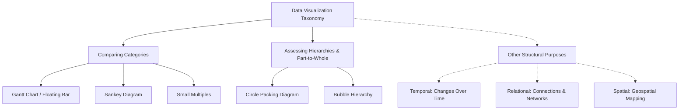
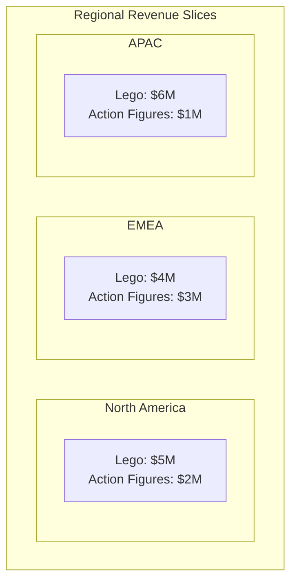
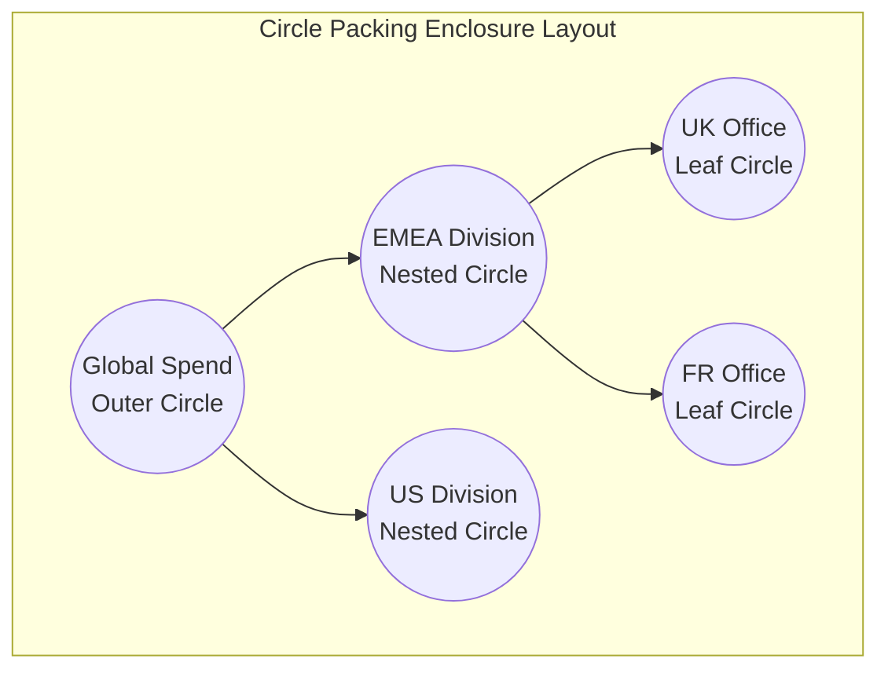
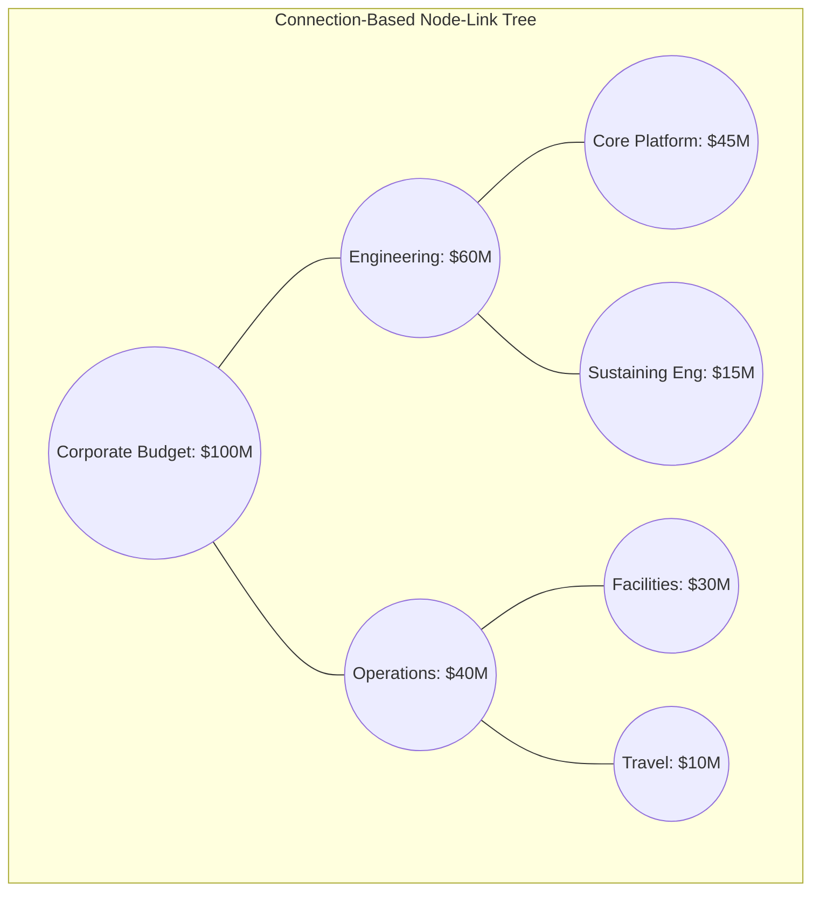
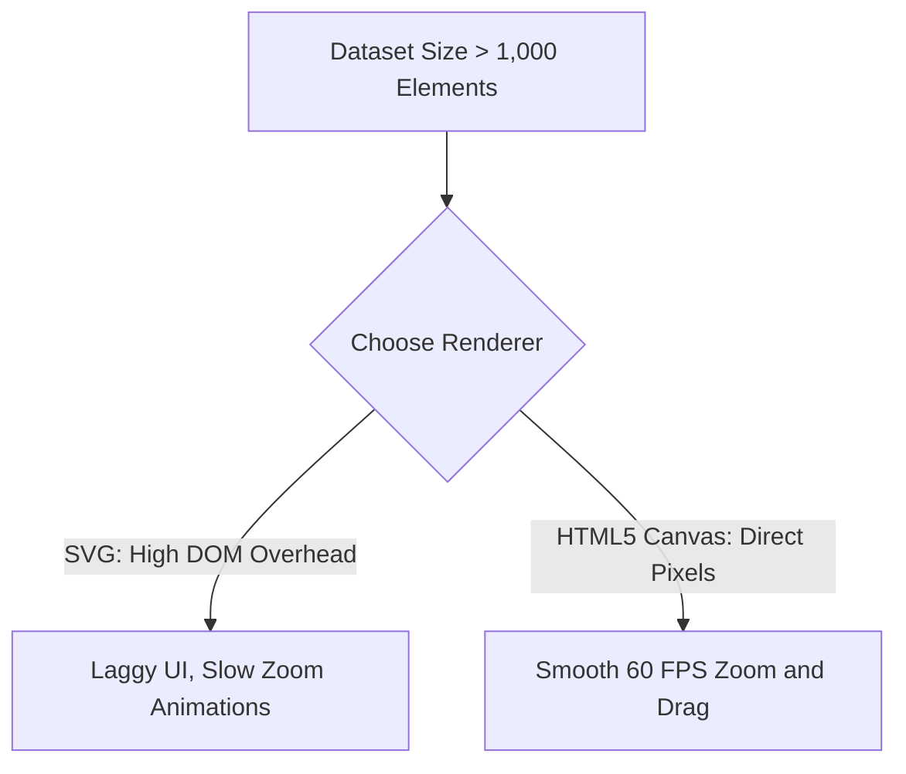

## Enterprise Data Visualization Taxonomy: Advanced Categorical Comparison, Flow Mapping, and Hierarchical Architecture

A robust taxonomy organizes data visualization methods by their primary communication purpose, helping engineers and architects select the most effective layout for a given dataset. This document details the visual paradigms, technical architectures, and practical trade-offs for two critical communication tasks: **Comparing Categories** and **Assessing Hierarchies / Part-to-Whole Relationships**.

---

## 1. Taxonomic Framework of Data Visualization Methods

Data visualization taxonomy maps specific mathematical and logical datasets to clear visual representations. The tree diagram below outlines this structural mapping:



### Comprehensive Method Evaluation Matrix

| Visualization Method | Input Data Type | Core Analytical Purpose | Primary Encodings | Structural Paradigm |
| :--- | :--- | :--- | :--- | :--- |
| **Gantt Chart (Floating Bar)** | Categorical + Two continuous range points (Start/End) | Show range spans and overlaps across categories | Floating horizontal bars on a shared axis | Interval-based linear comparison |
| **Sankey Diagram** | Directed graph with categorical stages and link weights | Show flow volumes, divisions, and combinations across stages | Flow bands where width matches volume | Node-link flow network |
| **Small Multiples** | High-dimensional tables with multiple category groupings | Scan across multiple grids to spot trends and anomalies | Synchronized multi-panel chart layout | Grid-based dimensional slicing |
| **Circle Packing Diagram** | Hierarchical tree with categorical groupings and leaf sizes | Show part-to-whole relationships within nested categories | Concentric nested circles scaled by area | Containment-based boundary nesting |
| **Bubble Hierarchy** | Hierarchical tree with parental connections and node weights | Show organization, reporting lines, and relative weights | Linked circles scaled by area and color-coded | Connection-based node-link layout |

### Key Takeaways
* **Clear Purpose Alignment:** Categorical comparison tools focus on relative and absolute sizes, while hierarchical tools show structural composition.
* **Structural Representation:** Hierarchies can be shown through **containment** (grouping elements inside boundaries) or **connection** (drawing lines between related items).
* **Scaling Consistency:** Both methods rely on area-proportional scaling to represent quantitative values accurately, avoiding visual bias.

---

## 2. Comparing Categories: Relative and Absolute Value Comparisons

Categorical comparison visualizations show how relative and absolute variables change across different categories. They help viewers compare the span, flow, or regional distribution of discrete items on a shared scale.

---

### A. Gantt Chart (Floating Bar)

```mermaid
gantt
    title Commodity Price Spread Analysis
    dateFormat  X
    axisFormat %s
    section Regional Energy Spreads
    US Gulf Coast (Spot Range)           :active, 12, 45
    Rotterdam Hub (Spot Range)           :active, 35, 95
    Singapore Terminal (Spot Range)      :active, 55, 110
```



#### Technical Breakdown
* **Definition:** A horizontal bar chart where each bar floats between minimum and maximum quantitative values, rather than anchoring to a fixed zero baseline.
* **Why It Matters:** Traditional bar charts can only show a single value starting from zero. Floating bars show both the **relative span** (the size of the bar) and the **absolute position** (where the bar sits on the axis) at the same time.
* **Real-World Use Case:** *Commodity Price Volatility.* A global supply-chain dashboard tracks natural gas import prices across regional hubs. Rather than plotting average prices, it uses floating bars to show daily minimum and maximum spreads, revealing both price ranges and absolute market differences.
* **Advantages:**
  * Displays two continuous data points (minimum and maximum limits) on a single horizontal line.
  * Makes it easy to compare overlapping values and ranges across categories.
  * Removes the zero-baseline constraint, preventing visual distortion when values sit far from zero.
* **Limitations:**
  * Cannot show cumulative totals across categories.
  * Becomes cluttered and hard to read if too many overlapping ranges are plotted on the same row.
* **Common Mistakes:**
  * Forcing the chart's axis to start at zero when all data points sit within a narrow, high-value range, which squishes the bars.
  * Arranging categories randomly instead of sorting them by minimum value, maximum value, or span width.
* **Best Practices:**
  * Sort categories by a meaningful metric (such as range width or absolute maximum) to make trends easy to spot.
  * Add vertical reference lines across the grid to help viewers compare absolute values.
* **Practical Implementation Notes:**
  * **Tableau:** Use the `Gantt Bar` mark type, mapping the minimum value to the Columns shelf and the range span (max minus min) to the Size shelf.
  * **Python:** Use `matplotlib.pyplot.barh` and pass the minimum values to the `left` parameter.

---

### B. Sankey Diagram

```mermaid
graph LR
    subgraph Resource Inputs (Stage 1)
        A[Electricity: 500MW]
        B[Natural Gas: 300MW]
    end
    subgraph Allocations (Stage 2)
        C[Residential: 400MW]
        D[Industrial: 400MW]
    end
    A -->|350MW| C
    A -->|150MW| D
    B -->|50MW| C
    B -->|250MW| D
```

#### Technical Breakdown
* **Definition:** A flow-based diagram where categories (nodes) are connected by bands (links) whose width is directly proportional to the flow volume passing between them.
* **Why It Matters:** Standard charts struggle to show resource changes across multiple stages. Sankey diagrams solve this by visualizing resource paths, showing both source allocations and final destinations in a single view.
* **Real-World Use Case:** *Enterprise Carbon Emissions Tracking.* A manufacturing company maps carbon emissions from its raw material facilities, through production plants, and out to final product lines, highlighting high-emission pathways across the supply chain.
* **Advantages:**
  * Visualizes complex, multi-stage relationships without losing track of total quantities.
  * Preserves balance across the system (the total width entering a stage matches the total width exiting it).
  * Helps viewers spot major pathways and system dependencies at a glance.
* **Limitations:**
  * Crossing flow lines in dense networks can create a tangled, hard-to-read layout.
  * Minor but critical flows can shrink to thin, unreadable lines if the scale is dominated by massive outliers.
  * Standard layout engines can break down if the data contains circular loops.
* **Common Mistakes:**
  * Leaving hundreds of tiny, insignificant transactions in the dataset, which litters the canvas with thin, distracting lines.
  * Failing to use clear directional cues, leaving users confused about which way the data is moving.
* **Best Practices:**
  * Group minor transactions into an "Other" category to keep the visual clean.
  * Use a dynamic layout solver (such as D3's iterative relaxation algorithm) to position nodes in a way that minimizes crossing paths.
* **Practical Implementation Notes:**
  * **JavaScript:** Use the `d3-sankey` library to calculate node and link coordinates.
  * **Python:** Use `plotly.graph_objects.Sankey` to generate interactive, draggable flow networks.

---

### C. Small Multiples



#### Technical Breakdown
* **Definition:** A grid-based layout where the same basic chart type is repeated across a categorical variable, with every panel sharing identical axes and scales.
* **Why It Matters:** When plotting multiple categories with several series on a single chart, the visual can quickly become cluttered. Small multiples solve this by separating the data into a clean, organized grid of individual charts, making it easy to spot trends and compare patterns across different groups.
* **Real-World Use Case:** *Product Performance Across Global Regions.* A retail company analyzes quarterly product line sales (6 categories) across 8 global regions. Instead of cramming all this data into one giant, hard-to-read grouped bar chart, they create an $8 \times 1$ grid of small bar charts, allowing regional managers to easily spot local sales trends.
* **Advantages:**
  * Spreads data out into a clean grid, making complex datasets easy to read without overlapping elements.
  * Shared axes and scales allow viewers to quickly compare values across charts.
  * Simplifies multivariable analysis by separating complex categories into clean slices.
* **Limitations:**
  * Needs a larger layout canvas to display the grid of charts clearly.
  * Comparing the exact values of elements in separate grid cells is slightly more difficult than comparing them side-by-side on a single chart.
* **Common Mistakes:**
  * Allowing each chart in the grid to calculate its own y-axis limits, which makes visual comparisons highly misleading.
  * Creating a grid with too many cells, which shrinks the individual charts and makes them unreadable.
* **Best Practices:**
  * Always lock the x- and y-axes to the same scales across all charts in the grid.
  * Sort the individual grid cells by a meaningful metric (such as total sales or growth rate) so that key insights bubble up to the top-left of the grid.
* **Practical Implementation Notes:**
  * **R/ggplot2:** Use `facet_wrap(~ region, ncol = 3)`.
  * **Seaborn:** Use `sns.FacetGrid(data, col="region")`.

---

### Section Summary & Key Takeaways
* **Gantt Charts** compare absolute and relative ranges, removing the zero-baseline constraint.
* **Sankey Diagrams** map continuous, multi-stage resource flows, preserving volume balances across the system.
* **Small Multiples** use a synchronized grid of simple charts to display high-dimensional data clearly, avoiding visual clutter.

---

## 3. Assessing Hierarchies: Part-to-Whole and Structural Visualizations

Hierarchical visualizations display the relationships between nested categories, showing how individual parts combine to form a larger system.

---

### A. Circle Packing Diagram



#### Technical Breakdown
* **Definition:** A containment-based visualization where hierarchical nodes are represented as circles, and nested child categories are packed tightly inside their parent circles.
* **Why It Matters:** Shows nested groupings and proportional sizes at the same time, using natural physical enclosure to define category boundaries.
* **Real-World Use Case:** *Technology Sourcing Costs.* An IT department maps hardware and software spending. The outer circle represents total IT spend, containing nested circles for departments (R&D, Sales), which in turn contain smaller circles for individual software licenses.
* **Advantages:**
  * Grouping via enclosure is highly intuitive and easy for viewers to understand.
  * Helps viewers quickly spot massive, high-cost nodes nested deep within the system.
  * Creates an engaging, organic visual layout that stands out on executive dashboards.
* **Limitations:**
  * Space is lost between the curved boundaries of packed circles, making it less space-efficient than a Treemap.
  * Comparing the exact sizes of circles is difficult for the human eye.
  * Deeply nested hierarchies become unreadable without interactive zoom controls.
* **Common Mistakes:**
  * Scaling circle sizes by radius rather than area, which quadratically distorts the perceived differences between values.
  * Trying to show deep hierarchies statically, turning small child nodes into unreadable pixel dust.
* **Best Practices:**
  * Always scale circles using their area: $r = \sqrt{\text{Value} / \pi}$.
  * Implement interactive "zoom-on-click" features to let users drill down into nested levels.
  * Use high-contrast color strokes to clearly separate parent and child boundaries.
* **Practical Implementation Notes:**
  * **D3.js:** Use the `d3.pack()` layout engine to compute circle coordinates.
  * **Python:** Use the `circlify` library to calculate nested coordinates, then render them using `matplotlib`.

---

### B. Bubble Hierarchy



#### Technical Breakdown
* **Definition:** A connection-based tree diagram where individual categories are represented as bubbles connected by branch lines, with each bubble sized by its quantitative value.
* **Why It Matters:** Unlike circle packing, bubble hierarchies draw explicit lines between parents and children. This makes it easier to track relationship paths across deep or uneven organizational structures.
* **Real-World Use Case:** *Corporate Budget Allocation.* A company maps divisional budgets across reporting lines. The central bubble represents total corporate budget, branching out to division nodes (Sized by spend), which connect to departmental subdivisions. This layout shows both reporting structures and financial weights in a single view.
* **Advantages:**
  * Clearly shows parent-child relationships using explicit connecting lines.
  * Easily handles unbalanced hierarchies where some branches are much deeper than others.
  * Allows viewers to compare the sizes of bubbles in different branches of the tree.
* **Limitations:**
  * Force-directed physics engines can cause nodes to wobble, overlap, or drift off the screen.
  * Needs significant canvas space to prevent connecting lines and bubbles from overlapping.
  * Recalculating physics simulations for more than 500 interactive nodes can cause performance lag.
* **Common Mistakes:**
  * Allowing bubbles to overlap due to weak collision detection in the layout engine.
  * Disconnecting parent and child nodes by using low-contrast connecting lines.
* **Best Practices:**
  * Use a layout engine with active collision detection to prevent bubble overlap.
  * Allow users to collapse and expand branches to keep the visual clean.
  * Keep bubble sizes proportional across the entire diagram to ensure accurate comparisons.
* **Practical Implementation Notes:**
  * Use D3's `d3-force` engine with `forceCollide` to keep bubbles separated.
  * Use NetworkX in Python to calculate tree structures, and Plotly to render the interactive layout.

---

### Section Summary & Key Takeaways
* **Circle Packing** uses nested containment to show group boundaries, making it highly aesthetic but less space-efficient.
* **Bubble Hierarchies** use explicit connecting lines to map complex, uneven organizational structures, though they require more screen space to prevent clutter.

---

## 4. Production-Grade Systems Architecture & Pipelines

Transforming raw transactional records into advanced interactive visualizations requires a structured data pipeline. The system architecture below outlines this flow:

```mermaid
flowchart LR
    subgraph Data Tier
        DB[(PostgreSQL / Snowflake)] -->|1. Export Flat Transactions| CSV[Flat CSV / JSON Stream]
    end
    
    subgraph Transformation Tier (Python / Node.js API)
        CSV -->|2. Validate Schema| VAL[Schema Validator]
        VAL -->|3. Route Data| ROUTE{Target Paradigm?}
        
        ROUTE -->|Sankey| SANK[Build Nodes & Edges]
        ROUTE -->|Circle Pack| PACK[Build Nested JSON Tree]
        
        SANK -->|Cycle Check| CYC[Detect & Break Loops]
        PACK -->|Scaling Math| SCALE[Apply Area Scaling: r = sqrt V/pi]
    end

    subgraph Client-Side Render Tier (Web UI)
        CYC -->|Nodes & Edges List| G_SANKEY[Plotly / D3 Sankey Canvas]
        SCALE -->|Coordinate Tree| G_PACK[D3 Pack / Canvas Engine]
    end
```

### Production Data Schemas

#### A. Flow-Based (Sankey) JSON Schema
Sankey engines require separate, validated lists of **nodes** and **links** (source-to-target pairs):

```json
{
  "$schema": "https://json-schema.org/draft/2020-12/schema",
  "title": "SankeyFlowData",
  "type": "object",
  "properties": {
    "nodes": {
      "type": "array",
      "items": {
        "type": "object",
        "properties": {
          "id": { "type": "string" },
          "label": { "type": "string" }
        },
        "required": ["id", "label"]
      }
    },
    "links": {
      "type": "array",
      "items": {
        "type": "object",
        "properties": {
          "source": { "type": "string" },
          "target": { "type": "string" },
          "value": { "type": "number", "minimum": 0.01 }
        },
        "required": ["source", "target", "value"]
      }
    }
  },
  "required": ["nodes", "links"]
}
```

#### B. Hierarchical (Circle Packing / Bubble Tree) Nested JSON Schema
Hierarchical engines require a nested tree structure where parent nodes contain child arrays:

```json
{
  "$schema": "https://json-schema.org/draft/2020-12/schema",
  "title": "HierarchicalTreeData",
  "type": "object",
  "properties": {
    "name": { "type": "string" },
    "value": { "type": "number" },
    "children": {
      "type": "array",
      "items": { "$ref": "#" }
    }
  },
  "required": ["name"]
}
```

---

## 5. Edge Cases, Failure Modes, and Production Debugging

### A. Performance Bottlenecks with Large Datasets

#### Issue: DOM Overhead with SVG Renderers
Rendering more than 1,000 interactive nodes or flow bands as SVGs can slow down the browser, leading to sluggish UI performance.



#### Mitigations:
* **Switch to Canvas Rendering:** For large datasets, use HTML5 Canvas instead of SVG. Canvas draws pixels directly to the screen, bypassing the DOM overhead.
* **Level of Detail (LOD) Rendering:** Only render visible elements. Hide deeper nested nodes until the user zooms into their parent category.

---

### B. Layout Stability in Force-Directed Bubble Hierarchies

#### Issue: Endless Jitter and Jiggling Nodes
Interactive bubble trees can sometimes bounce or wobble endlessly on the screen without settling, which distracts users and drains battery life.

#### Mitigations:
* Set a **cooling parameter threshold** to stop calculating node positions once their movement falls below a specific limit.
* Adjust the gravity and collision parameters to prevent nodes from bouncing back and forth indefinitely.

```javascript
// D3.js Force Simulation Stability Configuration
const simulation = d3.forceSimulation(nodes)
    .force("charge", d3.forceManyBody().strength(-50))
    .force("center", d3.forceCenter(width / 2, height / 2))
    .force("collision", d3.forceCollide().radius(d => d.radius + 2))
    .velocityDecay(0.4) // Increases friction to settle nodes faster
    .alphaMin(0.005);   // Stops calculation frames when movement becomes negligible
```

---

### C. Outliers and Value Anomalies

#### Issue: Distorted Scale from Extreme Outliers
If one division's budget is \$100M and another is \$10k, scaling their sizes linearly will make the smaller bubble practically invisible.

#### Mitigations:
* **Apply Logarithmic Scaling:** Use log scaling to keep smaller bubbles large enough to remain visible and interactive, while using colors to represent absolute differences.
* **Enforce a Minimum Bubble Size:** Set a minimum size threshold for very small values to ensure they remain clickable on the canvas.

$$\text{Radius}_{\text{Rendered}} = \max\left(\text{Radius}_{\text{Minimum}}, \sqrt{\frac{\text{Value}}{\pi}}\right)$$

---

### D. Zero or Negative Values in Part-to-Whole Diagrams

#### Issue: Negative Areas Break Scaling Mathematics
Since you cannot render a circle with a negative area, negative balances or net losses will break circle packing and bubble hierarchy layout engines.

```mermaid
flowchart TD
    A[Raw Value Received] --> B{Value <= 0?}
    B -->|No| C[Normal Area-Proportional Rendering]
    B -->|Yes| D{Apply Edge Case Handler}
    D -->|Option A| E[Convert to Absolute Value + Add Red Outline]
    D -->|Option B| F[Apply Hatched Pattern + Set Minimum Size]
    D -->|Option C| G[Filter out and log warning]
```



#### Mitigations:
* **Use Absolute Values with Visual Alerts:** Convert negative numbers to positive values to calculate their size, but add a distinct color (like bright red) or a hatched pattern to flag them as negative balances.
* **Apply Hatched Visual Textures:** Use specific textures to represent divisions with zero budget, keeping them visible on the chart without skewing the scaling math.

Tags: #statistics #machine-learning #data-science #statistical-modelling